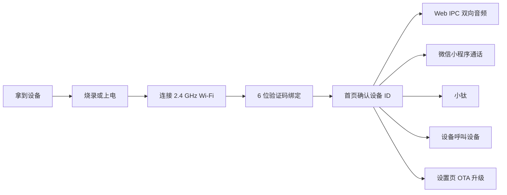
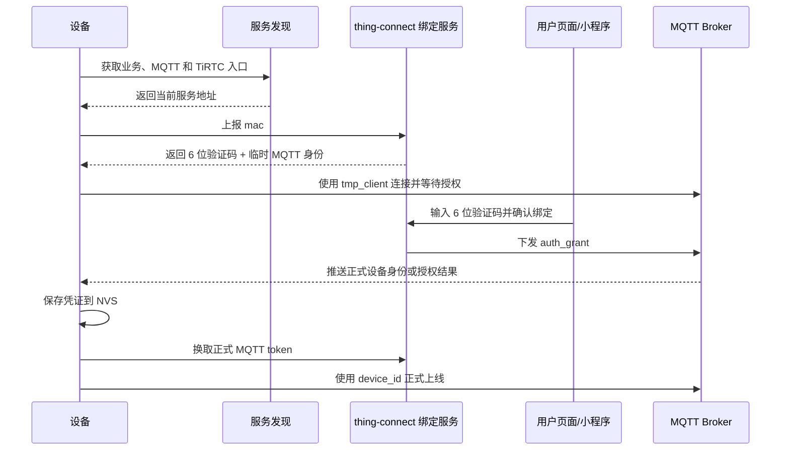

# TiRTC ESP32-S3 设备体验流程

这份流程把 `thing-connect` 的设备绑定、正式在线、微信 VoIP、小钛（AI 对讲）、设备
呼叫和 OTA 链路，整理成普通体验者实际拿到设备后的操作顺序。它不是接口文档，而是一条
从开机到完整体验的用户路径。

参考项目：[tangeai/tirtc-server-example/thing-connect](https://github.com/tangeai/tirtc-server-example/tree/main/thing-connect)

## 1. 总体验路线

用户只需要记住一条主线：先让设备联网，再用 6 位验证码绑定账号，之后所有功能都基于这台设备已经在线、已经有正式 `device_id` 的状态继续体验。

## 2. 角色关系

| 角色 | 用户能看到什么 | 背后承担什么 |
| --- | --- | --- |
| ESP32-S3 设备 | 屏幕主页、Wi-Fi、绑定码、设备 ID、各应用入口 | 麦克风、扬声器、TiRTC SDK、MQTT 在线、OTA，以及二维码扫描摄像头 |
| 绑定服务 | 用户输入 6 位验证码后完成绑定 | 分配或确认 `device_id/device_key`，签发 MQTT token |
| Web 端 | 浏览器里监听设备并按住说话 | 与设备建立 TiRTC 连接，验证双向音频 |
| 微信小程序 | 微信联系人、授权、呼叫和接听 | 完成微信账号侧授权，触发微信 VoIP 回调 |
| AI 服务 | 小钛页面里的语音回复、字幕和联系人动作 | 给设备签发 AI 连接凭证，进入 WHIP AI 会话 |

## 3. 第一次上电

从 `0x0` 烧录 `full` 完整镜像会覆盖 16 MB Flash，并清除旧 Wi-Fi、绑定和本地设置。
这种情况下，下面看到“未联网、未绑定”就是新设备的正常初始状态。

1. 用 USB 数据线连接开发板和电脑，或者接入稳定电源。
2. 等待屏幕进入主页。
3. 如果设备没有 Wi-Fi，会进入或提示 Wi-Fi 设置。
4. 如果设备没有绑定，会显示 6 位绑定码。
5. 如果设备已经绑定，主页二维码下面会显示当前设备 ID。

正常体验时，用户不需要手动输入设备密钥，也不需要知道 `device_key`。设备身份由绑定流程写入。

## 4. 连接 Wi-Fi

1. 从主页进入设置，再进入 Wi-Fi 设置。
2. 选择一个 2.4 GHz Wi-Fi。
3. 输入密码并保存。
4. 等待右上角 Wi-Fi 图标变成真实连接状态。
5. 回到主页后，设备会自动做时间同步和在线准备。

如果 Wi-Fi 没连上，后面的绑定、IPC、微信、小钛和 OTA 都不会完整闭环。先确认设备拿到了 IP，再继续体验。

## 5. 6 位验证码绑定

### 用户看到的动作

1. 设备联网后，如果本地没有正式身份，会显示 6 位验证码。
2. 用户打开绑定网页、业务后台或配套小程序。
3. 在绑定入口输入设备屏幕上的 6 位验证码。
4. 页面提示绑定成功。
5. 设备自动保存身份，返回主页或刷新设备状态。
6. 主页二维码下面显示 12 位设备 ID。

### 背后的链路

绑定完成前，设备可以显示界面，但 Web IPC、微信 VoIP、小钛、设备呼叫这些需要授权的链路都不应该被当成已经可用。

## 6. 首页确认设备

绑定完成后，先在主页做三个确认：

1. 右上角 Wi-Fi 图标是真实连接状态。
2. 二维码下面能看到设备 ID。
3. 设置页里设备状态、版本号和网络状态正常。

这一步很重要。多人同时测试时，设备 ID 是区分设备的最直接依据。

## 7. Web IPC 双向音频

### 设备侧

1. 主页点击查看。
2. 等待设备打开麦克风采集和音频播放资源。
3. 保持设备停留在查看页。

### Web 侧

1. 浏览器打开 ThingConnect H5：[https://mqtt-demo.tange-ai.com/](https://mqtt-demo.tange-ai.com/)
2. 进入 IPC 或设备监控入口。
3. 选择目标设备，或者按页面提示扫码/输入设备 ID。
4. 点击连接。
5. 开启设备音频，确认浏览器可以听到设备麦克风。
6. 使用网页按住说话或对讲入口，确认设备扬声器可以播放回传音频。
7. 断开连接，再从设备返回主页。

体验目标是确认麦克风、扬声器、网络和 TiRTC 连接都能跑通。`1.9.0` 不发布或播放 RTC
视频，网页没有设备画面是预期产品行为。退出查看页后，设备应释放 IPC 音频资源，回到可
进入其他应用的状态。

## 8. 微信小程序通话

微信通话有两条用户路径：小程序呼叫设备，以及设备主动呼叫微信联系人。

### 小程序呼叫设备

1. 确认设备已联网、已绑定、主页能看到设备 ID。
2. 用户用微信打开项目维护者提供的小程序体验入口。
3. 在小程序里登录或完成微信授权。
4. 添加设备，可以扫描设备 ID 二维码或输入设备 ID。
5. 完成微信 VoIP 授权。
6. 小程序点击呼叫设备。
7. 设备收到来电后进入微信通话页。
8. 设备侧建立 WHIP 连接，接通后双方开始对讲。
9. 任意一方挂断，设备释放通话资源。

### 设备主动呼叫微信联系人

1. 先完成小程序添加设备和 VoIP 授权。
2. 设备进入微信页面。
3. 设备从服务端拉取已授权联系人，兼容 `data.contacts` 和 `data.list`。
4. 联系人显示服务端备注；用户可以选择妈妈、爸爸、爷爷、奶奶、外公、外婆、哥哥、
   姐姐或朋友作为新备注。更新成功后设备刷新服务端权威列表。
5. 用户在设备上选择联系人并发起音频呼叫。
6. 微信侧响铃。
7. 微信用户接听后，设备立即进入 WHIP 连接。
8. 双方开始对讲。
9. 任意一方挂断后回到微信页。

微信链路的核心点是：用户看起来是在微信里接听或挂断，但设备侧收到 `call_incoming` 后要尽快建连 WHIP；后续接听、取消和挂断由微信侧事件、MQTT 通知和 TiRTC 命令共同驱动。

微信授权的创建和删除属于小程序用户侧：`report-auth/delete-auth` 必须携带用户 JWT。
设备只维护授权列表镜像，使用 NVS schema v2 缓存，使用设备 MQTT token 拉取
`device/contacts`、处理 `channel=wx` 的 `callers_update`，以及调用 `device/call`。
设备页扫码或输入 OpenID 不会创建授权，只能核对该联系人是否已经由小程序授权。设备侧
当前只发起微信音频呼叫，设备能力上报使用 `no_video=true`。

## 9. 小钛（AI 对讲）

1. 确认设备已经完成绑定，并且网络正常。
2. 主页进入小钛。
3. 设备向 AI 服务获取 `peer_id/token/role_id`。
4. 设备建立 WHIP 连接。
5. 用户对设备说话。
6. 设备上传麦克风音频。
7. 云端 AI 返回语音和字幕。
8. 设备播放 AI 回复，并在屏幕显示字幕。
9. 点击返回退出，设备停止 AI 会话并释放音频和 RTC 资源。

### 9.1 联系人动作

小钛可以查询设备联系人在线、离线或全部状态，按设备 ID/备注发起设备音频呼叫，以及按
微信 OpenID/备注发起微信音频呼叫。微信联系人不提供在线状态查询，视频类型会明确返回
不支持。

动作返回 `accepted` 时，只表示设备已经完成目标校验并接受应用切换请求；对端响铃、
接听和媒体建立由后续呼叫状态机决定。目标不存在、备注歧义、目标离线、设备忙碌或呼叫
类型不受支持时，设备会返回明确结果。

如果小钛页面提示授权或 token 异常，优先检查设备是否已经绑定到正确账号，以及服务端是否能为该设备签发 AI token。

## 10. 设备呼叫设备

设备呼叫设备适合验证同账号设备、联系人和 P2P 通话链路。

1. 两台设备都完成 Wi-Fi 和 6 位验证码绑定。
2. 两台设备都保持在线。
3. 在设备呼叫页刷新联系人。
4. 选择一个设备联系人。
5. 选择联系人并发起音频呼叫；本固件只接受 `call_type=audio`。
6. 被叫设备收到来电后接听。
7. 双方进入双向音频通话。
8. 主叫或被叫挂断后，服务端释放房间。

设备呼设备和微信 VoIP 是两条不同链路。设备呼设备使用设备联系人和 `TiRtcConnect`；微信通话使用微信授权联系人和 `TiRtcWhipConnect`。

## 11. OTA 升级

1. 主页进入设置。
2. 进入关于或 OTA 页面。
3. 点击检查更新。
4. 页面显示下载进度。
5. 下载、校验和写入完成后，点击重启。
6. 设备重启后，在设置页确认版本号。

体验时要保证电源稳定，不要在写入阶段断电。OTA 只更新应用分区，正常情况下保留 NVS、
Wi-Fi、设备绑定和 storage；首次完整烧录使用
[Espressif ESP Tool](https://espressif.github.io/esptool-js/)，并准备重新完成首次配置。

## 12. 一次完整演示脚本

下面这条顺序适合给客户、同事或直播演示：

1. 展示设备上电进入主页。
2. 进入 Wi-Fi 设置，连接 2.4 GHz Wi-Fi。
3. 展示 6 位绑定码。
4. 在绑定入口输入验证码，等待设备显示设备 ID。
5. 进入查看页，用 Web 端连接 IPC，展示设备音频上行和网页按住说话。
6. 进入微信页，用小程序呼叫设备，再从设备呼叫微信联系人。
7. 进入小钛，现场说一句话，展示字幕和语音回复；再查询联系人或发起一次呼叫动作。
8. 如果有第二台设备，演示设备呼设备。
9. 进入设置页检查 OTA，展示版本信息和升级入口。

这个顺序的好处是每一步都在验证下一步的前置条件：网络先通，身份再通，然后才验证媒体、微信、小钛和升级。

## 13. 常见卡点

| 现象 | 优先检查 |
| --- | --- |
| 设备一直显示绑定码 | 用户还没有在绑定入口输入验证码，或验证码已过期 |
| 主页没有设备 ID | 绑定没有完成，或本地身份被重置 |
| Web IPC 连接不上 | Wi-Fi、设备在线状态、设备是否停留在查看页 |
| Web IPC 已连接但没有画面 | `1.9.0` 只启用 RTC 双向音频；摄像头只用于二维码扫描 |
| 微信联系人为空 | 小程序是否添加设备并完成 VoIP 授权 |
| 微信接通后立刻断开 | 设备是否及时收到 `call_incoming`，WHIP 是否建连成功 |
| 小钛 token 失败 | 设备绑定状态、AI 服务配置、账号和设备关系 |
| 小钛联系人动作失败 | 检查目标是否唯一、在线，设备是否忙碌，以及呼叫类型是否受支持 |
| 微信联系人备注未更新 | 检查网络，等待后台更新和权威列表刷新 |
| OTA 卡在 0% | manifest 是否可访问、固件包是否存在、设备写入空间和任务栈是否正常 |

## 14. 验收清单

| 项目 | 通过标准 |
| --- | --- |
| Wi-Fi | 设置页能看到已连接状态和 IP |
| 绑定 | 主页能显示设备 ID |
| IPC | Web 端能验证设备麦克风上行和网页音频下行 |
| 微信通话 | 小程序呼设备、设备呼小程序联系人至少各跑通一次 |
| 小钛 | 能听到 AI 回复、看到字幕，并完成一次联系人状态查询或呼叫动作 |
| 设备呼叫 | 至少一台联系人设备能接听音频呼叫并完成双向通话 |
| OTA | 能检查更新、下载、重启，并看到新版本号 |
