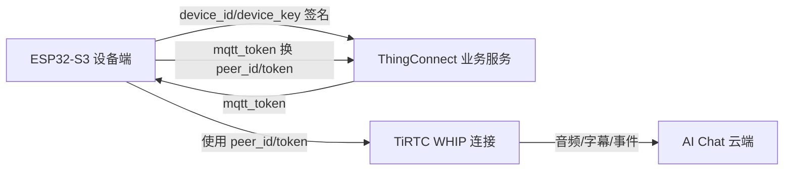
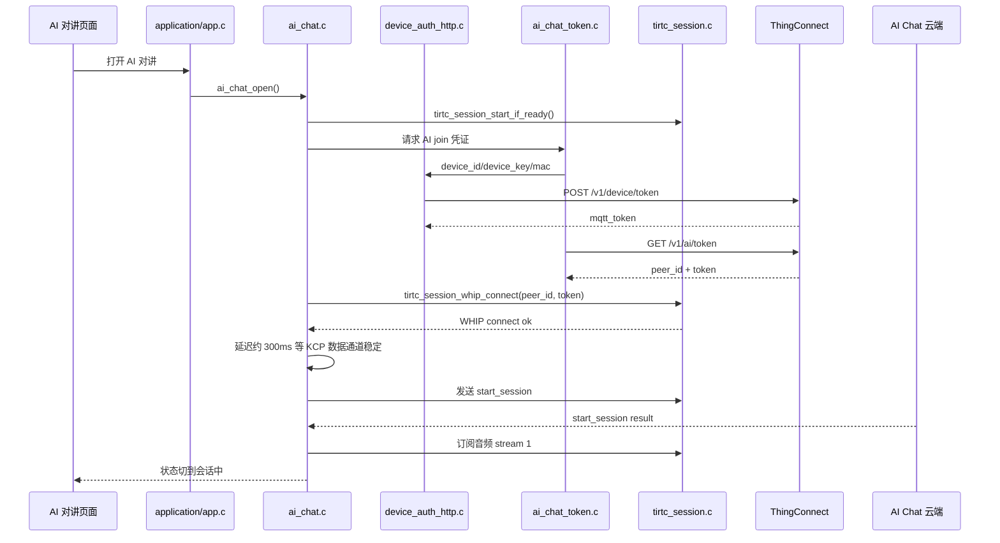
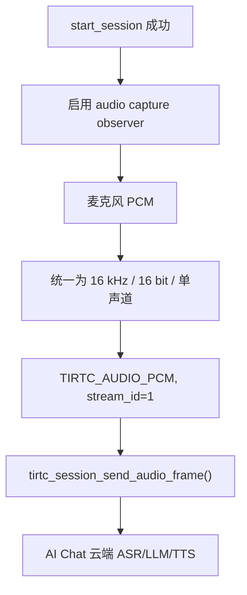
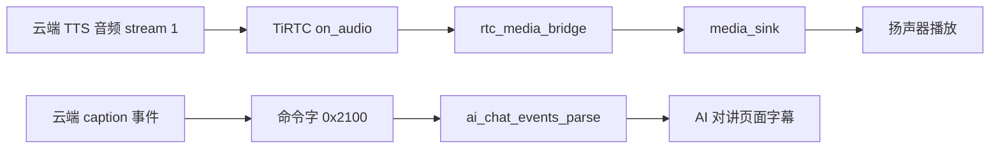

# AI 对讲接入说明

本文档对应本工程的 S3 设备端 AI 对讲实现，代码入口在 `main/services/ai_chat*` 与 `main/ui/display.c`。

参考官方文档：

- [AI Chat 开发文档](https://docs.tange.ai/products/ai-chat/)
- [总体流程](https://docs.tange.ai/products/ai-chat/guides/overall-flow.html)
- [设备端集成](https://docs.tange.ai/products/ai-chat/guides/device-integration.html)
- [事件协议](https://docs.tange.ai/products/ai-chat/api-reference/events.html)

## 角色边界

当前工程按 Python 演示的 ThingConnect 流程实现：设备保存绑定得到的 `device_id/device_key`，先签名请求 `/v1/device/token` 换取 `mqtt_token`，再用 `Authorization: Bearer mqtt_token` 请求 `/v1/ai/token` 获取短期 `peer_id/token`。设备端不再走旧版直连 token API，也不再持有 AI Chat 平台级服务密钥。

## 当前代码结构

| 文件 | 作用 |
| --- | --- |
| `main/services/ai_chat.c` | AI 对讲状态机，负责开关会话、WHIP 建连、`start_session`、心跳、打断、结束会话、音频上行。 |
| `main/services/ai_chat_events.c` | 解析云端下发的 JSON-RPC 事件，包括字幕、轮次开始/结束、打断、业务事件、结束。 |
| `main/services/ai_chat_token.c` | AI token 编排层：复用设备认证拿 `mqtt_token`，再向 `/v1/ai/token` 请求 `peer_id/token`。 |
| `main/services/device_binding/device_auth_http.c` | 设备认证层：按 `device_id + timestamp + nonce` 做 HMAC-SHA256 签名，请求 `/v1/device/token`。 |
| `main/protocols/http/thing_http_client.c` | 通用 ThingConnect HTTP 客户端，统一 URL 拼接、HTTPS 证书包、超时和响应收集。 |
| `main/application/app.c` | 把设备配置、RTC 配置和 AI 对讲服务连起来。 |
| `main/protocols/tirtc/tirtc_session.c` | TiRTC 连接层，新增 observer、WHIP connect、stream 1 音频订阅/发送接口。 |
| `main/drivers/audio/audio.c` | 麦克风采集和播放驱动，AI 对讲通过 capture observer 旁路采集音频。 |
| `main/services/rtc_media_bridge.c` | TiRTC 音频格式和本地播放格式转换，AI 下行 PCM 走这里播放。 |
| `main/ui/display.c` | AI 对讲页面，展示状态、ASR 字幕、TTS 字幕和开始新对话入口。 |

## 启动流程

## 语音上行

实现细节：

- AI 对讲只有一种模式：会话建立后默认常听，用户直接说话即可。
- 实体侧键只做控制动作：AI 正在回复时按下发送 `interrupt`，清空本地远端媒体队列并停止旧回复播放。
- 会话空闲或异常断开后，AI 对讲页面内按下实体侧键会重新发起一次新会话。
- 页面底部的“开始新对话”按钮和侧键重连走同一条启动流程。
- 当前固定协商 `pcm / 16000 Hz / 1 channel`，且 `start_session.input_audio`、`TIRTCFRAMEINFO.media` 和 `TIRTCFRAMEINFO.flags` 必须保持一致。
- `start_session` 使用 JSON-RPC 2.0，`id` 按官方事件协议使用字符串，例如 `start-session-001`；当前默认 `user_id=user-001`。`role_id` 以 `/v1/ai/token` 返回的 `peer_id` 查询参数为准，本地 `APP_CONFIG_AI_CHAT_ROLE_ID` 只作为兜底默认值。如果云端不回包，先确认设备日志里是否出现 `rtc command callback`。
- WHIP 连接回调后不会立刻发 `start_session`，当前延迟 300ms，和 Python demo 一致，用来等待 KCP 数据通道稳定。
- 必须等 `start_session` 成功响应后再启动麦克风上行；响应前推流会被云端丢弃。
- 如果底层采集格式不是 16 bit 单声道的 8 kHz 或 16 kHz PCM，本地会丢弃这一帧并计入丢帧，避免把伪静音发给云端。
- 打开会话、token 请求、WHIP 回调之间用 generation 做生命周期校验；用户退出页面后，未完成的旧启动流程不会再把设备拉回 AI 会话。

## 语音下行和字幕

字幕处理规则：

- `caption_type=0` 展示为用户 ASR 字幕。
- `caption_type=1` 展示为云端回复字幕。
- `mode=1` 优先按增量追加；如果云端实际下发的是当前完整文本前缀，设备端会按全量文本替换，避免字幕重复。
- `mode=0` 用全量文本替换。
- 使用 `caption_type + utterance_id` 分组，避免不同轮次混在一起。

## 事件处理

| 事件 | 当前处理 |
| --- | --- |
| `start_session` result | 校验音频格式，订阅 stream 1，进入会话中。 |
| `caption` | 更新 ASR/TTS 字幕。 |
| `round_start` | UI 切到云端回复状态。 |
| `round_end` | UI 回到等待输入状态。 |
| `heartbeat` | 会话中每 30 秒发送一次。 |
| `interrupt` | 本地清空远端媒体队列并停止播放旧回复。 |
| `event` | 保存 `params.data`，兼容字符串和 JSON 对象；具体设备能力动作后续按业务再接。 |
| `end_session` | 幂等关闭采集、清空播放队列、取消订阅和断开 TiRTC 连接。 |

## 当前结论

静态和编译层面已经具备完整链路：设备签名换 `mqtt_token`、获取 AI `peer_id/token`、WHIP 建连、发送 `start_session`、上行 PCM、订阅下行音频、解析字幕并展示。

真正的云端语音对讲还需要真机跑一次完整验证，重点看：

1. 设备系统时间是否已同步，否则 `/v1/device/token` 的 HMAC 签名会失败。
2. `device_id/device_key` 是否来自绑定流程，且该设备是否已在 ThingConnect / AI Chat 侧授权。
3. 云端是否接受本次协商的 `pcm / 16000 / 1`。
4. 收到 `caption` 后页面是否显示 ASR/TTS 字幕。
5. 收到 TTS 音频后扬声器是否连续播放，没有被普通 RTC 通话状态拦住。
