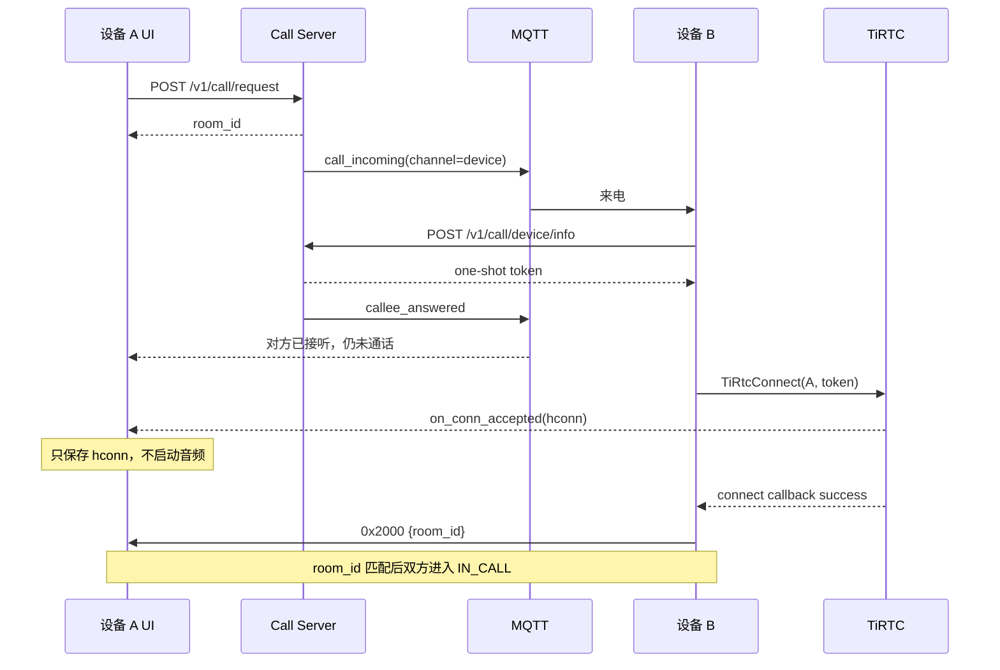

# 设备呼叫业务逻辑与 320 x 240 纸面线框 v2.1

> 视觉实现补充：页面颜色、字号、间距和组件形态已由
> `DEVICE_CALL_FIGMA_STYLE_SPEC_V2_2_CN.md` 接管。本文件继续作为业务流程和
> 状态机依据；其中与 Figma 现有呼叫首页入口形态冲突的纸面布局不再作为视觉
> 实现依据。

状态：纸面评审稿，未生成视觉效果图，未进入 Figma，未修改固件 UI。
屏幕：320 x 240 横屏，逻辑坐标与物理坐标均按 320 x 240 设计。
范围：ThingConnect 设备对设备纯音频呼叫；发挥本机摄像头与屏幕能力，以设备扫码互加为主要联系人入口；微信呼叫不在本应用内。

## 1. 本轮纠正

上一版设计存在三个需要先纠正的地方：

1. 视觉预览把多个页面排成设计展示板，不能证明单个页面在 320 x 240 上真实可用。
2. 呼叫状态不能只用一个枚举表达；当前通话之外还可能同时存在一个待处理来电。
3. 设备重启、MQTT 重连或应用重新进入时，Call Server 房间可以查询，但原 P2P 连接和一次性 token 不能可靠恢复，所以只能清理旧房间，不能显示“恢复通话”。

本稿先确定业务对象、状态机、异常和页面坐标，再进入图片生成。

## 2. 业务边界

### 2.1 本应用负责

- 拉取并展示 `type=device` 的服务端联系人。
- 使用设备 ID 发起联系人申请。
- 使用摄像头扫描另一台设备屏幕上的设备二维码。
- 在屏幕上展示本机设备二维码，供另一台设备扫描。
- 发起、接听、拒绝、取消和挂断设备 P2P 音频呼叫。
- 处理 MQTT `channel=device` 的呼叫事件。
- 处理 `TiRtcConnect`、`on_conn_accepted`、`0x2000` 和连接断开。
- 管理设备呼叫自己的麦克风、扬声器和媒体资源。

### 2.2 本应用不负责

- 微信联系人和微信 VoIP。
- 保存其他设备的 `device_secret_key`、`pair_key` 或连接 token。
- 在 NVS 中维护一份与服务端不同步的联系人列表。
- 视频通话。
- 伪造服务端尚未提供的设备端联系人删除和待审批列表。

## 3. 服务端数据模型

### 3.1 联系人

设备调用 `GET /v1/call/device/contacts`，只保留：

```text
type == "device"
status == accepted（服务端返回列表已是 accepted）
```

UI 使用字段：

```text
peer_device_id
remark
online
source = auto | manual
```

`type=voip` 的项目交给微信呼叫应用，不在本页混排。

### 3.2 联系人申请

```text
POST /v1/call/device/contacts/request
{"target_device_id":"..."}
```

- 同账号：服务端直接返回 `accepted`，联系人立即可见。
- 跨账号：返回 `pending`，设备只显示“申请已发送”。
- 当前设备接口没有 pending 列表；跨账号审批暂由 Web/H5 完成。
- 二维码内容只允许 `device_id`。

### 3.3 摄像头与屏幕形成设备互加闭环

官方 PC 模拟器以命令行输入设备 ID；本产品同时拥有摄像头和屏幕，因此把同一个服务端接口包装成更自然的设备交互：

```text
设备 A 打开“我的设备码”
-> 设备 A 屏幕显示只包含 device_id 的二维码
-> 设备 B 打开“扫码添加”
-> 设备 B 摄像头识别 device_id
-> 设备 B 显示扫描结果并要求确认
-> POST /v1/call/device/contacts/request
-> accepted：立即成为联系人
-> pending：显示申请已发送
```

手动输入保留为兜底路径，适用于：

- 对方设备不在现场。
- 摄像头正在被其他应用占用。
- 二维码损坏或环境光不适合识别。
- 调试和售后输入指定设备 ID。

二维码输出格式：

```json
{"device_id":"TIR588XN352C"}
```

扫描器兼容纯文本设备 ID 和旧 JSON，但只读取 `device_id`。发现 `device_secret_key`、`pair_key` 或其他敏感字段时必须忽略且不得落盘。

扫描成功不能直接发送申请，需要先展示目标设备 ID，由用户确认，防止扫到错误设备。

### 3.4 摄像头资源规则

- 只有呼叫会话为 `IDLE` 时允许进入扫码。
- 进入扫码前由应用层申请摄像头所有权。
- 扫描成功、用户退出、收到来电或应用切走时必须停止预览并释放摄像头。
- 扫码期间保持 Wi-Fi、MQTT 和 TiRTC 监听，不为扫码重启 RTC。
- 扫码期间收到设备来电时，来电优先：先退出摄像头，再显示 P4 来电页。
- 摄像头忙时显示“摄像头正在使用”，并直接提供“手动输入”。

## 4. 呼叫状态不是单一枚举

设备呼叫需要三个相互独立的状态域。

### 4.1 就绪域 `readiness`

```text
OFFLINE
UNBOUND
STARTING
READY
```

### 4.2 当前房间域 `session`

```text
IDLE
OUTGOING_RINGING
CALLER_CONNECTING
INCOMING_RINGING
CALLEE_CONNECTING
IN_CALL
ENDING
CLEANING_STALE_ROOM
FAILED
```

### 4.3 待处理来电域 `pending_incoming`

```text
EMPTY
PENDING(room_id, caller_id, caller_name, call_type)
```

`pending_incoming` 可以在 `OUTGOING_RINGING`、`CALLER_CONNECTING`、`CALLEE_CONNECTING` 或 `IN_CALL` 时存在。它不能被简单塞进当前房间状态，否则会覆盖正在进行的通话。

## 5. 官方主叫流程



主叫页面变化：

```text
联系人 -> 正在呼叫 -> 正在连接 -> 通话中
```

主叫绝不能调用 `TiRtcConnect()`。

## 6. 官方被叫流程

```text
MQTT call_incoming
-> 保存 pending_incoming
-> 当前无通话：显示来电页
-> 用户接听
-> POST /v1/call/device/info
-> token 获取成功
-> 第一次 TiRtcConnect(caller_id, token)
-> 后续重试 TiRtcConnect(caller_id, NULL)
-> connect callback success
-> 发送 0x2000 {room_id}
-> 发送动作提交成功后进入 IN_CALL
```

token 获取失败或全部连接失败：

```text
POST /v1/call/hangup {reason:"p2p_error"}
-> 清理 pending/current room
-> 返回联系人页并提示“连接失败”
```

## 7. 来电与当前通话冲突

公开 C 参考实现会暂存通话中的新来电。本产品按下列方式表达：

### 7.1 当前空闲

直接显示全屏来电页。

### 7.2 正在呼出或正在连接

显示“新来电”覆盖层：

- `拒绝`：拒绝新来电，继续当前呼叫。
- `结束当前并接听`：先取消/挂断当前房间，确认本地资源释放后接听 pending room。

### 7.3 正在通话

同样显示来电覆盖层，但明确写“接听将结束当前通话”。不允许无提示自动切换房间。

### 7.4 对方取消 pending 来电

收到匹配 `pending_room_id` 的 `room_cancel` 后只关闭覆盖层，不影响当前房间。

## 8. 房间清理与重启恢复

### 8.1 应用启动或 MQTT 重连

```text
GET /v1/call/room
-> data == null：进入 IDLE
-> 有 room 但本地无有效 hconn：进入 CLEANING_STALE_ROOM
```

### 8.2 清理策略

- `role=caller, status=active`：调用 `/v1/call/cancel`。
- `role=caller, status=answered`：调用 `/v1/call/hangup`。
- `role=callee`：调用 `/v1/call/hangup`。
- 清理完成后回到联系人页。
- 用户只看到短暂文案“正在清理上次通话”，不显示“恢复通话”。

### 8.3 `40202 already in room`

如果本地没有有效会话：

```text
GET /v1/call/room
-> 按角色清理
-> 原呼叫请求最多自动重试一次
```

如果本地确实正在通话，则拒绝新呼叫，不清理当前房间。

## 9. 结束流程

### 9.1 主叫在响铃阶段取消

```text
POST /v1/call/cancel
-> 停 30s timer
-> 清 expected_room_id
-> 回联系人页
```

### 9.2 被叫拒接

```text
POST /v1/call/reject {reason:"decline"}
-> 清 pending_incoming
-> 回原页面
```

### 9.3 通话中挂断

```text
UI 立即进入 ENDING，禁用重复点击
-> POST /v1/call/hangup
-> 停麦克风采集
-> 停扬声器播放
-> 清媒体队列
-> TiRtcDisconnect
-> hconn 清空
-> 回联系人页
```

远端收到 `room_cancel` 或 SDK `on_disconnected` 时执行相同本地清理。HTTP 失败不能阻止本地资源释放。

## 10. 页面数量收敛

320 x 240 屏幕不做十几个并列业务页面。第一版使用 6 个基础页面、4 个覆盖层和 3 个全屏工具；添加设备内部仍保持单栈导航。

### 10.1 基础页面

| ID | 页面 | 责任 |
| --- | --- | --- |
| P1 | 联系人 | 加载、刷新、选择联系人和发起呼叫 |
| P2 | 添加设备方式 | 选择扫码、手动输入或展示本机设备码 |
| P2M | 手动添加 | 输入设备 ID 并发送联系人申请 |
| P3 | 呼出 | `OUTGOING_RINGING` 与 `CALLER_CONNECTING` 两个变体 |
| P4 | 来电 | 空闲时的全屏来电处理 |
| P5 | 通话 | 时长、静音、扬声器音量和挂断 |

### 10.2 覆盖层

| ID | 覆盖层 | 责任 |
| --- | --- | --- |
| O1 | 结果条 | 离线、拒接、无人接听、刷新失败等短结果 |
| O2 | 通话中来电 | 拒绝或结束当前并接听 |
| O3 | 确认框 | 仅用于高风险的房间切换 |
| O4 | 扫描结果 | 展示识别到的设备 ID，确认添加或重新扫描 |

### 10.3 全屏工具

- T1：设备 ID 输入键盘。
- T2：全屏摄像头扫码。
- T3：全屏本机设备二维码。

工具不进入系统主页，按来源返回：T1 保存后回 P2M，T2 取消后回 P2、识别成功后进 O4，T3 退出后回 P2。

## 11. 320 x 240 全局网格

```text
屏幕：x=0..319，y=0..239
顶栏：x=0，y=0，w=320，h=32
页面安全区：x=8..311，y=36..235
基础间距：4 / 8 / 12
触摸目标：最小 40 x 40
圆角：最大 8
```

顶栏固定：

```text
x=0..39     返回，40 x 32 视觉区，实际触摸 40 x 40
x=40..239   居中标题
x=240..279  次操作图标
x=280..319  主操作图标
```

## 12. P1 联系人纸面线框

联系人首页就是设备呼叫应用的第一屏。

```text
320 x 240
┌────────────────────────────────────────┐ y=0
│ ‹              设备呼叫        ＋  ↻  │ h=32
├────────────────────────────────────────┤ y=32
│ 客厅设备                     [电话图标]│ y=36  h=60
│ TIR588XN352C        ● 在线              │
├────────────────────────────────────────┤ y=100
│ 门口设备                     [禁用图标]│ h=60
│ TIRH88RRZZ2W        ○ 离线              │
├────────────────────────────────────────┤ y=164
│ 书房设备                     [电话图标]│ h=60
│ TIR0D3K1A8Q7        ● 在线              │
└────────────────────────────────────────┘ y=239
```

坐标：

```text
row 1: x=8 y=36  w=304 h=60
row 2: x=8 y=100 w=304 h=60
row 3: x=8 y=164 w=304 h=60
call button: 每行 x=264 y=row+10 w=40 h=40
```

空列表使用同一页面的状态变体：

```text
┌────────────────────────────────────────┐
│ ‹              设备呼叫        ＋  ↻  │
├────────────────────────────────────────┤
│                                        │
│              暂无联系人                │
│          添加设备后即可呼叫            │
│                                        │
│       [          扫码添加          ]   │
│                                        │
└────────────────────────────────────────┘
```

空列表的主按钮直接进入 T2 扫码；顶栏 `＋` 进入 P2，供用户选择扫码、手动输入或展示本机设备码。

## 13. P2 添加设备方式纸面线框

```text
┌────────────────────────────────────────┐
│ ‹              添加设备                │ h=32
├────────────────────────────────────────┤
│                                        │
│ [ 摄像头图标       扫码添加设备      ] │ y=44  h=68
│                                        │
│ [ 手动输入 ]        [ 我的设备码 ]     │ y=124 h=48
│                                        │
│               最近扫描：无             │ y=196
└────────────────────────────────────────┘
```

扫码是主操作，使用整行绿色按钮；手动输入和本机设备码是等权次操作。页面不显示说明段落。

### 13.1 T2 全屏摄像头扫码

```text
┌────────────────────────────────────────┐
│                                        │
│             实时摄像头画面             │
│        ┌────────────────────┐          │
│        │     二维码取景框    │          │
│        │                    │          │
│        └────────────────────┘          │
│                                        │
│                                        │
└────────────────────────────────────────┘
```

- 整屏 `320 x 240` 都是相机预览，不设置标题栏。
- 取景框只是轻量角标，不遮挡画面。
- 点击屏幕退出并回 P2，但画面上不显示操作说明文字。
- 连续识别到合法二维码后立即冻结结果、停止摄像头并打开 O4。

### 13.2 O4 扫描结果确认

```text
┌────────────────────────────────────────┐
│              扫描到设备                │
│                                        │
│            TIR588XN352C                │
│                                        │
│ [    重新扫描    ]   [     添加      ] │
└────────────────────────────────────────┘
```

- `添加` 才调用联系人申请接口。
- 扫到本机 ID：显示“不能添加本机”。
- 已是联系人：显示“已是联系人”，可直接返回联系人页。
- 识别到无效内容：不退出相机，只显示短暂红色状态并继续扫描。

### 13.3 P2M 手动添加

```text
┌────────────────────────────────────────┐
│ ‹              手动添加                │ h=32
├────────────────────────────────────────┤
│ 设备 ID                                │ y=42
│ [ TIR______________________________ ]  │ y=58 h=36
│                                        │
│ [        发送联系人申请            ]   │ y=190 h=42
└────────────────────────────────────────┘
```

点击输入框进入 T1。输入键盘是独立全屏工具，不能把键盘压缩在这张页面底部。

### 13.4 T1 设备 ID 输入键盘

```text
┌────────────────────────────────────────┐
│ ‹              设备 ID          保存   │ h=32
├────────────────────────────────────────┤
│ [ TIR588XN352C____________________ ]   │ y=40 h=36
│                                        │
│ [1#][ q][ w][ e][ r][ t][ y][ u][ i]  │
│ [ a][ s][ d][ f][ g][ h][ j][ k][ l]  │ y=84..232
│ [⇧ ][ z][ x][ c][ v][ b][ n][ m][⌫ ]  │
└────────────────────────────────────────┘
```

- 键盘外框：`x=8 y=84 w=304 h=148`。
- 键帽不能超出左右边界，第一列和最后一列触摸区域仍需完整。
- 保存后回 P2M，并由 P2M 的“发送联系人申请”完成网络操作。

### 13.5 T3 我的设备码

```text
┌────────────────────────────────────────┐
│ ‹            我的设备码                │ h=32
├────────────────────────────────────────┤
│             ┌────────────┐             │
│             │            │             │
│             │  168x168   │             │
│             │    QR      │             │
│             └────────────┘             │
│            TIRH88RRZZ2W                │
└────────────────────────────────────────┘
```

二维码区域约 `168 x 168`，完整设备 ID 固定显示在下方。返回或点击屏幕退出，不显示任何设备密钥。

## 14. P3 呼出与连接纸面线框

P3 保持布局不变，只替换状态文案，避免页面闪动。

### 14.1 正在呼叫

```text
┌────────────────────────────────────────┐
│ ‹                呼叫                  │ h=32
├────────────────────────────────────────┤
│                 (电话)                 │ y=48
│               客厅设备                 │ y=104
│            TIR588XN352C                │ y=126
│               正在呼叫…                │ y=154
│                                        │
│ [              取消                ]   │ y=194 h=38
└────────────────────────────────────────┘
```

### 14.2 正在连接

```text
状态主文案：对方已接听
状态副文案：正在建立连接…
底部动作：挂断
```

此时不显示时长、麦克风或扬声器控件。

## 15. P4 空闲来电纸面线框

```text
┌────────────────────────────────────────┐
│                  来电                  │ h=32
├────────────────────────────────────────┤
│                 (来电)                 │ y=48
│               门口设备                 │ y=104
│            TIRH88RRZZ2W                │ y=126
│               音频呼叫                 │ y=154
│                                        │
│ [     拒绝     ]    [      接听     ] │ y=194 h=38
└────────────────────────────────────────┘
```

来电页不提供返回按钮，避免用户误以为返回等同于拒接。

## 16. P5 通话纸面线框

通话页不使用大头像，优先给状态和硬件控制留空间。

```text
┌────────────────────────────────────────┐
│                  通话                  │ h=32
├────────────────────────────────────────┤
│ 客厅设备                    00:18       │ y=38
│ TIR588XN352C                ● 已连接    │ y=58
├────────────────────────────────────────┤
│ 麦克风        [ 静音图标 ]       62     │ y=86 h=40
├────────────────────────────────────────┤
│ 扬声器        [ − ]      70      [ + ] │ y=132 h=40
├────────────────────────────────────────┤
│ [              挂断                ]   │ y=190 h=42
└────────────────────────────────────────┘
```

时长从双方确认 `0x2000` 后开始计时。

## 17. O2 通话中来电覆盖层

背景保持当前通话页，增加半透明遮罩和居中面板。

```text
┌────────────────────────────────────────┐
│                当前通话                │
│       ┌──────────────────────────┐     │
│       │ 新来电：门口设备         │     │
│       │ 接听将结束当前通话       │     │
│       │                          │     │
│       │ [拒绝] [结束当前并接听]  │     │
│       └──────────────────────────┘     │
└────────────────────────────────────────┘
```

面板：`x=16 y=52 w=288 h=136`。两个按钮触摸高度 40 px。

## 18. 结果反馈放置

呼叫结果不再单独占一个 320 x 240 页面。

```text
结束呼叫
-> 回到联系人页
-> 顶栏下方显示 28 px 高结果条
-> 2.5 秒后自动消失
```

结果条文案：

- 对方当前离线
- 对方已拒绝
- 暂时无人接听
- 对方已取消
- 连接失败
- 通话已结束
- 联系人更新失败

## 19. 页面与业务事件映射

| 事件 | 数据变化 | UI 变化 |
| --- | --- | --- |
| 联系人拉取成功 | 更新 contacts | P1 Loaded / Empty |
| 用户选择扫码添加 | 申请 camera owner | P2 -> T2 |
| 扫码成功 | 释放 camera，保存 scanned_id | T2 -> O4 |
| 扫码时收到来电 | 释放 camera，保存 pending | T2 -> P4 |
| 手动输入 | 打开设备 ID 键盘 | P2 -> P2M -> T1 |
| 呼叫请求成功 | 保存 room、role=caller | P1 -> P3 Ringing |
| `callee_answered` | session=CALLER_CONNECTING | P3 Connecting |
| `on_conn_accepted` | 保存 hconn | P3 不变，不启动媒体 |
| 匹配的 `0x2000` | session=IN_CALL | P3 -> P5 |
| `call_incoming` 且空闲 | 写 pending | 任意普通页 -> P4 |
| `call_incoming` 且忙 | 写 pending | 当前页 + O2 |
| `room_cancel` 匹配 pending | 清 pending | 关闭 P4/O2 |
| `room_cancel` 匹配 current | session=ENDING | 清理后回 P1 + O1 |
| 用户取消 | `/cancel` | P3 -> P1 |
| 用户拒接 | `/reject` | P4/O2 -> 原页面 |
| 用户挂断 | `/hangup` + disconnect | P5 -> P1 |
| SDK disconnected | 清媒体和 hconn | P1 + O1 |

## 20. 第一版不进入视觉图的内容

- 视频呼叫。
- 通话记录。
- 联系人详情页。
- 设备端删除联系人。
- 设备端 pending 申请列表。
- 一对多群呼选择。
- 信号质量曲线和工程错误码。

这些内容不应挤占第一版 320 x 240 页面。

## 21. 纸面评审门禁

生成视觉图片前只需要确认以下结构性决定：

1. P1 联系人列表作为设备呼叫入口第一屏。
2. 第一版只有纯音频一对一呼叫。
3. P2 以扫码添加为主操作，手动输入为兜底，本机设备码用于设备互扫。
4. P3 的“正在呼叫 / 正在连接”使用同一页面变体。
5. P5 通话页采用紧凑信息布局，不使用大头像。
6. 忙时来电使用 O2 覆盖层，允许“拒绝”或“结束当前并接听”。
7. 呼叫结果回联系人页后显示结果条，不另建结果页面。

确认后按页面分别生成严格 4:3 的低保真线框图，每张只表现一块 320 x 240 屏幕，不先生成多屏展示板。逐屏确认裁切和信息密度后，再把已确认页面排成交互总览；最后才生成配色精修图。

---

```yaml
artifact_envelope:
  artifact_name: page_blueprint_package
  artifact_type: ia
  version: v2.1
  status: draft
  confidence: high
  assumptions:
    - 第一版以一对一纯音频为唯一主流程
    - 跨账号联系人审批暂时由 Web/H5 完成
  decisions:
    - decision: 使用三个正交状态域，不用单枚举覆盖全部呼叫状态
      source: evidence
      confidence: high
    - decision: 6 个基础页面、4 个覆盖层和 3 个全屏工具
      source: design_inference
      confidence: high
    - decision: 重启后清理 stale room，不伪恢复 P2P 通话
      source: evidence
      confidence: high
    - decision: 摄像头扫码为联系人建立主路径，手动输入为兜底
      source: user_input
      confidence: high
  outputs:
    page_blueprint_package:
      platform: ESP32-S3 320x240 landscape touch
      navigation: stack_with_global_incoming_overlay
      primary_page: P1_CONTACTS
      base_pages:
        - P1_CONTACTS
        - P2_ADD_METHODS
        - P2M_MANUAL_ADD
        - P3_OUTGOING
        - P4_INCOMING
        - P5_IN_CALL
      overlays:
        - O1_RESULT_BANNER
        - O2_CALL_WAITING
        - O3_SWITCH_CONFIRM
        - O4_SCAN_RESULT
      next_artifact: low_fidelity_320x240_wireframe_image
  open_questions:
    - 是否确认七项纸面评审门禁
  risks:
    - 服务端设备 API 暂无 pending 列表和删除接口
    - 视觉图生成前不能引入未确认页面
  next_recommended_skill: 界面预览提示总控
```
