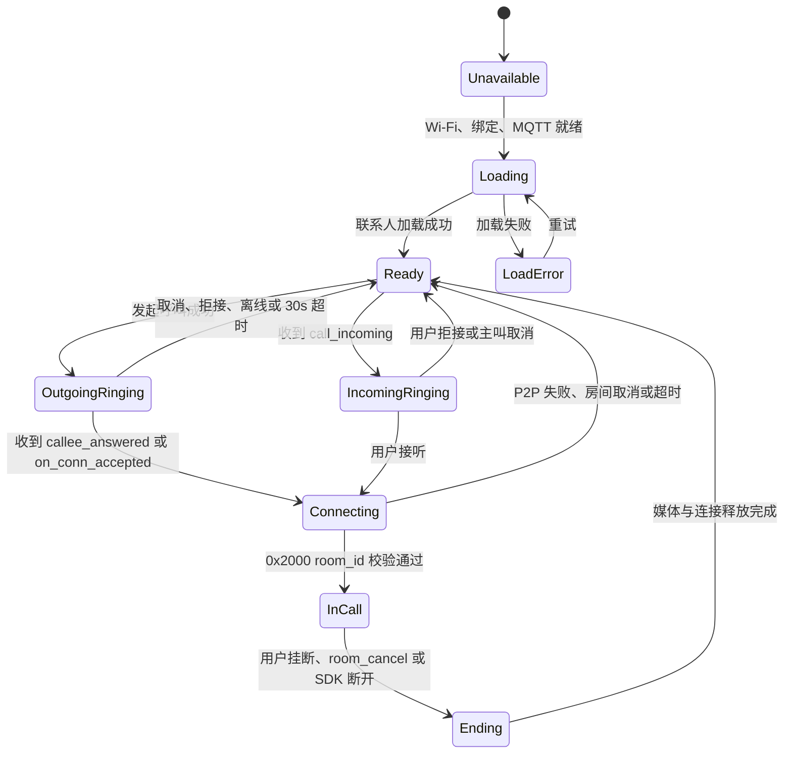

# 设备呼叫 UI 设计蓝图

版本：v1.0-draft
目标设备：ESP32-S3，320 x 240 横屏触摸屏
业务基线：ThingConnect `device-sim-c` / `device-sim-py` 设备间 P2P 呼叫流程
设计状态：v1 已被 `DEVICE_CALL_BUSINESS_AND_WIREFRAME_V2_CN.md` 的业务复核与 320 x 240 线框替代，保留本文件仅供变更对照

官方依据：

- [C 设备呼叫参考实现](https://github.com/tangeai/tirtc-server-example/tree/main/thing-connect/device-sim/device-sim-c)
- [C P2P 连接模块](https://github.com/tangeai/tirtc-server-example/blob/main/thing-connect/device-sim/device-sim-c/src/tirtc_call.c)
- [C 呼叫业务状态机](https://github.com/tangeai/tirtc-server-example/blob/main/thing-connect/device-sim/device-sim-c/src/call_session.c)
- [ThingConnect API Reference](https://github.com/tangeai/tirtc-server-example/blob/main/thing-connect/api-reference.md)

## 1. 设计结论

设备呼叫应用重新设计，不继承旧版“本地联系人 + pair_key + 设备密钥二维码”的业务模型。

本轮确认以下原则：

1. 设备呼叫与微信呼叫是两个独立应用。
2. 设备呼叫使用 ThingConnect 设备联系人、Call Server、MQTT `channel=device` 和 `TiRtcConnect`。
3. 微信呼叫继续使用微信授权联系人和 `TiRtcWhipConnect`，本设计不修改微信页面。
4. 联系人来自服务端，设备端不保存另一台设备的 `device_secret_key`。
5. 二维码内容是公开的 12 位 `device_id` 原文，不使用 JSON，也不得携带密钥。
6. 第一阶段只交付双向音频呼叫；`call_type=video` 保留在协议层，不进入第一版 UI。
7. 设备呼叫首页直接展示联系人列表，不再先展示“添加联系人 / 联系人列表 / 大二维码”菜单。
8. 连接确认与媒体启动分离：收到匹配房间的 `0x2000` 后才显示“通话中”并启动媒体。

## 2. 官方业务流程

### 2.1 主叫

```text
联系人列表
-> 选择在线设备
-> POST /v1/call/request
-> 获得 room_id
-> 显示“正在呼叫”
-> 收到 callee_answered
-> 显示“对方已接听，正在连接”
-> on_conn_accepted 仅保存 hconn
-> 收到 0x2000 {room_id}
-> 校验 room_id
-> 启动双向音频
-> 显示“通话中”
```

主叫不调用 `TiRtcConnect()`。

### 2.2 被叫

```text
收到 MQTT call_incoming(channel=device)
-> 显示来电页
-> 用户接听
-> POST /v1/call/device/info
-> 获得连接 token
-> TiRtcConnect(caller_id, token)
-> 失败重试时 TiRtcConnect(caller_id, NULL)
-> connect callback 成功
-> 发送 0x2000 {room_id}
-> 启动双向音频
-> 显示“通话中”
```

### 2.3 结束

```text
响铃阶段主叫取消 -> POST /v1/call/cancel
来电阶段被叫拒接 -> POST /v1/call/reject
通话阶段任一方挂断 -> POST /v1/call/hangup + TiRtcDisconnect
收到 room_cancel / SDK disconnected -> 停止媒体并回到联系人列表
```

`0x2001` 暂不作为产品主流程。当前公开 C/Python 参考实现以 Call Server 房间通知和 SDK 断开完成挂断闭环。

## 3. 产品对象

| 对象 | 核心字段 | UI 用途 |
| --- | --- | --- |
| 本机设备 | `device_id`、在线状态 | 分享设备码、鉴权状态 |
| 设备联系人 | `device_id`、`remark`、`online`、`source` | 联系人列表和呼叫目标 |
| 呼叫房间 | `room_id`、`caller`、`answered_by`、`call_type` | 保证呼叫事件属于同一会话 |
| P2P 连接 | `hconn`、连接状态 | 决定何时允许发送媒体 |
| 音频会话 | 麦克风静音、扬声器音量、收发帧 | 通话控制和运行反馈 |

## 4. 状态机



### 4.1 UI 状态定义

| 状态 | 用户看到 | 允许操作 | 禁止操作 |
| --- | --- | --- | --- |
| `UNAVAILABLE` | 网络或绑定未就绪 | 返回、进入设置 | 呼叫、添加联系人 |
| `LOADING` | 联系人骨架或加载提示 | 返回 | 重复刷新、呼叫 |
| `READY` | 联系人列表 | 呼叫、刷新、添加 | 无 |
| `OUTGOING_RINGING` | 正在呼叫对方 | 取消 | 再次呼叫 |
| `INCOMING_RINGING` | 来电身份、接听、拒接 | 接听、拒接 | 进入其他应用 |
| `CONNECTING` | 对方已接听，正在建立连接 | 挂断 | 媒体控制 |
| `IN_CALL` | 时长、静音、音量、挂断 | 通话控制 | 返回联系人而不挂断 |
| `ENDING` | 正在结束 | 无 | 重复挂断 |
| `ERROR` | 可理解的失败原因 | 返回、重试 | 显示底层错误码给普通用户 |

## 5. 页面架构

导航模型采用单栈结构：

```text
主页
-> 设备呼叫 / 联系人
   -> 添加设备
      -> 扫码
      -> 发送申请结果
   -> 我的设备码
   -> 呼出页
   -> 来电页
   -> 连接页
   -> 通话页
```

设备呼叫应用共 6 个页面、若干状态变体。

## 6. 页面详细设计

### DC-01 联系人首页

**职责**：查看设备联系人并发起呼叫。

**首屏布局**：

```text
┌──────────────────────────────────────┐ 0..31
│ ‹          设备呼叫        ＋   ↻   │
├──────────────────────────────────────┤
│ ● 客厅设备                 [呼叫]   │
│   TIR588XN352C · 在线                │
├──────────────────────────────────────┤
│ ○ 门口设备                 [呼叫]   │
│   TIRH88RRZZ2W · 离线                │
├──────────────────────────────────────┤
│ ● TIRXXXXXXXX              [呼叫]   │
│   刚刚在线                           │
└──────────────────────────────────────┘ 239
```

**布局尺寸**：

- 顶栏：`x=0 y=0 w=320 h=32`。
- 内容左右边距：8 px。
- 联系人行：`w=304 h=60`，最多首屏显示 3 行。
- 行间距：4 px。
- 呼叫按钮触摸区域：至少 `56 x 40`。
- 下拉或拖动滚动，滚动条默认隐藏，拖动时显示。

**联系人行内容优先级**：

1. `remark`，为空时显示 `device_id`。
2. `device_id`。
3. 在线状态。
4. 呼叫按钮。

**状态变体**：

- `Loading`：显示 3 行稳定高度骨架，不改变布局。
- `Empty`：居中显示“暂无设备联系人”，下方显示“添加设备”。
- `Offline`：联系人保留显示，呼叫按钮禁用，点击给出“对方当前离线”。
- `ServiceError`：保留上次缓存，顶栏下显示窄错误条“联系人更新失败”。
- `Unavailable`：显示“请先连接网络并完成设备绑定”，提供“去设置”。

**交互**：

- 点击联系人主体：进入简要详情弹层，不直接呼叫。
- 点击呼叫图标：直接发起音频呼叫。
- 点击 `＋`：进入 DC-02 添加设备。
- 点击刷新图标：重新拉取服务端联系人。
- 长按联系人：第一版不提供删除。当前设备侧官方接口没有删除联系人能力。

### DC-02 添加设备

**职责**：通过设备 ID 发起联系人申请。

```text
┌──────────────────────────────────────┐
│ ‹             添加设备              │
├──────────────────────────────────────┤
│ 设备 ID                              │
│ [ TIR___________________________ ]   │
│                                      │
│ [ 扫码识别 ]      [ 我的设备码 ]    │
│                                      │
│ [          发送联系人申请          ]│
└──────────────────────────────────────┘
```

**规则**：

- 只输入 `device_id`。
- 不显示、不扫描、不保存 `device_secret_key` 或 `pair_key`。
- 输入页面复用现有全屏键盘，但输入框和键盘不得遮挡。
- 自己的 `device_id` 禁止提交。
- 同账号设备返回 `accepted` 时提示“已添加联系人”。
- 跨账号返回 `pending` 时提示“申请已发送，等待对方确认”。
- 当前服务端没有设备侧待审批列表，跨账号审批先由 Web/H5 完成。

**二维码识别格式**：

```text
TIR588XN352C
```

正式格式为 12 位设备 ID 原文。扫描兼容旧版 JSON 时只读取 `device_id`，忽略 `device_secret_key`，且不落盘。

### DC-03 我的设备码

**职责**：让另一台设备获取本机公开设备 ID。

- 全屏白底二维码，二维码内容只编码 12 位 `device_id` 原文。
- 二维码下方显示完整的本机 12 位设备 ID。
- 呼叫首页点击二维码进入全屏，再次点击全屏二维码退出。
- 除设备 ID 外，全屏页不追加其他字段或说明文字。
- 不展示设备密钥、MQTT token、TiRTC token。

### DC-04 呼出 / 连接页

同一页面使用两个状态变体，避免页面跳动。

**Ringing 变体**：

```text
┌──────────────────────────────────────┐
│                呼叫                 │
│                                      │
│             客厅设备                │
│          TIR588XN352C                │
│             正在呼叫…               │
│                                      │
│ [              取消                ]│
└──────────────────────────────────────┘
```

**Connecting 变体**：

- 主标题不变。
- 状态文字变为“对方已接听”。
- 次级状态为“正在建立安全连接…”。
- 取消按钮变为“挂断”。
- 不显示麦克风、扬声器和时长。

**时序规则**：

- `POST /v1/call/request` 成功才进入 Ringing。
- `callee_answered` 只进入 Connecting，不进入通话。
- `on_conn_accepted` 只更新连接状态，不启动媒体。
- 收到匹配 `room_id` 的 `0x2000` 才进入 DC-06。
- 30 秒无人接听自动取消并返回联系人页。

### DC-05 来电页

来电属于高优先级全屏状态，不使用普通小弹窗。

```text
┌──────────────────────────────────────┐
│                 来电                │
│                                      │
│             门口设备                │
│          TIRH88RRZZ2W                │
│              音频呼叫               │
│                                      │
│ [     拒绝     ]   [     接听     ] │
└──────────────────────────────────────┘
```

**交互**：

- 接听：按钮立即禁用，进入 Connecting，后台请求 token 并执行 `TiRtcConnect()`。
- 拒绝：调用 `/v1/call/reject`，显示“已拒绝”后返回原页面。
- 收到 `room_cancel`：立即关闭来电页并提示“对方已取消”。
- 设备正处于其他通话：默认显示新来电但不自动接听；用户接听意味着切换房间，界面需二次确认。

### DC-06 通话页

**职责**：展示已确认建立的音频通话，并提供最少但完整的控制。

```text
┌──────────────────────────────────────┐
│                通话                 │
│ 客厅设备                 00:18       │
│ TIR588XN352C             已连接      │
├──────────────────────────────────────┤
│ 麦克风       [静音]   输入  62       │
│ 扬声器       [ − ]     70    [ + ]   │
├──────────────────────────────────────┤
│ [              挂断                ]│
└──────────────────────────────────────┘
```

**规则**：

- 时长从 `0x2000` 校验成功后开始，不从 HTTP 请求成功或 `on_conn_accepted` 开始。
- 麦克风默认开启；静音是明确的开关状态。
- 扬声器音量使用减号、数值、加号步进器。
- 麦克风输入增益作为次要数值，不把“增益”和“静音”混成一个按钮。
- 第一版固定全双工对讲，不显示“对讲机 / 实时对讲”模式切换。
- 点击系统返回等同于挂断，需要先完成连接和媒体释放，再回联系人页。
- 收到 `room_cancel`、`on_disconnected` 或致命媒体错误时自动进入 Ending。

### DC-07 结果与错误反馈

错误尽量使用联系人页上的非阻塞结果条；只有需要用户选择时才使用对话框。

| 业务结果 | 用户文案 | 返回位置 |
| --- | --- | --- |
| 对方离线 `40201` | 对方当前离线 | 联系人页 |
| 非联系人 `40205` | 还不是设备联系人 | 添加设备页 |
| 已在其他房间 `40202` | 正在恢复上次通话 | 房间恢复流程 |
| 对方拒接 | 对方已拒绝 | 联系人页 |
| 30s 超时 | 暂时无人接听 | 联系人页 |
| 房间不存在 `40400` | 通话已结束 | 联系人页 |
| 已被其他设备接听 `40210` | 来电已由其他设备接听 | 原页面 |
| P2P 全部重试失败 | 连接失败，请稍后重试 | 联系人页 |
| 网络断开 | 网络连接已断开 | 联系人页 / 设置入口 |
| 音频设备失败 | 音频设备不可用 | 通话页后退出 |

底层错误码保留在调试页和日志中，不直接展示给普通用户。

## 7. 页面跳转规则

1. 设备呼叫应用内所有二级页面返回联系人首页，不返回系统主页。
2. 来电页可以覆盖任何普通页面，但不能覆盖 OTA 安装等不可中断操作。
3. 通话过程中禁止进入摄像头扫码、OTA、AI 对讲和微信呼叫。
4. 退出设备呼叫应用前，如存在房间或连接，必须先完成挂断和资源释放。
5. 应用切回前台时调用 `/v1/call/room` 做崩溃或重启恢复。

## 8. 视觉规范

延续现有 S3 Figma 风格，但重新组织业务结构。

| Token | 值 | 用途 |
| --- | --- | --- |
| 页面背景 | `#EAF4F8` | 全局浅蓝背景 |
| 表面 | `#FFFFFF` | 联系人行、输入区 |
| 主文字 | `#10243E` | 标题和主要信息 |
| 次文字 | `#64758A` | 设备 ID、说明 |
| 主操作 | `#21C783` | 接听、呼叫、确认 |
| 主操作按下 | `#18A96D` | 按压反馈 |
| 危险操作 | `#F15A5A` | 拒绝、挂断 |
| 等待状态 | `#F2A93B` | 呼叫中、连接中 |
| 禁用 | `#C8D3DE` | 离线和不可用按钮 |
| 描边 | `#D6E4EF` | 列表和输入框 |

统一约束：

- 圆角最大 8 px。
- 按钮按下时下移 1 px，阴影缩短，不能通过改变尺寸造成布局抖动。
- 图标使用 PNG 位图，不使用临时 SVG 或字符图标。
- 固定中文 UI 文案从 Figma 导出透明 PNG。
- 动态设备 ID、时间、数值使用字体渲染。
- 动态联系人备注使用现有 AI 对讲中文字库；缺失字符以英文句点 `.` 替代。
- 触摸目标最小 40 x 40 px。
- 所有长文本单行省略，但设备 ID 必须保留完整查看入口。

## 9. PNG 资源清单

建议目录：

```text
main/ui/image/call/
├── icons/
│   ├── back.png
│   ├── add.png
│   ├── refresh.png
│   ├── phone.png
│   ├── phone_incoming.png
│   ├── phone_hangup.png
│   ├── microphone.png
│   ├── microphone_off.png
│   ├── volume_down.png
│   ├── volume_up.png
│   ├── online.png
│   └── offline.png
└── text/
    ├── title_device_call.png
    ├── title_add_device.png
    ├── title_incoming_call.png
    ├── title_calling.png
    ├── title_in_call.png
    ├── action_answer.png
    ├── action_reject.png
    ├── action_cancel.png
    ├── action_hangup.png
    └── status_connecting.png
```

Figma 导出后需生成 manifest，记录节点 ID、尺寸、SHA256 和代码变量名。

## 10. Figma 帧与组件清单

### Frames

- `Call / Contacts / Loaded`
- `Call / Contacts / Loading`
- `Call / Contacts / Empty`
- `Call / Contacts / Unavailable`
- `Call / Add Device / Input`
- `Call / Add Device / Pending`
- `Call / QR / Scan`
- `Call / QR / My Device`
- `Call / Outgoing / Ringing`
- `Call / Outgoing / Connecting`
- `Call / Incoming / Audio`
- `Call / Active / Audio`
- `Call / Active / Muted`
- `Call / Result / Rejected`
- `Call / Result / Timeout`
- `Call / Result / Failed`

### Components

- `CallHeader`
- `ContactRow`
- `OnlineIndicator`
- `CallActionButton`
- `CallPeerIdentity`
- `CallStateMessage`
- `VolumeStepper`
- `MicrophoneToggle`
- `CallResultBanner`
- `ConfirmDialog`

## 11. 调试页先行

在固件 UI 接入前，设备调试页必须能独立驱动所有业务动作：

- 获取联系人。
- 添加联系人。
- 发起音频呼叫。
- 接听、拒接、取消和挂断。
- 查看 `room_id`、角色、业务状态、TiRTC 状态和音频收发帧。
- 注入或观察 `call_incoming`、`callee_answered`、`room_cancel`、`call_reject`。
- 明确显示 `on_conn_accepted` 与 `0x2000` 的先后顺序。
- `0x2000` 前音频 TX/RX 必须为 0。

调试页验证通过后，设备 UI 只订阅同一状态快照并发送用户 intent，不直接调用 HTTP、MQTT 或 TiRTC SDK。

## 12. 验收标准

### 业务验收

1. A 呼 B、B 呼 A 均可接通。
2. 呼叫、取消、拒接、无人接听、挂断均能回到联系人页。
3. 第二次、第三次呼叫不需要重启设备。
4. 连续完成 10 轮双向呼叫，无死机、无 stale room。
5. `0x2000` 前无麦克风采集、无音频发送。
6. 通话建立后双方均有音频 TX、RX 和扬声器输出。
7. 微信呼叫和设备呼叫互不污染联系人、状态和媒体资源。

### UI 验收

1. 所有 Figma 帧为 320 x 240。
2. 所有按钮文字、图标和动态内容不重叠。
3. 离线联系人不能误触呼叫。
4. 来电页在 100 ms 内可见，按钮可点击。
5. 页面返回符合应用栈，不会误回系统主页。
6. 固定中文与 Figma PNG 像素一致。

## 13. 暂缓项

- 视频通话 UI 和摄像头资源竞争。
- 设备端联系人删除：当前官方设备 API 未提供删除接口。
- 设备端跨账号待审批列表：当前设备 API 未提供 pending 列表。
- 多被叫同时响铃的群呼 UI。
- 通话记录与未接来电历史。

这些能力需要先补齐服务端契约，再进入页面设计，不能在固件里本地伪造。

## 14. 设计门禁

进入 Figma 前需要确认：

1. 第一版是否确定为纯音频呼叫。
2. 联系人首页是否确定为设备呼叫应用的第一屏。
3. 跨账号联系人审批是否保持在 Web/H5。
4. 已确认移除旧版 `pair_key`、联系人密钥二维码、本地联系人持久化和本地联系人删除。

当前固件实现已按该结论收口：添加联系人只提交 `device_id`，列表只读云端快照；设备端不再伪造本地添加或删除结果。

---

```yaml
orchestration_decision_package:
  current_stage: Skill2
  operating_mode: change_request
  workflow_scope: full_pipeline
  user_input_summary: 以官方 ThingConnect 设备呼叫流程为基线，废弃旧业务假设，重新设计独立设备呼叫 UI
  route_to_skill: Skill2
  workflow_progress:
    stage_sequence:
      - stage: Skill0
        expected_artifact: intent_package
        status: confirmed
      - stage: Skill1
        expected_artifact: meta_function_package
        status: confirmed
      - stage: Skill2
        expected_artifact: design_blueprint_package
        status: produced
      - stage: Skill3
        expected_artifact: preview_prompt_pack
        status: pending
      - stage: Skill4
        expected_artifact: figma_build_package
        status: pending
    active_stage: Skill2
    active_stage_goal: 确认设备呼叫页面范围、状态体验和页面流
    waiting_for_user: true
    waiting_for:
      - 纯音频第一版确认
      - 联系人首页作为第一屏确认
      - 移除 pair_key 和设备密钥二维码确认
    next_stage_if_confirmed: Skill3
    completion_state: waiting_user
  next_action: 确认蓝图后制作 320x240 全状态视觉预览，再构建 Figma 帧和组件
```
