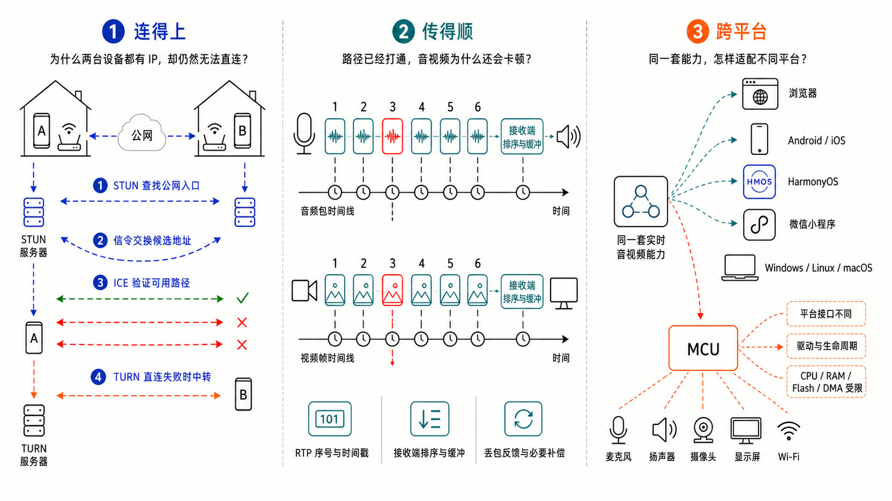
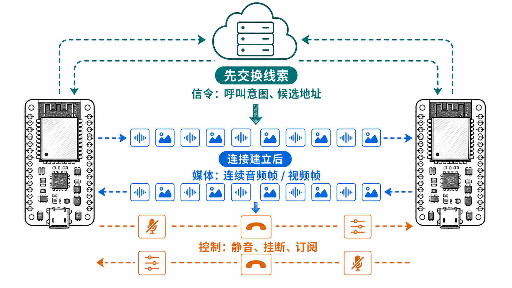
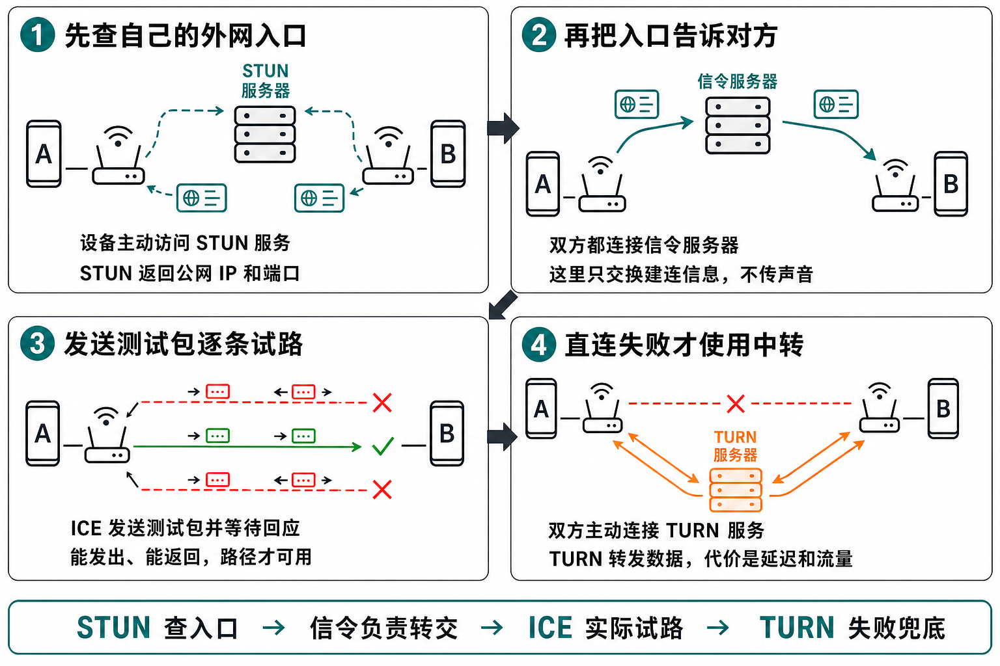
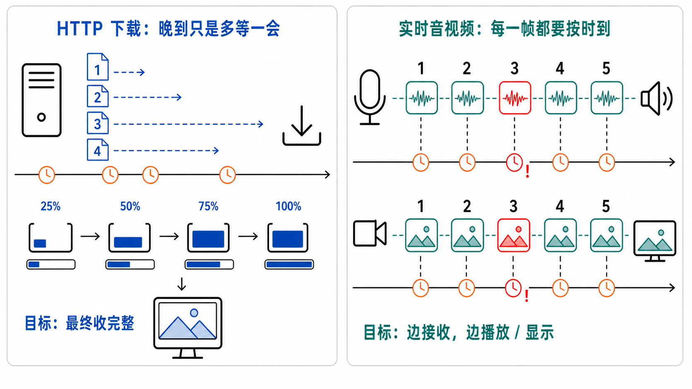
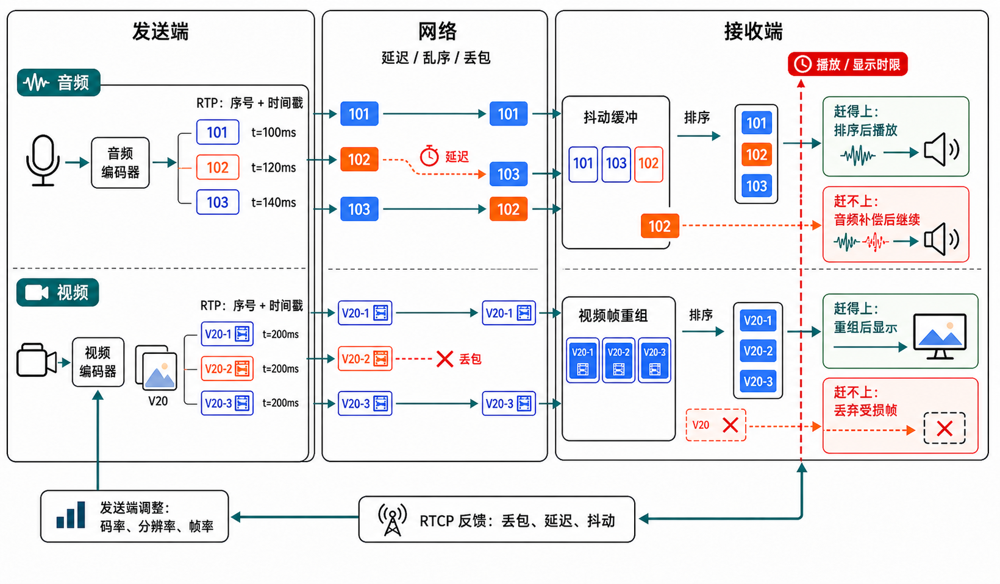
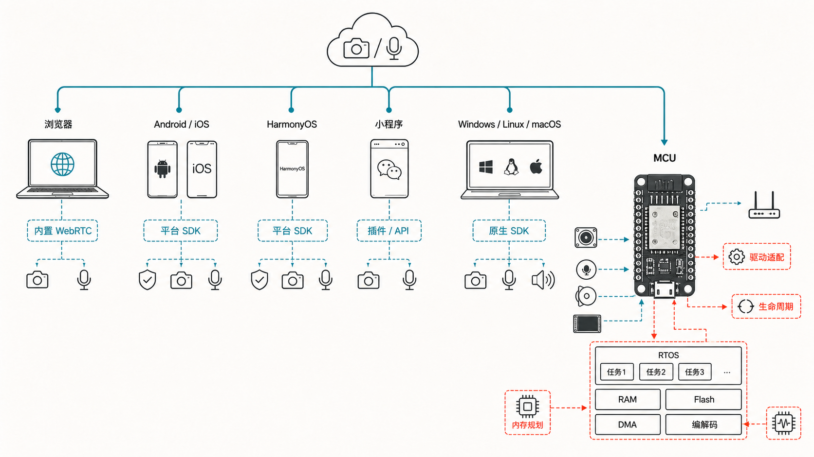
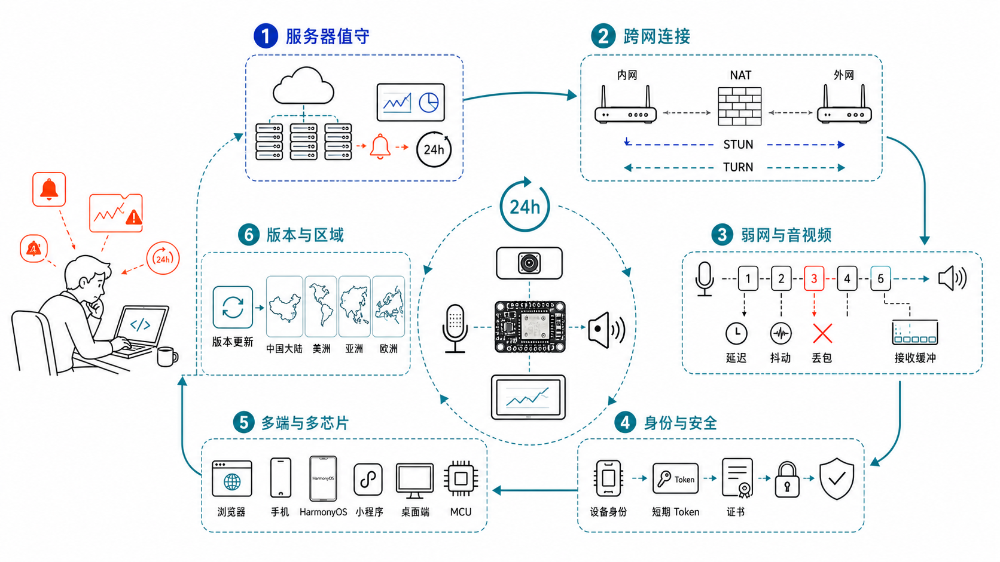
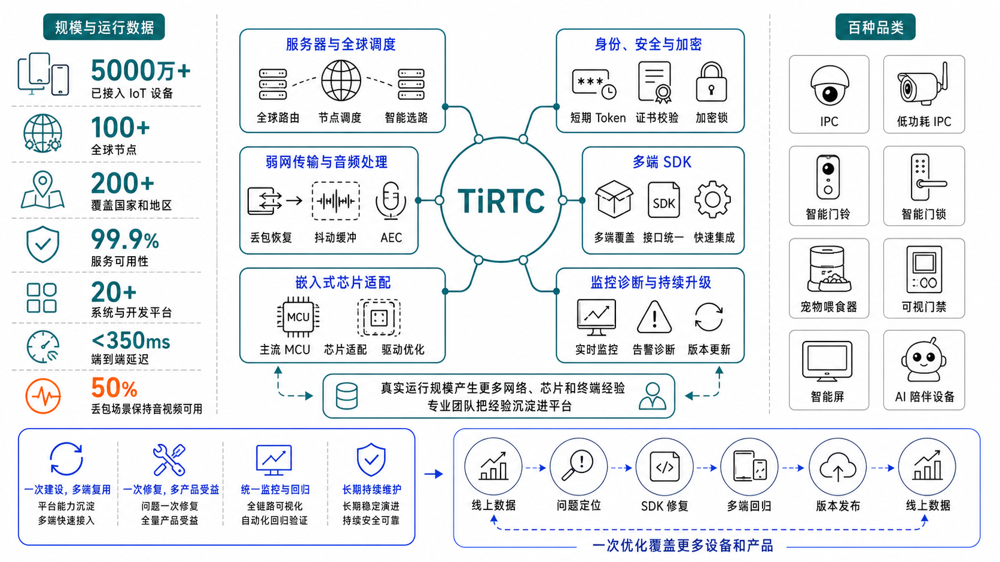
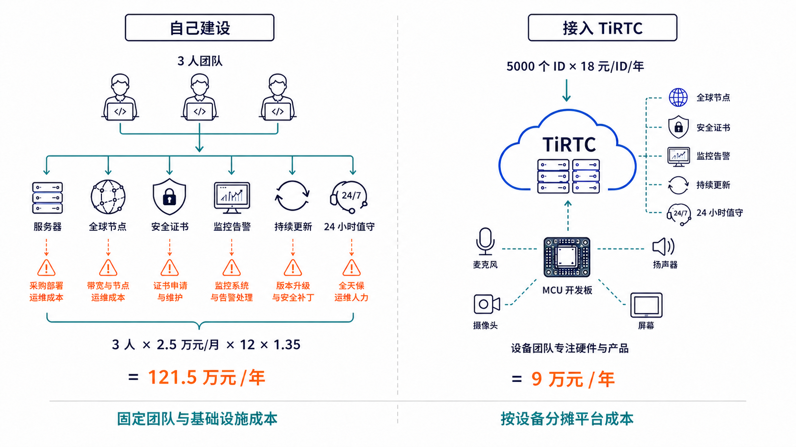
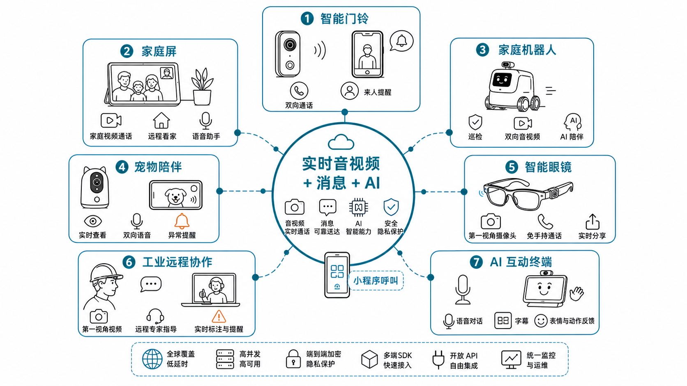

# 第一章：WebRTC 是什么

刚烧录好一块开发板，屏幕显示已经连上 Wi-Fi，还拿到了 IP 地址。很多人这时会冒出同一个想法：

> 另一台设备也有 IP，把两个地址互相填进去，不就能说话了吗？

这个想法只碰到了第一个问题。一套实时通信真正可用，要连续过三道关：

1. **连得上：** 两台设备可能藏在不同的路由器后面，需要找到一条双方都能走通的网络路径。
2. **传得顺：** 路径打通后，音视频还要连续、及时地送到，不能像下载文件一样慢慢等齐。
3. **跨平台：** 同一套能力还要落到网页、手机和嵌入式设备上，尤其要适应 MCU 的处理器、内存和硬件接口。

“拿到 IP”只说明设备已经接入网络。能否找到对端、音视频能否准时到达、目标硬件能否稳定运行，是三个不同的问题。

WebRTC 的全称是 Web Real-Time Communication，也就是网页实时通信。按照 [W3C WebRTC 标准](https://www.w3.org/TR/webrtc/)，它为浏览器提供连接远端、发送和接收音视频、传输数据的接口，并配合网络穿透机制寻找可用路径。

下面先解决前两道关：为什么两台设备明明都有 IP，却不一定能互相访问；路径打通以后，音视频又为什么不能照搬普通文件下载。第三道关再回到 MCU，看看怎样把这些能力真正接进设备。

## 第一道关：有 IP，为什么还是进不了对方的家门

假设设备 A 的地址是 `192.168.1.20`，设备 B 的地址是 `192.168.31.15`。

这两个地址只在各自的局域网里有效。不同家庭可以同时有许多个 `192.168.1.20`，互联网看见这个地址，并不知道你说的是哪一台设备。

家庭路由器还会执行 NAT，也就是把内网地址临时映射成公网地址和端口。端口可以理解成同一个公网地址下的数字入口：

- A：`192.168.1.20:40000` 对应 `203.0.113.8:53001`
- B：`192.168.31.15:41000` 对应 `198.51.100.26:62004`

这个入口通常要等设备先向外发包才会建立。外部数据如果找不到匹配的映射，路由器不知道该转给哪台内网设备，通常直接丢弃。

映射还不固定。设备换 Wi-Fi，公网 IP 会变；路由器重启，端口可能会变；长时间没有数据，旧映射也可能被回收。今天抄下来的公网地址，明天未必还能用。

所以系统要分别解决两件事：先确认“你要找哪台设备”，再根据双方此刻的网络寻找一条能走通的路。WebRTC 负责后面的连接和媒体能力；设备身份、在线状态以及“谁能呼叫谁”，要由产品自己的业务来决定。

### WebRTC 先交换线索，再一条条试路

设备 A 想呼叫设备 B 时，两边还没有可以直接传数据的连接。A 不能先把自己的网络地址发给 B，因为“怎么把这条消息送到 B”本身就是尚未解决的问题。

更实际的做法是：A 和 B 都先连接一台公网可访问的业务或信令服务器。服务器根据设备身份找到 B，再把 A 的呼叫请求和建连信息转给它。这个阶段传递的是“谁要连接谁、双方支持什么、可以尝试哪些网络地址”，还不是连续的音视频数据。

图里的三条线发生在不同阶段，也不一定使用相同的传输通道：

- **信令先走：** 通过双方都能访问的服务器交换呼叫请求、会话能力和候选地址。它负责促成连接，不负责持续搬运音视频。
- **媒体后走：** 找到可用路径以后，音频帧或视频帧才沿着选中的媒体路径持续发送。
- **控制按需发送：** 静音、挂断、订阅变化等命令由产品或 SDK 定义。它们可以复用业务信令，也可以走已经建立的数据通道，并不是 WebRTC 规定的一套固定页面流程。

WebRTC 规定了连接怎样协商和验证，但不限制信令的传递方式。产品可以选择 HTTP、WebSocket 或 MQTT，把呼叫请求和建连信息可靠地送到双方；真正的音视频不会持续走这条信令链路。

随后，A 和 B 开始找路。整个过程就是：查入口、互换入口、实际试路，直连失败时再中转。

1. **查自己的外网入口：** 设备主动访问一个公网服务，请它回答：“互联网看到我是哪个 IP 和端口？”这个服务叫 **STUN**。
2. **把入口交给对方：** 双方还没有直连，只能先把这些可能可用的地址交给一台双方都能访问的公网服务器，再由它转发给对方。这台负责传话的服务器叫 **信令服务器**。
3. **逐条试一遍：** 拿到对方的地址后，设备会实际发送测试数据。能够发过去，也能收到回应，才算找到一条可用路径。这个试路过程叫 **ICE**。
4. **直连不通就中转：** 如果试过的路径都不通，双方就各自连接一台中继服务器，后续数据由它转发。这个中继服务叫 **TURN**。

前三步优先寻找直连路径；直连失败时，才由 TURN 中转。路径确定后，才进入持续传输音视频的阶段。

## 第二道关：数据还要赶上播放时限

实时媒体有一个专业概念：**播放时限（playout time）**。每段音频、每帧视频都有一个“最晚还能用”的时间。数据在时限前到达，可以整理后输出；过了时限才到，即使内容完整，也已经跟不上当前对话。[RFC 8451](https://www.rfc-editor.org/rfc/rfc8451.html)把这类迟到的数据视为无用数据。

HTTP 下载关心文件最终是否完整。实时音视频还要受**端到端延迟预算**约束：采集、编码、网络传输、接收缓冲和解码显示都要在有限时间内完成。

WebRTC 围绕这个时限处理媒体数据：

- **RTP：给媒体包标明位置和时间。** [RTP 标准](https://www.rfc-editor.org/rfc/rfc3550.html)为包提供序号和时间戳。序号告诉接收端“前面是否少了一包”，时间戳告诉它“这段媒体原本该在什么时候播放或显示”。RTP 通常由 UDP 承载，因此旧包迟到时，后面的新包仍可继续前进。
- **接收缓冲：用很短的等待吸收网络抖动。** 音频包先进入抖动缓冲，视频包先重组成完整视频帧。早到的包等一会，乱序的包重新排好，然后按照媒体时钟输出。
- **RTCP：把网络情况反馈给发送端。** [WebRTC 的 RTP 规范](https://www.rfc-editor.org/rfc/rfc8834.html)允许接收端报告丢包，发送端再判断是否重传、增加冗余或降低码率。视频还可以降低分辨率、帧率，或者请求新的关键帧。只有能赶上播放时限的数据，才值得补发。

以音频包 `102` 为例：它虽然比 `103` 晚到，只要赶在播放时限前进入缓冲区，接收端仍会按 `101、102、103` 的顺序播放。已经迟到的包会被丢弃，接收端通常用**丢包隐藏（PLC）**补一小段近似音频，再继续播放 `103`，不会为了旧包停住整段通话。

视频的处理略有不同。一帧画面可能拆成多个 RTP 包；少了其中一包，整帧都可能无法解码。时间还来得及时，可以请求重传；已经赶不上时，就丢掉受损帧，必要时请求关键帧，让后续画面尽快恢复。

缓冲区也不能一味加大。[RFC 7005](https://www.rfc-editor.org/rfc/rfc7005.html)对抖动缓冲的描述很直接：缓冲可以吸收网络延迟变化，但等待越久，端到端延迟越高。WebRTC 要做的是在延迟预算内维持音频连续、画面可用，而不是收齐每一个旧包。

## 第三道关：跨平台适配，尤其是 MCU

浏览器已经内置了 WebRTC 运行环境。网页通过 JavaScript 调用摄像头、麦克风和远端音视频接口，就能完成一次基础通话。

真实项目往往不会只停在浏览器。接下来还要支持 Android、iOS、HarmonyOS、小程序、Windows、Linux、macOS，以及不同芯片和开发板。通信目标相同，底层环境却完全不同：

- 摄像头、麦克风和扬声器的接口不同；
- 权限、线程、时钟、网络栈和编解码器不同；
- 操作系统、芯片或驱动升级后，每个平台都要重新验证。

这类工作叫**平台适配**。工程上通常用平台抽象层和硬件抽象层隔开差异，让上层继续使用统一的连接、采集、发送、接收和播放接口。难点不只是第一次接通，而是后续每增加一个平台、换一块板卡或升级一次 SDK，都要继续维护。

MCU 的压力最大。它没有浏览器运行时，内部 RAM、Flash、CPU 和 DMA 空间都有限，还要同时运行 Wi-Fi、音视频、UI 和业务。任务放在哪里、缓冲区开多大、回调能否阻塞、硬件何时初始化和释放，都会直接影响稳定性。

所以第三道关真正要解决的是：**同一套实时通信能力，怎样在不同平台上稳定运行，并且长期维护得住。**

## 要做好实时通信，开发和维护工程量很大很复杂，要怎么办呢？

前面的三道关拼在一起，已经是一套需要长期运行的**实时通信基础设施**。第一次接通只是开始。产品交付以后，服务器、网络、系统和芯片仍在变化，任何一层出问题，用户看到的都可能是同一个结果：连不上、卡顿、无声或突然断开。

如果全部自建，后面接住的是一份没有明确下班时间的工作：

- **服务器必须全天在线。** 信令、设备在线入口、身份授权、STUN、TURN、监控和告警缺一不可。直连失败时，TURN 要替双方转发每一个媒体包；[TURN 标准](https://www.rfc-editor.org/rfc/rfc8656.html)明确提醒，中继服务需要高带宽，运营成本很高。容量不足会卡，节点故障会断，鉴权不严还可能被盗用流量。
- **弱网问题每天都不一样。** 家庭 Wi-Fi、蜂窝网、企业防火墙和跨运营商链路都会带来丢包、抖动、乱序和突发延迟。发送码率、重传、冗余、接收缓冲、音频处理和视频恢复要一起调，某个参数改错，可能只是把卡顿换成更长的延迟。
- **安全问题出一次就够疼。** 长期密钥泄露可能让陌生端冒充设备或越权连接；证书过期、证书链变化和加密库升级又会让正常设备突然连不上。密钥存储、短期授权、证书校验、轮换和审计都要长期维护。
- **跨国部署不是多开几台服务器。** 节点离用户太远会直接增加往返时间。还要处理地区网络差异、运营商路由、故障切换、容量调度和区域部署。一个地区表现正常，不代表另一个地区也能稳定使用。
- **平台越多，回归矩阵越大。** Web、Android、iOS、HarmonyOS、小程序、桌面系统和 MCU 的网络栈、权限、编解码、音频设备与生命周期都不同。浏览器、操作系统、芯片 SDK 或驱动升级后，旧功能也可能重新出问题。
- **线上故障必须能定位、能回退。** 只有“连接失败”四个字远远不够。还要持续采集建连耗时、路径、丢包、抖动、码率、缓冲水位和错误阶段，并准备灰度发布、兼容策略和版本回滚。否则最难受的场景往往发生在设备已经交付以后，现场只有一句“昨天还能用”。

这些工作大多与某一款门铃、摄像头或机器人无关，却会在每个项目里重复出现。单个项目独立建设，既要先付出服务器、协议和多端 SDK 的固定成本，以后还要长期养运维、安全、音视频和嵌入式团队；产品数量越多，重复投入越明显。

所以，这件事天然适合由一家公司集中运营：把服务器、全球节点、协议、安全和多端 SDK 建成公共平台，用同一支团队长期维护，再让不同设备复用。固定成本被更多设备和产品分摊，线上问题也能在公共层修复一次，而不是让每个项目各自熬夜排查一遍。

### TiRTC 把共性工作集中起来

TiRTC 做的正是这层集中建设。它把设备在线入口、连接授权、跨网找路、中继、弱网音视频、多端 SDK、嵌入式适配和线上诊断放进同一套体系，并由一支同时理解设备、网络和云端的团队持续维护。

- **有真实规模支撑优化。** [官网](https://tange.ai/)披露已接入 **5000 万+ IoT 设备**，覆盖 **20+ 系统与开发平台、100+ 全球节点、200+ 国家和地区**，服务可用性为 **99.9%**。真实运行量会不断暴露家庭网络、运营商、芯片和终端组合里的边缘问题，这些经验可以沉淀回平台，而不是停留在某个项目的临时补丁里。
- **服务器和全球网络统一运营。** 平台维护在线入口、节点调度、跨网路径、必要的中继、容量与故障切换。设备接入后不用再单独建设一套 24 小时值守的 RTC 后台，也不用从零解决跨区域接入。
- **设备到云端由同一条链路排查。** 团队持续适配 MCU、RTOS、芯片、驱动和编解码器，也维护服务端和多端 SDK。连接、传输或播放异常时，可以沿同一条证据链定位，减少设备、App、云端彼此猜测。
- **安全是连接的默认组成。** [连接模型](https://docs.tange.ai/products/tirtc/guides/connection.html)用稳定的设备身份找到目标，再由业务服务端签发限时、限权的短期 `token`；[密钥管理要求](https://docs.tange.ai/products/tirtc/security/secret-management.html)则把长期密钥限制在设备或受控服务端。配合服务器身份校验和链路加密，可以降低设备冒充、越权访问、密钥泄露和内容窃听的风险。
- **优化和升级可以规模复用。** 官网给出的指标包括 **端到端延迟低于 350ms**，以及 **50% 丢包场景下保持音视频可用**。线上数据、问题定位、SDK 修复、多端回归和版本发布形成闭环，一次公共层优化可以覆盖更多设备和产品。
- **接入成本会随规模下降。** [官网](https://tange.ai/)列出的应用方向已经覆盖泛 IPC、智能穿戴、AI 玩具和机器人等场景。平台、工具链和适配经验可以被不同设备复用，新项目主要完成硬件和业务接入，不必重新支付从零建设整套 RTC 的成本。

#### 把账算开：以 5000 台设备为例

下面是一笔便于讨论的保守账，不是统一的人力报价。自建部分按 3 人小组估算，每人月薪 2.5 万元，再用 1.35 倍覆盖社保、办公和管理成本；这已经是一支很紧的队伍，还没有做到真正完整的 24 小时值守。

| 项目 | 计算方式 | 一年成本 |
| --- | --- | ---: |
| 自建最低人力 | 3 人 × 2.5 万元/月 × 12 个月 × 1.35 | 121.5 万元 |
| TiRTC 设备授权 | 5000 ID × 18 元/ID/年 | 9 万元 |
| 仅这两项的差额 | 121.5 万元 - 9 万元 | 112.5 万元 |

[TiRTC 公开定价](https://tange.ai/products/ti-rtc/pricing)显示，单次采购 5000 个 ID 的参考单价为 18 元/ID/年；每台已激活设备每月还包含 2 GB P2P Relay 中转流量和 10000 次 API 调用。换算下来，5000 台设备每月合计包含 10 TB 中转流量和 5000 万次 API 调用，最终价格与服务内容仍以订单或合同为准。

再看中继压力。假设只有 1% 的设备同时进入需要中继的会话，也就是 50 路；每路双向媒体按 512kbps 计算，连续运行一个月约产生 **8.3TB** 中继吞吐。这个数还没有加入流量突发、冗余容量、跨区域节点、监控存储和故障切换。自建时，它们都会继续落到账单和运维工作里。

这组数字不表示两种方案完全等价，但足以说明成本结构：平台授权按设备分摊，自建则先承担团队和基础设施的固定成本。即使只算 1 名同样口径的工程师，一年约 40.5 万元，也已经是上述 5000 台授权参考价的 4.5 倍。

这就是规模化分工的价值：TiRTC 负责重复、长期、需要持续投入的通信底座；设备工程继续负责麦克风、扬声器、摄像头、屏幕、AEC、驱动生命周期和产品交互。前者由一个平台统一运营更可靠，也更划算；后者才是每款设备真正需要做出差异的地方。

## 有了实时通信底座，还能做出什么

设备连上网络、接入 TiRTC 并完成音视频与消息收发以后，产品形态就不再局限于“打电话”。看、听、说、提醒、远程控制和 AI，可以与不同硬件继续组合：

- **智能门铃与看家摄像机：** Ring Video Doorbell 的实时画面和双向通话，说明“远程看见现场并立即说话”已经成为家庭安防的基础体验。
- **家庭屏与远程陪伴：** Echo Show 把视频通话、家庭摄像头画面和语音助手放在一块屏幕上；Enabot EBO 则把双向音视频、家庭巡检和 AI 互动装进可以移动的机器人。
- **宠物陪伴：** Furbo 360° Dog Camera 使用实时画面、双向音频、提醒和远程互动，让摄像头从“查看”变成“陪伴”。
- **智能眼镜与第一视角协作：** Ray-Ban Meta 支持免手持通话和视频通话；RealWear Navigator 把第一视角实时视频用于远程专家指导和工业协作。
- **AI 互动设备：** 音视频上行可以交给识别和多模态模型，下行返回语音、字幕、表情和动作，形成 AI 玩具、桌面助手、陪伴机器人和数字人终端。
- **小程序呼叫与多人业务：** 微信小程序可以呼叫设备；在设备身份、连接和媒体能力之上，还能继续组织设备对讲、家庭群聊、值班调度和多人协作。

上面的产品用于说明实时通信正在进入哪些设备形态，并不表示这些品牌使用了 TiRTC。
共同点是：底层都需要稳定连接、实时音视频、消息、安全和长期运维。通信底座准备好以后，
<strong>真正拉开差异的是硬件设计、产品能力和使用体验。</strong>

下一章进入[TiRTC 与快速体验](02_TIRTC_OVERVIEW_AND_EXPERIENCE_CN.md)：先解释设备身份、业务授权和三端分工为什么这样设计，再从连接 Wi-Fi、六位验证码绑定开始，逐步验证设备上线和实时应用。
