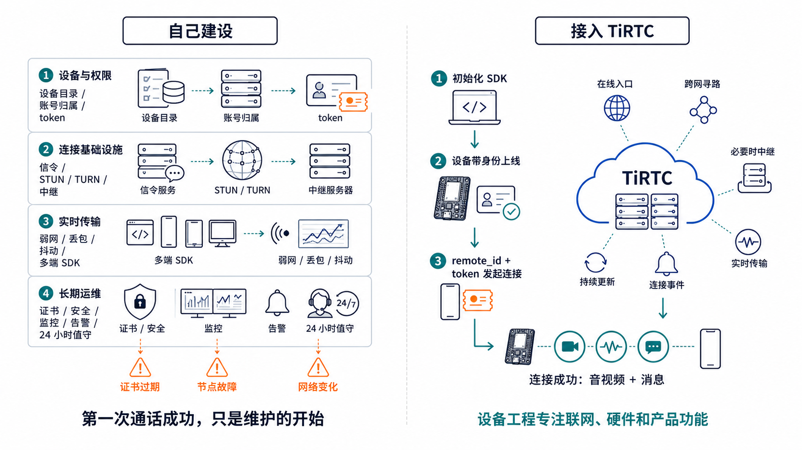
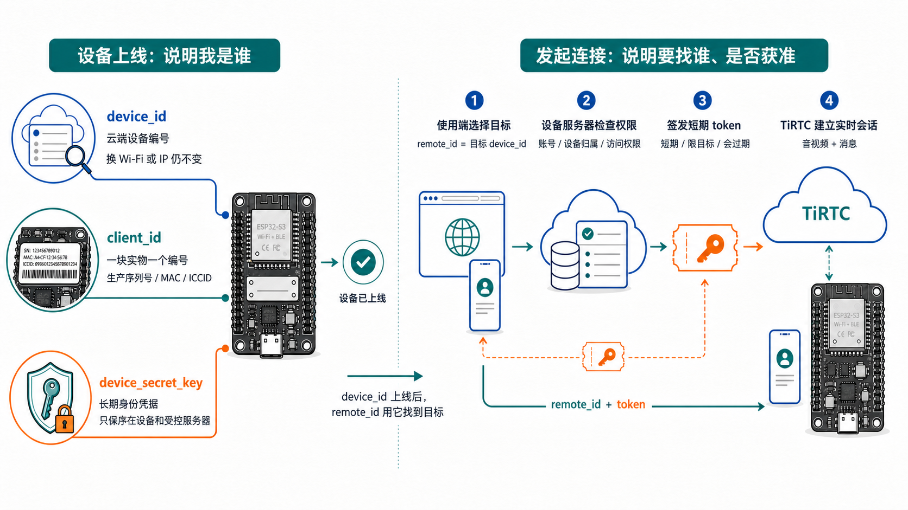

# 第二章：聊聊 TiRTC 的设计和体验

WebRTC 已经解决了网络穿透、连接协商和实时音视频传输，为什么设备接入时还需要 TiRTC？

原因很实际：WebRTC 关心的是两个通信端怎样建立连接，却不知道产品里“哪台设备属于谁”“网页要找哪台设备”“这次访问是否允许”。这些问题不在 WebRTC 标准的职责范围内，却是设备上线后每天都会遇到的事。

[W3C WebRTC 标准](https://www.w3.org/TR/webrtc/)定义了 `RTCPeerConnection`、SDP、ICE 和 RTP 等机制，但没有规定信令服务必须怎样实现。通信双方仍要通过 HTTP、WebSocket 或其他通道交换 Offer、Answer 和 ICE 候选地址。

如果直接从 WebRTC 开始做一款设备，团队还要自己补齐：

- 设备在线状态和设备目录
- SDP、ICE 候选地址的交换服务
- STUN、TURN 以及直连失败后的中继
- 断线重连、超时和协商冲突
- 账号、设备归属和访问权限
- Web、手机和 MCU 的分别适配

这些功能都能自己实现，但维护对象随之变成了一套长期在线的通信系统。网络环境会变，证书会过期，协议和操作系统也会升级，后续维护不会在第一次通话成功后结束。

## 精简的 TiRTC 流程

开发者只要让设备联网、初始化 TiRTC，并按业务提交连接参数，就能开始实现查看、对讲和呼叫。连接能否直达、何时需要中继以及音视频怎样持续传输，由 TiRTC 在底层处理。

按照官方的[连接设备](https://docs.tange.ai/products/tirtc/guides/connection.html)流程，把五个参数逐个看明白就行。

设备上线时需要准备三个参数：

1. **`client_id`：硬件的唯一编号。** 通常使用生产序列号、MAC 或 ICCID，用来区分每一块实物。
2. **`device_id`：设备在云端的编号。** 网页、手机或其他设备用它找到目标；更换 Wi-Fi 或 IP 后，这个编号仍然不变。
3. **`device_secret_key`：设备的长期身份凭据。** 它用来证明设备身份，只能保存在设备和受控服务器中。

发起连接时再准备两个参数：

4. **`remote_id`：这次要连接谁。** 发起连接时，填写目标设备的 `device_id`。
5. **`token`：本次连接的短期通行证。** 设备服务器检查权限后签发，过期后重新申请即可。

可以把整个过程记成一句话：设备先带着自己的编号和凭据上线，使用端再拿着“目标设备编号 + 临时通行证”发起连接。连接成功后，双方就能收发音视频和消息。

当然，你不需要把这些细节全部记住。我们已经把 TiRTC 接入流程整理成可由 AI 自动执行的 Skills；按照[使用 Skills 集成](https://docs.tange.ai/products/tirtc/get-started/skills-integration.html)说明你想实现的功能，AI 就能协助完成 SDK 接入、参数配置和基础验证。

## 快速验证整套流程

为了让开发者在业务后台尚未完成时也能先验证链路，我们准备了 [TiRTC 开发者平台](https://demo-open.tange-ai.com/)和自动分配 `device_id` 的体验流程。设备联网后按页面完成认领，就能依次检查上线、连接、音频和业务功能。

这套体验服务已经开源在 [tirtc-server-example](https://github.com/tangeai/tirtc-server-example/tree/main/thing-connect)，其中包含服务发现、设备上报、自动分配 `device_id`、设备绑定、联系人在线通知、`token` 签发和业务 API。正式开发时，可以直接以这套代码为起点，替换账号体系、设备归属和权限规则，再接入自己的页面与产品流程。

## 用一块嘉立创开发板 S3 走完体验流程

先不要急着看 API。按照下面的顺序把功能真正玩一遍，第三章会沿用同一顺序，把每项功能对应到代码：

1. **设备上线：** 连接 2.4 GHz Wi-Fi，在开发者平台完成体验设备认领，确认设备 ID 和在线状态。
2. **Web 实时查看与双向对讲：** 网页连接设备，先听到设备现场声音，再从网页讲话，确认设备扬声器能够播放。
3. **AI 对讲：** 对设备说一句完整的话，确认 AI 能听懂、回答，并同步显示字幕。
4. **微信通话：** 分别验证微信呼叫设备，以及设备呼叫已授权的微信联系人。
5. **设备互呼：** 使用两块设备完成来电、接听、双向通话和挂断。
6. **网络测试与 OTA：** 查看延迟、抖动和丢包表现，再检查一次远程升级流程。

入口和逐步操作见：

- [TiRTC 开发者平台](https://demo-open.tange-ai.com/)
- [完整设备体验流程](../complete-applications/esp32-s3/device-monitor/docs/USER_EXPERIENCE_FLOW_CN.md)

这一章先回答“设备上能玩什么、按下去会发生什么”。下一章进入[具体代码实现](03_TIRTC_DEVELOPMENT_CN.md)，保持同一顺序打开代码：每到一个功能，就在现场解释它怎样连接、传什么数据、收什么回调以及怎样退出。帧长、缓冲、码率、AEC 和弱网参数统一留到第四章。
