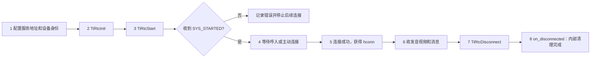
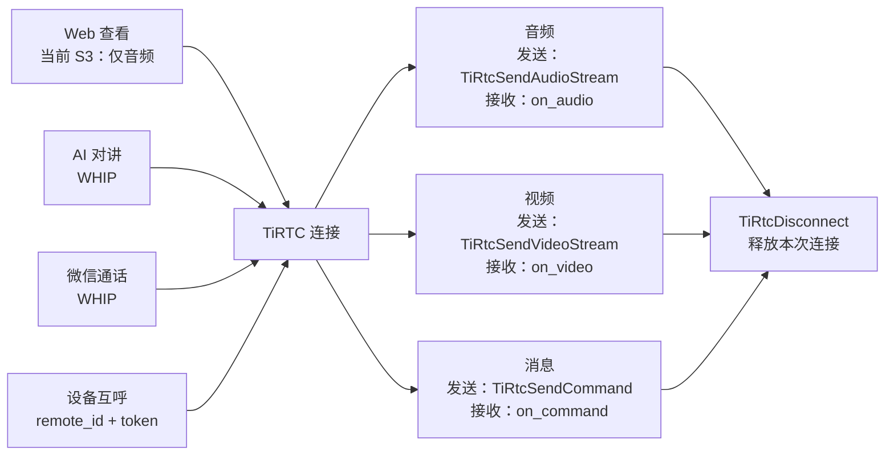
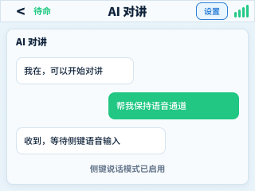
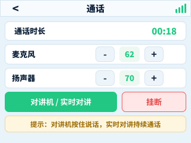
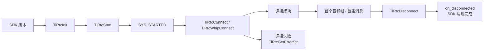

# 第三章：具体代码实现

第二章已经把各项功能摸了一遍。这一章换到开发者视角，只沿着一条主线往下走：**启动 SDK，等设备就绪，建立一条连接，在连接里收发音视频和消息，最后完整释放。**

Web 查看、AI 对讲、微信通话和设备互呼看起来差别很大，落到 TiRTC 接口后，复用的仍是这套主线。先把主干跑通，再把不同业务接到主干上，代码会清楚很多。

如果想先建立全局认识，可以先看官方的[开发流程总览](https://docs.tange.ai/products/tirtc/guides/development-overview.html)。本章则顺着设备端代码，把这条主线逐段落到接口和回调上。




### 1. 确认真正链接进固件的 SDK

排查问题前先打印 SDK 版本。这样可以避免“头文件是新版，静态库却还是旧版”的隐蔽错误。

```c
#include "tiRTC.h"

ESP_LOGI("rtc", "TiRTC=%s", TiRtcGetVersion());
ESP_LOGI("rtc", "build=%s", TiRtcGetBuildInfo());
```

当前工程使用 TiRTC 2.3.0。升级时应把头文件、静态库和版本说明作为一套替换，并重新核对构建日志。接口准备和集成顺序可对照[官方 C SDK 集成说明](https://docs.tange.ai/products/tirtc/guides/sdk-integration/c.html)，函数签名以[官方 C API](https://docs.tange.ai/products/tirtc/api-reference/c.html)和当前 SDK 头文件为准。

### 2. 回调声明

设备是否就绪、连接是否成功，以及收到的音视频和消息，都会通过回调送回应用。回调结构必须长期有效，不能放在一个马上退出的局部函数里。

```c
static const TIRTCCALLBACKS s_callbacks = {
    .on_event         = on_sdk_event,
    .on_conn_accepted = on_incoming_connection,
    .on_conn_error    = on_connection_error,
    .on_disconnected  = on_disconnected,
    .on_audio         = on_audio,
    .on_video         = on_video,
    .on_command       = on_command,
};
```

所有回调都运行在 SDK 内部线程。最稳的处理方式只有三个动作：**检查数据、复制必要内容、投递给应用任务**，然后立即返回。

```c
static void on_audio(tirtc_conn_t hconn,
                     const TIRTCFRAMEINFO *frame,
                     void *data)
{
    /* data 在回调返回后失效：先复制，再交给播放任务。 */
    audio_queue_copy_and_push(hconn, frame, data);
}
```

上面的 `audio_queue_copy_and_push()` 代表工程自己的“复制并入队”函数。HTTP 请求、NVS 写入、页面切换、解码播放和硬件销毁都不要堵在回调里。队列满时应记录丢弃计数并尽快返回，不能为了保住一帧拖住后续回调。

回调字段、函数参数和数据类型以[官方 C API](https://docs.tange.ai/products/tirtc/api-reference/c.html)为准；SDK 的接入顺序和回调注册要求可对照[C SDK 接入与初始化](https://docs.tange.ai/products/tirtc/guides/sdk-integration/c.html)。

### 3. 初始化 SDK，再让设备上线

初始化准备公共运行环境；启动则提交这台设备的身份和回调。关键顺序只有下面几步：

```c
TiRtcSetOption(TIRTC_OPT_SERVICE_ENDPOINT,
               endpoint, strlen(endpoint) + 1);
TiRtcInit();

TiRtcSetOption(TIRTC_OPT_DEVICE_SECRET_KEY,
               secret, strlen(secret) + 1);
TiRtcSetOption(TIRTC_OPT_CLIENT_ID,
               client_id, strlen(client_id) + 1);
int ret = TiRtcStart(device_id, &s_callbacks);
```

每一步都要检查返回值。尤其要区分两件事：

- `TiRtcStart()` 返回 `0`：参数通过检查，启动请求已经受理。
- 收到 `TIRTC_EVENT_SYS_STARTED`：SDK 已经真正启动，设备进入可连接状态。

```c
static void on_sdk_event(int event, const void *data, int len)
{
    if (event == TIRTC_EVENT_SYS_STARTED) {
        s_sdk_ready = true;
    }
}
```

设备密钥不能输出到日志。联调时记录“是否存在、长度和不可逆摘要”就够了。设备、业务服务和使用端各自负责什么，可随时回看[官方连接设备说明](https://docs.tange.ai/products/tirtc/guides/connection.html)。

普通 Wi-Fi、4G 以及受限网络需要设置哪些启动选项，见[C SDK 接入与初始化](https://docs.tange.ai/products/tirtc/guides/sdk-integration/c.html)中的网络参数说明。

### 4. 连接成功后，连接句柄才能使用

网页、手机或另一台设备主动连接本机时，设备从 `on_conn_accepted()` 得到本次连接；设备主动发起连接时，则调用 `TiRtcConnect()` 或 `TiRtcWhipConnect()`，并等待异步结果。

```c
static void on_connect_result(int error,
                              tirtc_conn_t hconn,
                              void *user_data)
{
    if (error == 0 && hconn != NULL) {
        s_conn = hconn;      /* 从这里开始才可以收发数据 */
    } else {
        ESP_LOGE("rtc", "connect: %s", TiRtcGetErrorStr(error));
    }
}

int ret = TiRtcConnect(remote_id, token,
                       on_connect_result, NULL);
```

`TiRtcConnect()` 返回 `0` 仍然只是“连接任务已提交”。只有结果回调返回 `error == 0` 且 `hconn` 有效，才算真正连上。`hconn` 只属于这一场会话，不能缓存后跨会话复用。

主动连接、被动接入、三端参数和“何时才算真正连上”的完整约定，见[连接设备](https://docs.tange.ai/products/tirtc/guides/connection.html)。

### 5. 断开只能由一个资源所有者执行

把断开动作集中到同一个控制任务，先从应用状态中取走旧连接，再调用 SDK。这样退出页面、远端挂断和错误回调同时到来时，不会重复释放同一个连接。

```c
static void rtc_disconnect_once(void)
{
    tirtc_conn_t hconn = s_conn;
    s_conn = NULL;

    if (hconn != NULL) {
        TiRtcDisconnect(hconn);
    }
}
```

`TiRtcDisconnect()` 返回后，这个 `hconn` 就不能再用于发送。`on_disconnected()` 表示 SDK 内部清理已经完成，适合通知应用销毁与这场会话绑定的剩余资源。

不同客户端的连接状态、`disconnect()` 与对象释放边界也整理在[连接设备](https://docs.tange.ai/products/tirtc/guides/connection.html)中。

## 同一条连接能做什么

下面四项功能复用同一套连接、媒体、消息和释放规则。变化的是连接对象和业务状态，不是底层收发模型。



### Web 查看与双向音频

网页连入后，设备在 `on_conn_accepted()` 收到连接。麦克风音频用 `TiRtcSendAudioStream()` 上行，网页下发的音频从 `on_audio()` 进入设备播放队列。

```c
TIRTCFRAMEINFO frame = {
    .stream_id = 1,
    .media     = TIRTC_AUDIO_ALAW,
    .flags     = TIRTC_AUDIOSAMPLE_8K16B1C,
    .ts        = timestamp_ms,
    .length    = length,
};
TiRtcSendAudioStream(s_conn, &frame, alaw_data);
```

当前 S3 APP 的 Web 查看只开放音频。帧格式、时间戳、播放缓冲和弱网策略留到第四章集中说明。通用媒体接口参见[实时音视频](https://docs.tange.ai/products/tirtc/guides/real-time-audio-video.html)，双向说话的业务组织参见[语音对讲](https://docs.tange.ai/products/tirtc/guides/voice-talkback.html)。

需要从设备启动、签发连接凭证一直走到客户端播放，可参考官方的[运行示例项目](https://docs.tange.ai/products/tirtc/get-started/view-device-live-av.html)。

### AI 对讲

AI 对讲不再连接另一台 `device_id` 设备，而是使用 AI 服务提供的 `peer_id` 和短期 `token` 建立 WHIP 连接。业务服务如何申请这组凭证，可查[AI 实时对话服务端接口](https://docs.tange.ai/products/ai-chat/api-reference/server-api.html)；设备从建连到开始会话的完整顺序，可查[AI 实时对话设备端集成](https://docs.tange.ai/products/ai-chat/guides/device-integration.html)。

```c
TiRtcWhipConnect(service_desc, token,
                 on_connect_result, NULL);
```

连接成功后，麦克风和扬声器仍走同一套音频接口。字幕、`start_session`、打断、轮次结束和设备动作等业务状态，通过 `on_command()` 交给 AI 模块处理；设备向服务发送命令时使用 `TiRtcSendCommand()`。命令字、JSON-RPC 字段和事件方向以[AI 实时对话事件协议](https://docs.tange.ai/products/ai-chat/api-reference/events.html)为准，AI 专项问题可按[AI 诊断与日志](https://docs.tange.ai/products/ai-chat/troubleshooting/diagnostics-and-logs.html)排查。



### 微信通话

微信通话涉及小程序、业务服务端、探鸽云平台和设备端。建议先看[微信 VoIP 通话流程](https://docs.tange.ai/products/wxvoip/guides/voip-call-flows.html)确认四方职责，再按[微信 VoIP 设备端集成](https://docs.tange.ai/products/wxvoip/guides/device-integration.html)实现设备逻辑。业务服务处理联系人、来电、接听和挂断，再把本次通话的 `service_desc` 与 `token` 交给设备；服务端接口和下行消息见[集成业务服务端](https://docs.tange.ai/products/wxvoip/guides/app-server.html)。设备仍用 `TiRtcWhipConnect()` 建立媒体连接，用音频回调完成双向通话。

这层分工要保持清楚：业务服务决定“这通电话现在是什么状态”，TiRTC 负责“连接建立后怎样传输音视频和消息”。RTC 资源尚未释放时，不要重叠发起下一通连接。

### 设备呼叫设备

主叫从联系人中选择目标设备，业务服务检查关系并签发短期 `token`，随后调用：

```c
TiRtcConnect(target_device_id, connect_token,
             on_connect_result, NULL);
```

被叫从 `on_conn_accepted()` 获得连接。接通后，两边复用已经验证过的采集、发送、接收和播放链路，只额外维护响铃、接听、拒绝和挂断状态。

设备互呼仍遵循标准的 `remote_id + token` 连接模型，三端如何签发凭证、发起连接和确认接通可回看[连接设备](https://docs.tange.ai/products/tirtc/guides/connection.html)。



## 媒体和消息分别走哪条接口

| 要做的事 | 发送端 | 接收端 |
| --- | --- | --- |
| 传音频 | `TiRtcSendAudioStream()` | `on_audio()` |
| 传视频 | `TiRtcSendVideoStream()` | `on_video()` |
| 发业务命令 | `TiRtcSendCommand()` | `on_command()` |

发送前，应用负责准备完整的帧信息和数据；收到回调后，应用负责及时复制并交给自己的音频、视频或业务任务。SDK 负责实时传输，不替应用决定扬声器怎么播、屏幕怎么画、某个命令代表接听还是挂断。

命令字和请求应答的约定参见[命令消息](https://docs.tange.ai/products/tirtc/guides/command-messaging.html)；需要在媒体流中携带同步消息时，参见[流消息](https://docs.tange.ai/products/tirtc/guides/stream-messaging.html)。

## 日志




ESP32 上可以把 SDK 日志接入 `ESP_LOG`：

```c
static void rtc_sdk_log(const char *log, uint32_t length)
{
    ESP_LOGI("tirtc_sdk", "%.*s", (int)length, log);
}

TiRtcLogSetCallback(rtc_sdk_log);
TiRtcLogSetLevel(4);
```

SDK 日志不保证以 `\0` 结尾，所以必须按 `length` 输出。等级 `1` 到 `5` 依次是 error、warn、ok、info、verbose；日常联调用 `4`，专项定位时短时间使用 `5`。大于 `10` 会打开大量底层日志，可能干扰实时任务。

一次问题至少保留这些证据：

1. SDK 版本、构建信息和启动耗时。
2. `TiRtcInit()`、`TiRtcStart()` 的返回值，以及是否收到 `SYS_STARTED`。
3. 使用哪种连接接口、异步结果和首帧时间。
4. 谁发起断开、断开返回值和内部清理回调。
5. 同一功能第二次进入时，是否拿到了新的连接。

错误码统一用 `TiRtcGetErrorStr()` 转成可读文本。可以记录设备编号、连接阶段、耗时和帧数，不能记录设备密钥、完整 `token`、签名头和媒体正文。日志字段与排查顺序可对照[诊断与日志](https://docs.tange.ai/products/tirtc/troubleshooting/diagnostics-and-logs.html)，桌面联调可配合[TiRTC CLI](https://docs.tange.ai/products/tirtc/get-started/devtools-cli.html)。

## 官方资料按问题查

- 想先了解整个开发路径：看[开发流程总览](https://docs.tange.ai/products/tirtc/guides/development-overview.html)。
- 不清楚初始化顺序和 C 接口怎么接：看[C SDK 集成](https://docs.tange.ai/products/tirtc/guides/sdk-integration/c.html)。
- 不清楚设备、业务服务和使用端怎样配合：看[连接设备](https://docs.tange.ai/products/tirtc/guides/connection.html)。
- 想先用现成链路验证 SDK：看[运行示例项目](https://docs.tange.ai/products/tirtc/get-started/view-device-live-av.html)或[快速体验](https://docs.tange.ai/products/tirtc/get-started/out-of-box-experience.html)。
- 不清楚音视频帧怎样收发：看[实时音视频](https://docs.tange.ai/products/tirtc/guides/real-time-audio-video.html)和[语音对讲](https://docs.tange.ai/products/tirtc/guides/voice-talkback.html)。
- 不清楚业务命令和流消息怎样组织：看[命令消息](https://docs.tange.ai/products/tirtc/guides/command-messaging.html)和[流消息](https://docs.tange.ai/products/tirtc/guides/stream-messaging.html)。
- 接 AI 对讲：先看[设备端集成](https://docs.tange.ai/products/ai-chat/guides/device-integration.html)，再查[事件协议](https://docs.tange.ai/products/ai-chat/api-reference/events.html)和[服务端接口](https://docs.tange.ai/products/ai-chat/api-reference/server-api.html)。
- 接微信通话：先看[通话流程](https://docs.tange.ai/products/wxvoip/guides/voip-call-flows.html)，再按[设备端集成](https://docs.tange.ai/products/wxvoip/guides/device-integration.html)和[业务服务端集成](https://docs.tange.ai/products/wxvoip/guides/app-server.html)分工实现。
- 开发网页、App 或其他使用端：看[客户端 SDK 集成](https://docs.tange.ai/products/tirtc/guides/client-integration.html)。
- 需要核对每个参数和回调：看[C API](https://docs.tange.ai/products/tirtc/api-reference/c.html)。
- 连接失败需要完整排查路径：看[诊断与日志](https://docs.tange.ai/products/tirtc/troubleshooting/diagnostics-and-logs.html)。

下一章进入[音视频调试](04_AUDIO_VIDEO_PIPELINE_CN.md)，集中处理音视频采集、帧格式、播放缓冲、回声消除和弱网自适应。
