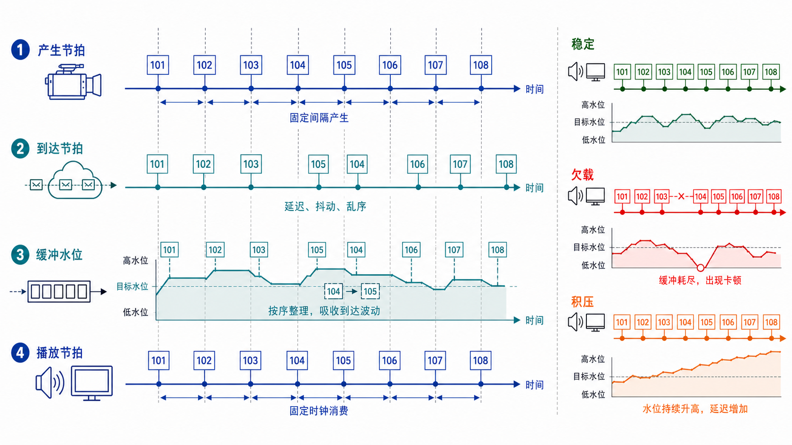
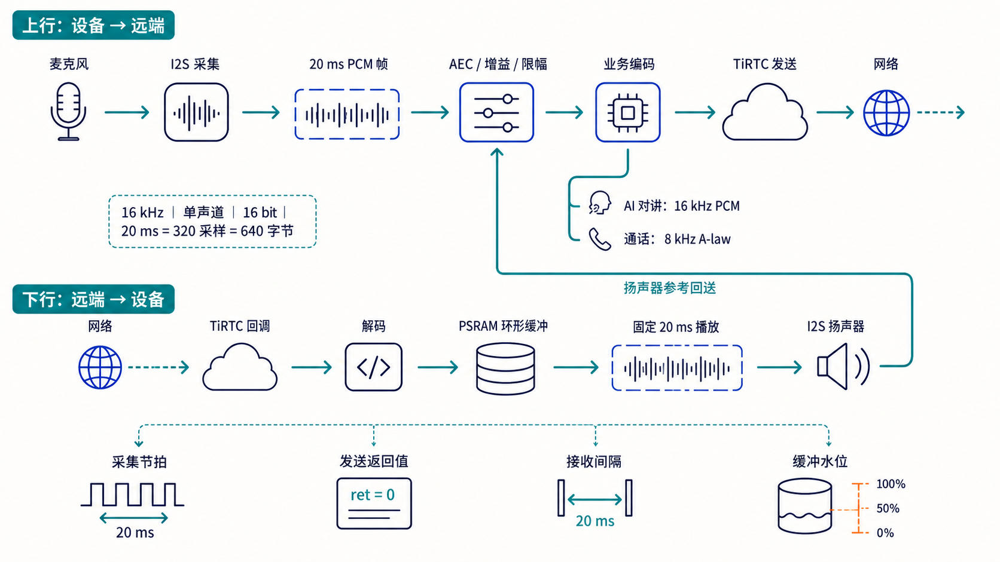
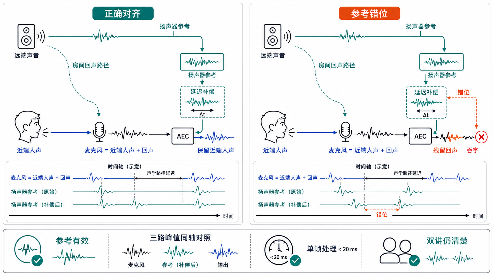
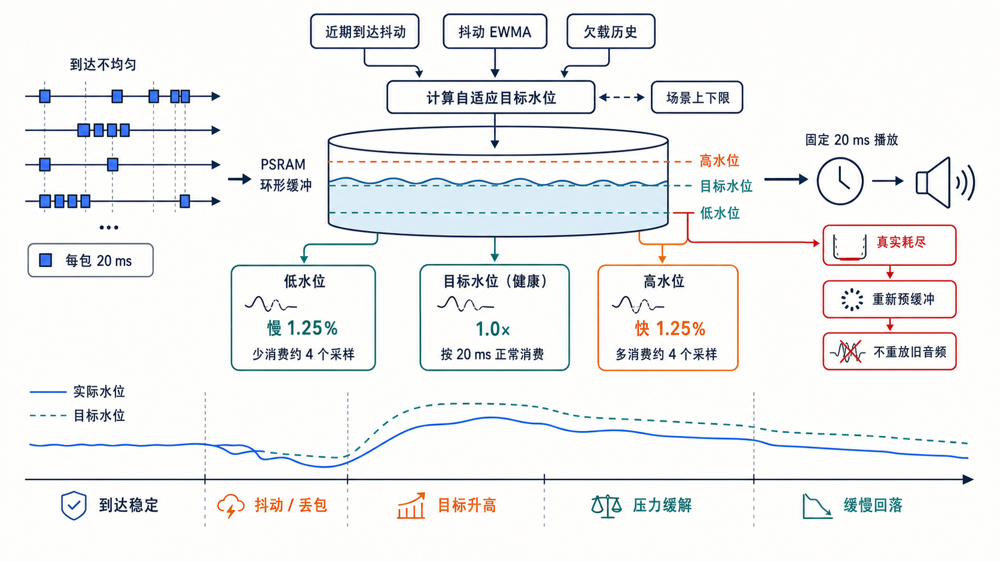
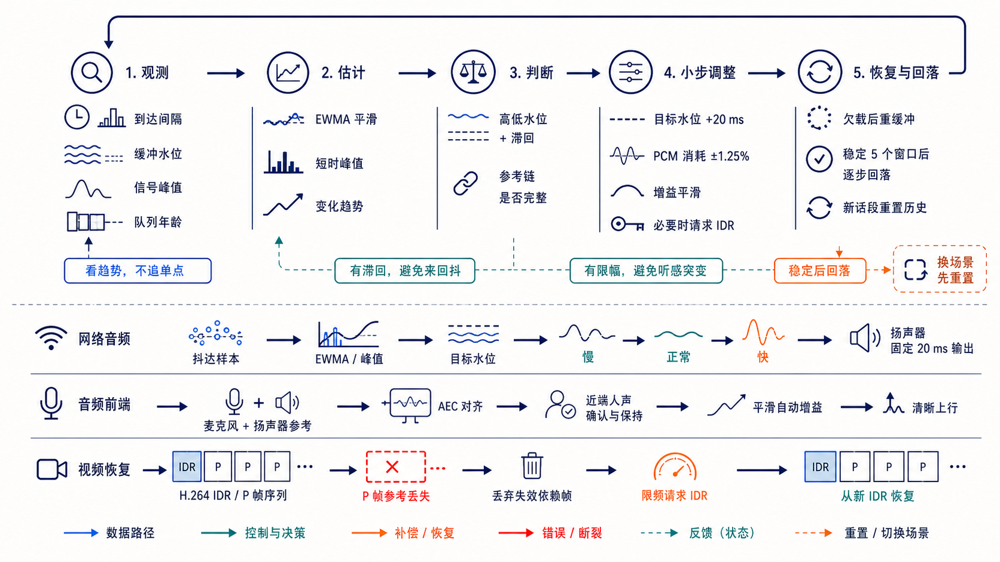
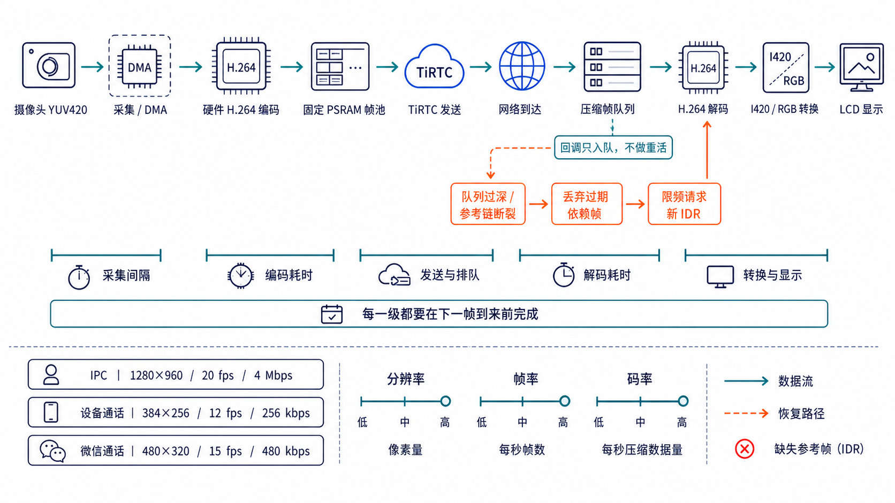
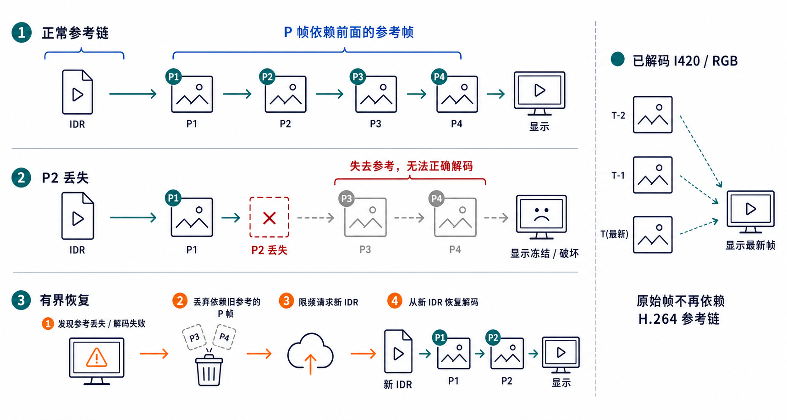
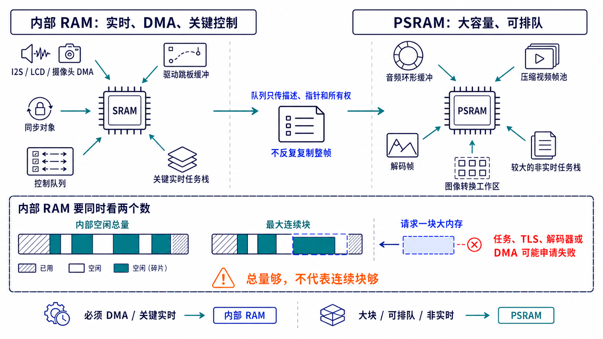
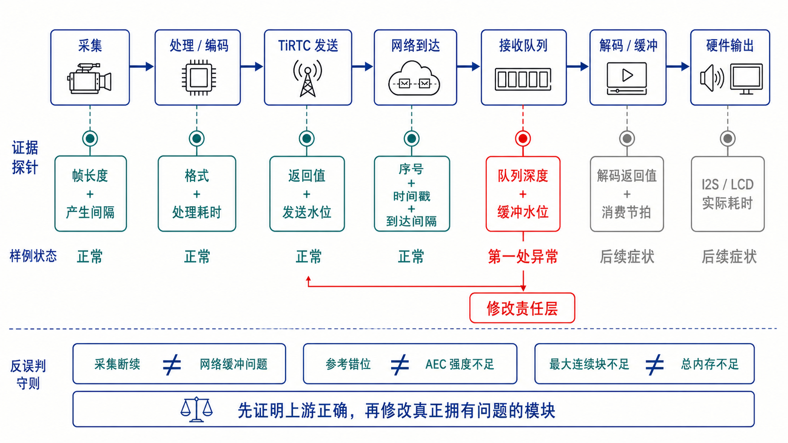

# 第四章：音视频调试

连接建立以后，真正影响听感和画面的工作才刚开始：麦克风和摄像头要按固定节拍产生数据，网络会让数据迟到、乱序甚至丢失，接收端还要在不明显增加延迟的前提下稳定播放。

这类问题容易陷入“缓冲再加大一点”“AEC 再强一点”的循环。更可靠的方法是先把一帧数据从产生到输出的全过程拆开，找到**第一处异常**，再修改真正拥有这个问题的参数。

本章把 ESP32-S3 的音频调试和 ESP32-P4 的音视频调试放在同一条主线上。两块芯片的性能不同，但诊断方法相同：

> 先看数据有没有按时产生，再看它何时到达、如何排队，最后看硬件是否按时消费。

## 先看四条时间线

实时媒体至少同时存在四条时间线：

1. **产生节拍**：麦克风或摄像头多久产生一帧。
2. **到达节拍**：帧经过网络以后，什么时候抵达接收端。
3. **缓冲水位**：已经到达、但还没有播放的数据还有多少。
4. **播放节拍**：扬声器或屏幕什么时候真正消费一帧。



网络延迟只表示“整体晚了多久”；网络抖动表示“每一帧晚到的程度不一样”。只看平均延迟，解释不了为什么同一条连接偶尔卡一下。真正决定播放是否连续的，是到达间隔与播放节拍之间的差值，以及缓冲区能否吸收这段差值。

所以，排查时要把三个问题分开：

- **内容是否正确**：格式、长度、时间戳和关键帧标记有没有错。
- **时间是否连续**：采集、发送、到达和播放的间隔是否稳定。
- **资源是否健康**：队列、任务栈、内部 RAM、PSRAM 和 DMA 是否还能承受当前负载。

## 20 ms 的音频节拍

当前 S3 工程以 16 kHz、16 bit、单声道 PCM 作为音频处理基线。每 20 ms 产生：

```text
16000 次/秒 × 0.02 秒 = 320 个采样
320 个采样 × 2 字节 = 640 字节 PCM
```

这个 20 ms 是整条链路共同遵守的节拍：采集任务按它取数据，AEC 按它处理，业务层按它编码，播放任务也按它消费。业务格式可以变化，节拍不能忽快忽慢。



当前工程里，AI 对讲使用 16 kHz PCM；设备呼叫、IPC 对讲和微信 VoIP 等链路按业务契约使用 8 kHz A-law。格式转换发生在业务边界，公共采集、AEC 和播放资源仍由同一套音频模块管理，避免每个应用各自打开一遍 I2S。

调试时至少保留四个观测点：

- **采集节拍**：20 ms 是否持续产出 320 个采样。
- **发送返回值**：SDK 是否接收了这一帧，发送水位是否持续升高。
- **接收间隔**：相邻回调相差多少毫秒，是否出现突发到达。
- **播放水位**：缓冲区是在健康范围内波动，还是持续见底或积压。

如果采集端已经断续，继续调网络缓冲没有意义；如果接收回调连续而扬声器仍然卡顿，问题就已经落在解码、缓冲消费或 I2S 路径。

## AEC

AEC（Acoustic Echo Cancellation，声学回声消除）要解决的是：扬声器播放的远端声音被麦克风重新收进去，又传回远端形成回声。

算法需要同时看到两路信号：

- 麦克风采到的混合声音，其中既有人声，也可能有扬声器回声。
- 与扬声器真实播放内容对应的参考信号。

两路信号在时间上对齐，AEC 才知道该减掉哪一部分。参考过早、过晚、采样率不一致，或者播放数据绕过参考路径，都可能造成残留回声；抑制过强时，还会把近端人声一起削掉，表现为吞字、音量变小或声音发闷。



S3 当前使用 MIC1 采集近端人声，并优先使用 MIC3 的电气播放参考；参考不可用时才进入受控的延迟参考路径。当前工程基线为 16 kHz、高性能模式、4 段滤波、约 80 ms 参考延迟和 320 ms 参考活跃尾窗。这些是当前硬件上的工程参数，不是所有设备都应照抄的固定答案。

日志里出现“AEC 已启用”只能证明生命周期走到了初始化，不能证明回声已经正确消除。有效证据至少包括：

- 参考信号确实处于活跃状态，并且波形不是全零。
- 麦克风、参考和 AEC 输出峰值能在同一时间轴上对照。
- 单帧处理耗时稳定小于 20 ms，没有持续超时或积压。
- 双讲时近端人声仍然清楚，不靠降低麦克风音量掩盖回声。

调 AEC 时一次只改一个变量，并保留原始麦克风、参考和输出 PCM 做 A/B 对照。听感变安静不一定是进步，也可能只是人声被一起消掉了。

## 抖动缓冲

接收端不能让“网络什么时候来包”直接决定“扬声器什么时候播放”。正确做法是在两者之间放一个抖动缓冲区：网络负责把数据放进去，播放任务仍按固定 20 ms 节拍取数据。

抖动缓冲同时承担两个相反目标：

- 存得太少，稍有抖动就会欠载，出现断音。
- 存得太多，声音虽然连续，端到端延迟却会越来越高。

因此，当前工程使用**自适应目标水位**。它根据近期到达抖动峰值、抖动的指数加权移动平均值（EWMA）和欠载历史估算需要保留多少数据，再把结果限制在当前业务允许的范围内。



当前 S3 设备呼叫在水位偏低时最多减慢约 1.25%，在积压偏高时最多加快约 1.25%。以 16 kHz、20 ms 一帧计算，一帧是 320 个采样，单次最多调整约 4 个采样。这个幅度足够缓慢拉回水位，又不至于让人声明显变调。

真正耗尽时，应重新预缓冲，等待新数据恢复到可播放水位；不能重复播放旧音频来制造“还在响”的假象。

不同业务使用不同基线：

| 场景 | 起播前预缓冲 | 正常目标 | 当前取舍 |
|---|---:|---:|---|
| 低延迟实时查看 | 20 ms | 60 ms，临时约 100 ms | 优先快速出声 |
| IPC 按住说话 | 80 ms | 180 ms | 把一次按下视为新的话段，不跨话段累计变速 |
| 设备间通话 | 320 ms | 140 ms，弱网时可临时提高 | 优先保证连续双向通话，并允许 ±1.25% 小幅修正 |
| AI 对讲 | 340 ms | 420 ms，弱网时可继续提高 | 更重视整句回答连续，接受稍高延迟 |

这些数值是当前 S3 工程的调试基线。换编解码格式、网络协议、采样率或扬声器驱动后，需要重新用日志和听感验证，不能把它们当成通用标准。

## 自适应处理的共同套路

固定参数只能照顾一种环境。真实设备却会在稳定 Wi-Fi、手机热点、突发抖动、长句播报和双向通话之间切换。更稳妥的做法，是把媒体处理做成一个**闭环控制系统**：先观察变化，再估算压力，只做有限调整，稳定后慢慢回到基线。



这类算法不应该是越灵敏越好。当前工程遵循五条规则：

1. **不凭一个包下结论。** 同时观察到达间隔、缓冲水位、信号峰值和队列年龄，避免把一次调度停顿误判成网络持续恶化。
2. **既看平均趋势，也保留近期峰值。** 指数加权移动平均值（EWMA）用于看趋势，短期峰值用于防住刚刚发生的最坏抖动。
3. **高低阈值之间留出回差。** 进入保护和退出保护使用不同水位，避免算法在临界点来回切换。
4. **每次只动一点，并且设置上限。** 缓冲目标按小步增加，播放只做约 1.25% 的微调，增益也平滑变化，不让保护动作本身制造变调、泵音或延迟突跳。
5. **压力出现时快速保护，稳定后缓慢回落。** 新话段或业务模式切换时重新建立基线，不能把上一场通话的高延迟状态带进下一场。


## 视频参考链和整条处理预算

视频链路比音频更重。除了网络抖动，还要同时承担摄像头采集、颜色格式、硬件编码、压缩帧池、网络发送、接收队列、解码、图像转换和 LCD 刷新。



图中下方三档参数都指 **P4 设备端的 H.264 上行**，不是微信手机端采集参数，也不是服务端到设备的下行参数：

- IPC 上行：`1280×960@20fps`，约 `4Mbps`。
- 设备通话上行：`384×256@12fps`，约 `256kbps`。
- 微信通话上行：`480×320@15fps`，约 `480kbps`。
- 微信通话下行：设备请求 `640×480` MJPEG，服务端实际帧可以更小；P4 硬件解码后以 `cover` 方式映射到 `480×320` 屏幕。当前工程没有为这条下行固定帧率或码率。

这里的三个常用参数分别控制不同问题：

- **分辨率**决定每帧有多少像素，直接影响清晰度、帧大小和处理量。
- **帧率**决定每秒产生多少帧，影响运动连贯性和 CPU/编码压力。
- **码率**限制单位时间内发送多少压缩数据，过低会变糊，过高会增加拥塞和排队。

只提高码率并不能修复卡顿。必须分别记录采集间隔、编码耗时、发送水位、网络到达间隔、解码耗时和显示耗时，确认每一级都能在下一帧到来前完成自己的工作。

## H.264的处理

PCM 音频帧通常可以相对独立地播放；H.264 的 P 帧却依赖前面的参考帧。P2 丢失后，后续 P3、P4 即使到达，也可能无法正确解码。继续堆积这些帧，只会让画面越来越晚。



所以视频恢复通常分四步：

1. 发现压缩队列已经过深或参考链断裂。
2. 丢弃已经失去价值的过期 P 帧。
3. 限频请求新的 IDR 关键帧。
4. 从新 IDR 重新建立解码参考链。

已经解码成 I420 或 RGB 的原始画面没有压缩参考依赖，可以保留“最新一帧”供界面刷新；压缩 H.264 队列则不能简单保留任意最新 P 帧。二者必须分开设计。

P4 工程把压缩输入、解码输出和显示队列拆开，并使用固定池和有界队列控制最坏内存占用。解码任务不会直接塞进 SDK 回调，显示也不会阻塞网络收包。当前 H.264 解码双任务模式保持关闭，因为实际调试中发现并发解码会引入解码器竞争；这是用稳定性换取可预测性的明确边界。

### 视频的自适应

视频也需要动态处理，但第一步不是频繁改码率，而是保证故障能够在有限时间和有限内存内结束。接收侧持续观察压缩队列年龄、解码返回值、参考链状态和显示耗时：

- 已经解码的 I420 或 RGB 画面可以丢旧留新，降低显示延迟。
- 压缩 H.264 一旦丢失参考帧，就丢弃依赖它的后续 P 帧，并限频请求新的 IDR。
- 队列和帧池都设置上限，恢复动作不能靠无限堆积换取“也许之后能播”。

这是当前工程已经采用的有界恢复。自动码率属于下一层能力，需要同时参考网络丢包、往返时延、抖动、编码耗时和队列年龄，还要计算调整码率后触发关键帧的成本。当前工程没有把它作为已验证功能，因此不能只凭队列变深就宣称已经实现了自动码率。

## 内存和 DMA

在 MCU 上，“还有多少内存”不能只看一个总数。内部 RAM 负责 DMA、驱动和关键实时路径；PSRAM 容量大，适合保存媒体帧和较大的工作区，但不能无条件替代内部 RAM。



当前 S3/P4 工程遵循同一分配原则：

- I2S、LCD、摄像头 DMA 及其必要的跳板缓冲留在内部 RAM。
- 同步对象、控制队列和真正需要实时访问的关键栈留在内部 RAM。
- 音频环形缓冲、压缩视频帧池、解码帧、转换工作区和较大的非实时任务栈优先放到 PSRAM。
- 队列尽量传递描述和所有权，不让同一帧在多个模块之间反复复制。

还要同时观察**内部空闲量**和**内部最大连续块**。总量看起来还有 60 KB，不代表一定能申请到一块连续的 32 KB。任务创建、TLS、解码器或 DMA 申请失败时，最大连续块往往比总空闲量更接近第一现场。

## 怎样证明自适应真的在工作

“代码里有自适应”不等于“自适应有效”。每个闭环都要留下输入、动作和结果三类证据：

| 机制 | 必须记录 | 有效的表现 |
|---|---|---|
| 抖动目标水位 | 到达抖动 EWMA、近期峰值、保护增量、实际与目标水位 | 压力出现时目标上升，稳定后逐步回落 |
| 播放微变速 | 快/慢调节次数、消费采样数、缓冲毫秒数 | 水位回到释放区间，速度恢复正常，不长期卡在快或慢 |
| 自动增益与噪声门 | 处理前后峰值、RMS、增益倍数、门关闭帧数 | 远近音量更稳定，没有削顶、泵音或吞字 |
| AEC 双讲保护 | 参考活跃、近端检测、麦克风/参考/线性/最终峰值、耗时与超时 | 回声下降，双方同时说话时近端人声仍完整 |
| H.264 恢复 | 队列年龄、解码错误、参考链状态、IDR 请求和恢复时刻 | 断链后丢弃无效帧，从新 IDR 恢复，队列不会无限增长 |

还要检查三个反例：调整量是否长期顶到上限，状态是否在两个阈值之间频繁振荡，退出应用后自适应状态是否污染下一次会话。出现其中任意一种，都说明闭环仍需修改，不能只看“暂时没卡”就判定完成。

## 异常排查

听感和画面是最终结果，日志要回答的是“异常最早从哪里开始”。建议按下面顺序取证：



| 现象 | 第一组证据 | 优先检查的责任层 |
|---|---|---|
| 音频卡顿 | 采集节拍、接收间隔、缓冲水位、欠载次数 | 先区分发送中断、网络抖动和播放消费异常 |
| 回声或吞字 | 麦克风、参考、AEC 输出的峰值与时间对齐 | 音频参考路径与 AEC，不先改网络缓冲 |
| 延迟持续升高 | 接收速率、消费速率、实际水位和目标水位 | 播放调度、变速上限或持续积压 |
| 视频花屏或冻结 | IDR 标记、参考链、压缩队列深度和解码返回值 | 编码标记、丢帧恢复和解码队列 |
| 界面变慢或看门狗 | 解码、转换、LCD 刷新耗时及任务占核 | 调度与硬件输出，不在 SDK 回调做重活 |
| 任务或连接创建失败 | 内部空闲量、最大连续块、栈余量 | 内存布局和资源生命周期 |

根因修复要落在真正拥有问题的分层。增加缓冲只能吸收抖动，不能修复采集断续；加大 AEC 只能改变抑制行为，不能修复参考错位；把任务栈搬到 PSRAM 也不能解决必须使用内部 RAM 的 DMA 申请。

## 一轮有效调参应怎样进行

推荐用同一段音频或同一组画面，按下面顺序逐步增加压力：

1. **好网基线**：先证明格式、节拍和硬件输出正确。
2. **固定延迟**：只增加单向延迟，观察端到端时延，不混入抖动。
3. **网络抖动**：增加到达间隔变化，验证目标水位是否上升、稳定后是否回落。
4. **丢包**：观察音频补偿、视频 IDR 恢复和业务状态是否符合预期。
5. **重复进入退出**：连续切换 IPC、AI 对讲、设备呼叫和微信 VoIP，确认上一场配置没有污染下一场。
6. **长时间运行**：记录内部 RAM、最大连续块、PSRAM、队列和栈的最低水位。

每轮只改一个变量，并记录修改前后的首帧时间、到达间隔、缓冲水位、欠载次数、处理耗时和主观听感。这样得到的结论才可以复现，也能判断优化究竟来自网络、媒体策略、驱动还是资源布局。

四章到这里形成了从概念、体验、代码到媒体调试的完整路径。需要重新选择阅读入口时，回到
[TiRTC 开发者指南](README_CN.md#tirtc-开发者指南)；需要回看 SDK 生命周期和业务接入时，返回
[第三章：具体代码实现](03_TIRTC_DEVELOPMENT_CN.md)。
