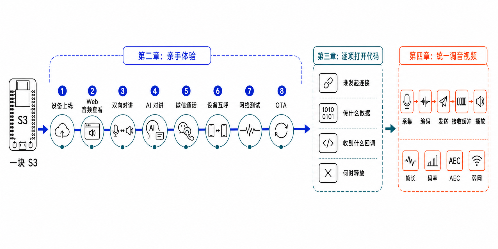

# 文档入口

第一次接入 TiRTC，建议按“最小集成 -> 最小系统体验 -> 完整应用”逐步选择：

1. 最小 TiRTC 集成示例用于理解 SDK 生命周期和基础音视频链路。
2. 最小系统例子用于观察 ThingConnect、AI 对讲和设备呼叫的协议状态。
3. 完整应用用于带屏设备、真实音频硬件和完整业务体验；摄像头是否参与 RTC 由各项目说明。

八个项目分别使用独立的“平台 + 项目 + 版本号”Tag。某个项目更新时，只增加该项目的新
Release，不再用日期批次同时代表整仓内容。当前版本和下载入口见[版本与证据清单](VERSIONS_CN.md)
与[固件下载与校验](RELEASES_CN.md)。

## TiRTC 开发者指南

这四章是一条连续阅读路径：先理解实时通信要解决什么，再亲手体验 TiRTC，随后进入 SDK 代码，
最后沿着采集、传输、缓冲和播放链路排查音视频问题。



| 章节 | 读完能解决什么 |
| --- | --- |
| [第一章：WebRTC 是什么](01_WEBRTC_OVERVIEW_CN.md) | 理解跨网连接、实时传输、播放时限和跨平台适配 |
| [第二章：TiRTC 的设计与快速体验](02_TIRTC_OVERVIEW_AND_EXPERIENCE_CN.md) | 理解设备身份、业务授权和完整体验流程 |
| [第三章：具体代码实现](03_TIRTC_DEVELOPMENT_CN.md) | 掌握 SDK 生命周期、异步回调、连接句柄和业务接入 |
| [第四章：音视频调试](04_AUDIO_VIDEO_PIPELINE_CN.md) | 沿证据链检查采集、AEC、抖动缓冲、编解码和硬件输出 |

文中的代码和媒体参数以本仓当前公开的 ESP32-S3/P4 完整应用为例。每个项目实际使用的 SDK、
构建结果和真机验证范围，以项目 README 和[版本与证据清单](VERSIONS_CN.md)为准。

## 按手头任务找文档

| 你现在要做什么 | 从这里开始 |
| --- | --- |
| 下载已经构建好的 ESP32-S3/P4 固件 | [固件下载与校验](RELEASES_CN.md) |
| 第一次移植 TiRTC SDK | [最小 TiRTC 集成](../sdk-integration-examples/README.md) |
| 用串口观察配网、绑定、AI 和呼叫协议 | [ESP32-S3 最小系统例子](../minimal-system-examples/esp32-s3/README.md) |
| 在带屏 S3 板上运行完整业务 | [ESP32-S3 Device Monitor](../complete-applications/esp32-s3/device-monitor/README.md) |
| 在 P4+C6 板上构建完整业务 | [ESP32-P4 Device Monitor](../complete-applications/esp32-p4/device-monitor/README.md) |
| 核对源码、SDK 和构建证据 | [版本与证据清单](VERSIONS_CN.md) |

每个项目 README 是主入口。先沿着其中的“准备 -> 配置 -> 构建或下载 -> 烧录 -> 首次启动”完成
一遍，再按需阅读架构和协议专题；这样不会一上来就掉进实现细节里。

## 最小 TiRTC 集成

| 文档 | 版本 | TiRTC SDK | 解决的问题 |
| --- | --- | --- | --- |
| [示例总览](../sdk-integration-examples/README.md) | - | - | 选择目标平台并了解验证边界 |
| [ESP32-S3 最小示例](../sdk-integration-examples/esp32-s3/README.md) | `1.2.0` | `2.2.1` | 芯片本地 Wi-Fi 与 TiRTC 基础链路 |
| [ESP32-P4 最小示例](../sdk-integration-examples/esp32-p4/README.md) | `1.1.1` | `2.2.1` | ESP32-C6 Hosted/SDIO 与 P4 TiRTC 接入 |
| [G32S10X 最小示例](../sdk-integration-examples/g32s10x/README.md) | `0.8.3` | `2.2.1` | 君正 SDK、ATBM Wi-Fi 与测试媒体流 |

## 最小系统体验

| 文档 | 版本 | TiRTC SDK | 解决的问题 |
| --- | --- | --- | --- |
| [最小系统例子总览](../minimal-system-examples/README.md) | - | - | 选择串口 AT 与完整协议体验入口 |
| [ESP32-S3 最小系统例子](../minimal-system-examples/esp32-s3/README.md) | `0.8.0` | `2.2.1` | 烧录、配网、绑定、网页查看、AI 对讲和设备呼叫 |
| [ESP32-P4 最小系统例子](../minimal-system-examples/esp32-p4/README.md) | `0.2.0` | `2.3.0` | P4+C6/C61、串口 AT、网页查看、AI 对讲和设备呼叫 |

## 完整应用

| 文档 | 版本 | TiRTC SDK | 解决的问题 |
| --- | --- | --- | --- |
| [完整应用总览](../complete-applications/README.md) | - | - | 选择目标开发板 |
| [ESP32-S3 Device Monitor](../complete-applications/esp32-s3/device-monitor/README.md) | `1.9.7` | `2.3.0 mini` | 绑定、H5 双向音频、分阶段呼叫超时、UI 动作队列、小钛、微信、二维码扫描和 OTA |
| [ESP32-P4 Device Monitor](../complete-applications/esp32-p4/device-monitor/README.md) | `1.5.1` | `2.3.0` 官方源码重建版 | 独立绑定门户、Hosted 网络、TGMP 码率、持久 PSRAM 媒体池和双向设备视频 |
| [G32S10X Device Monitor](../complete-applications/g32s10x/device-monitor/README.md) | `0.1.1` | `2.2.1` | G32S10X 完整设备能力与君正平台适配 |
| [固件下载与校验](RELEASES_CN.md) | - | - | Release 下载、烧录入口和一致性校验 |

完整应用的典型体验路径：

```text
从 GitHub Releases 获取目标板资产 -> 使用平台烧录工具
-> 按项目说明联网和绑定 -> 验证对应业务功能
```

ESP32 使用 [Espressif ESP Tool](https://espressif.github.io/esptool-js/)；G32S10X 使用君正
Cloner。烧录文件和地址以当次 Release 的清单及项目说明为准。

## 功能和协议

设备端示例与
[tangeai/tirtc-server-example](https://github.com/tangeai/tirtc-server-example)
使用同一套 ThingConnect 契约。功能说明、字段、错误码和服务端行为以服务端仓文档为准：

- [设备上线与 MQTT 接入](https://github.com/tangeai/tirtc-server-example/blob/main/thing-connect/device-integration.md)
- [H5 实时查看与按住说话](https://github.com/tangeai/tirtc-server-example/blob/main/thing-connect/device-h5-live.md)
- [AI 对讲设备接入](https://github.com/tangeai/tirtc-server-example/blob/main/thing-connect/device-ai.md)
- [微信 VoIP 对讲设备接入](https://github.com/tangeai/tirtc-server-example/blob/main/thing-connect/device-voip.md)
- [设备呼设备接入](https://github.com/tangeai/tirtc-server-example/blob/main/thing-connect/device-call.md)
- [统一会话模型](https://github.com/tangeai/tirtc-server-example/blob/main/thing-connect/device-session-model.md)

## 验证边界

1. 先核对项目版本、TiRTC SDK、来源 Tag 和 commit。
2. 使用项目声明的 ESP-IDF、供应商 SDK 或工具链做干净构建。
3. 分开记录静态来源、构建、附件哈希、烧录、联网和业务验证。
4. 构建成功不能替代目标板、网络或音视频运行证明。

## 版本与下载

- [版本与证据清单](VERSIONS_CN.md)
- [版本变更记录](CHANGELOG_CN.md)
- [固件下载与校验](RELEASES_CN.md)
- [第三方组件与 SDK](THIRD_PARTY_NOTICES_CN.md)
