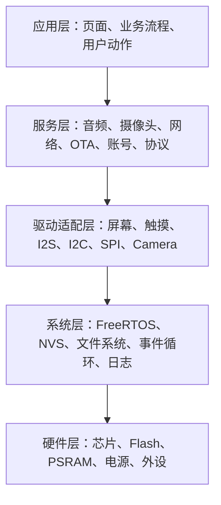
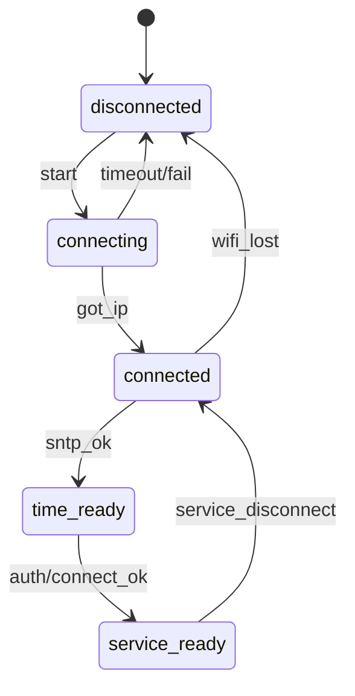
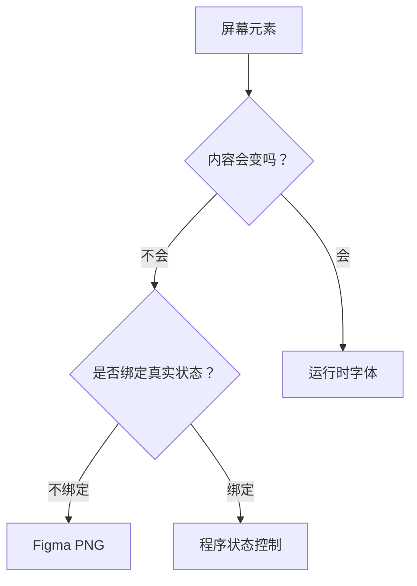
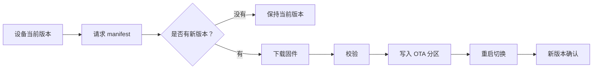

# 嵌入式硬件开发与 AI 协作分享会

## 1. 概念速查

### 1.1 硬件、固件、工程

| 概念 | 含义 | 重点 |
| --- | --- | --- |
| MCU / SoC | 带 CPU、外设、存储控制器、无线能力的芯片 | ESP32-S3 属于带 Wi-Fi / BLE 的 SoC |
| 开发板 | 把芯片、电源、USB、Flash、外设接口做好的板子 | 关注芯片型号、Flash、PSRAM、屏幕、音频、摄像头 |
| 固件 | 烧进 Flash 里的程序 | 由编译生成，设备上电后运行 |
| 工程 | 固件的源代码、配置、组件、资源集合 | ESP-IDF 工程通常有 `CMakeLists.txt`、`main`、`components` |
| Bootloader | 上电后最先运行的引导程序 | 负责加载应用固件 |
| Partition Table | Flash 分区表 | 决定 app、NVS、OTA、资源分区大小 |
| App 分区 | 主程序固件所在区域 | OTA 场景下通常有多个 app 分区 |
| NVS | 非易失键值存储 | 适合保存 Wi-Fi、设备配置、小量状态 |
| SPIFFS / FATFS / LittleFS | 文件系统类资源区 | 适合图片、字体、音频等资源 |

### 1.2 常见固件文件

| 文件 | 作用 | 什么时候需要 |
| --- | --- | --- |
| `bootloader.bin` | 引导程序 | 首次烧录、bootloader 配置变更 |
| `partition-table.bin` | Flash 分区表 | 首次烧录、分区布局变更 |
| `ota_data_initial.bin` | OTA 状态初始化 | 双 OTA 分区首次烧录 |
| `app.bin` / `sample_project.bin` | 应用固件 | 每次业务代码变更 |
| `storage.bin` | 文件系统或默认数据 | 资源、默认配置变更 |
| `fonts.bin` | 字体资源 | 字库变更 |

### 1.3 ESP-IDF 工具链

| 工具 | 作用 | 常见命令 |
| --- | --- | --- |
| ESP-IDF | 乐鑫官方开发框架 | 提供驱动、网络、系统组件 |
| `idf.py` | ESP-IDF 的统一命令入口 | `build`、`flash`、`monitor` |
| CMake | 生成构建系统 | 由 `idf.py` 调用 |
| Ninja | 执行增量编译 | 由 `idf.py` 调用 |
| Python 环境 | 运行 ESP-IDF 脚本 | 安装组件、生成配置、烧录 |
| `sdkconfig` | 实际生效配置 | 由 menuconfig / build 生成 |
| `sdkconfig.defaults` | 默认配置模板 | 适合提交到仓库 |
| `dependencies.lock` | 组件锁定版本 | 保证依赖可复现 |

### 1.4 存储和内存

| 类型 | 用途 | 风险 |
| --- | --- | --- |
| Flash | 保存固件、资源、NVS、文件系统 | 分区不够会导致编译或 OTA 失败 |
| SRAM / Internal RAM | 任务栈、堆、DMA、实时数据 | 最紧张，音频/摄像头/UI 都会抢 |
| PSRAM | 大缓冲、图片、视频帧、字体缓存 | 比内部 RAM 慢，不适合所有 DMA |
| Task Stack | FreeRTOS 任务栈 | 太小会栈溢出，太大浪费 RAM |
| Heap | 动态内存 | 泄漏或碎片化会导致运行久了崩 |

### 1.5 常见外设和总线

| 外设 / 总线 | 用途 | 典型场景 |
| --- | --- | --- |
| GPIO | 普通输入输出 | 按键、复位、使能脚 |
| UART | 串口通信 | 烧录、日志、外部模块 |
| I2C | 低速外设控制 | 触摸、音频 Codec 控制、传感器 |
| SPI | 高速同步通信 | 屏幕、Flash、SD 卡 |
| I2S | 音频数据 | 麦克风采集、扬声器播放 |
| PWM / LEDC | 脉宽调制 | 背光、蜂鸣器、电机 |
| ADC | 模拟采样 | 电池电压、传感器 |
| Camera / DVP / MIPI | 摄像头数据 | 图像采集、二维码、视频 |

### 1.6 FreeRTOS 基本概念

| 概念 | 含义 | 调试关注点 |
| --- | --- | --- |
| Task | 任务 / 线程 | 优先级、栈大小、是否阻塞 |
| Queue | 队列 | 任务间传递消息 |
| Mutex | 互斥锁 | 防止共享资源冲突，也可能死锁 |
| Event Group | 事件位 | Wi-Fi 连接、服务就绪等状态同步 |
| Timer | 定时器 | 周期任务、超时处理 |
| Watchdog | 看门狗 | 主循环或任务长时间不让出 CPU 会触发 |
| ISR | 中断服务函数 | 不能做耗时操作 |

### 1.7 网络概念

| 概念 | 含义 | 关键日志 |
| --- | --- | --- |
| STA | 设备作为 Wi-Fi 客户端 | 连接路由器 |
| SSID / Password | Wi-Fi 名称和密码 | 配错会反复断连 |
| DHCP | 自动获取 IP | `ip=...` |
| DNS | 域名解析 | HTTPS / API 请求依赖它 |
| SNTP | 网络时间同步 | TLS、RTC、签名常依赖正确时间 |
| TLS 证书 | HTTPS 安全校验 | 证书、时间、域名都要正确 |
| HTTP / MQTT / RTC | 应用层通信 | 日志要区分连接、鉴权、业务三阶段 |

### 1.8 UI 和资源

| 概念 | 含义 | 使用建议 |
| --- | --- | --- |
| LVGL | 常用嵌入式 UI 框架 | 负责控件、页面、事件、绘制 |
| 字体 | 运行时渲染文字 | 动态文本需要字体 |
| PNG 资源 | 预渲染图片 | 固定文案、图标、按钮更适合 PNG |
| 图集 / Atlas | 多张小图合成一张大图 | 减少资源管理复杂度 |
| 状态图标 | 程序按状态切换的图片 | Wi-Fi 信号、电量、连接状态 |

## 2. 开发流程总览


### 2.1 标准分层模型



| 层级 | 负责什么 | 不应该做什么 |
| --- | --- | --- |
| 应用层 | 页面跳转、用户操作、状态展示 | 直接操作 I2C、I2S、Camera 寄存器 |
| 服务层 | 把音频、网络、OTA、协议包装成可调用能力 | 依赖某个页面存在 |
| 驱动适配层 | 统一 init/deinit/read/write/start/stop 接口 | 处理业务 token、页面逻辑 |
| 系统层 | 任务、队列、事件、存储、日志、时间 | 硬编码具体业务流程 |
| 硬件层 | 电气连接和芯片能力 | 承担软件状态机职责 |

一个稳定的嵌入式项目，核心不是“能跑起来”，而是每一层都知道自己的边界。应用切页面时调用服务，服务决定要不要打开驱动，驱动只关心资源是否被正确初始化和释放。

| 阶段 | 成功标志 | 失败时优先看 |
| --- | --- | --- |
| 硬件确认 | 芯片、Flash、PSRAM、外设明确 | 板卡资料、原理图、丝印 |
| 环境安装 | `idf.py --version` 可执行 | IDF 路径、Python、工具链 |
| 工程打开 | 找到工程根目录 | `CMakeLists.txt`、`main` |
| 目标芯片 | target 正确 | `idf.py set-target` |
| 功能配置 | `sdkconfig` 生成 | menuconfig、Kconfig |
| 编译 | `Project build complete` | 最后 30 行错误 |
| 烧录 | `Hash of data verified` | 串口、BOOT 模式、线材 |
| 日志 | monitor 持续输出 | 日志口、波特率、任务是否卡死 |
| 联网 | 有 IP、时间同步 | Wi-Fi、DHCP、DNS、SNTP |
| 功能验证 | 页面、音频、摄像头、协议正常 | 最后成功阶段 |
| 发布 | 版本、bin、文档、OTA 包一致 | 分区、版本号、敏感信息 |

## 3. 流程一：确认硬件

| 检查项 | 要确认什么 |
| --- | --- |
| 芯片型号 | ESP32、ESP32-S3、ESP32-C3、ESP32-P4 等 |
| Flash 大小 | 4MB、8MB、16MB、32MB |
| PSRAM | 是否存在、大小、速度模式 |
| USB 口 | USB-UART、USB Serial/JTAG、原生 USB |
| 屏幕 | 分辨率、驱动 IC、接口 SPI/RGB/MIPI |
| 触摸 | I2C 地址、复位脚、中断脚 |
| 音频 | Codec 型号、I2S 口、采样率、通道数 |
| 摄像头 | 传感器型号、像素格式、帧缓冲位置 |
| 电源 | USB 供电是否稳定，外设峰值电流是否够 |

资料来源优先级：

1. 开发板官方资料。
2. 原理图和引脚表。
3. 示例工程。
4. 串口启动日志。
5. 实测。

硬件信息卡：

| 字段 | 示例写法 | 为什么重要 |
| --- | --- | --- |
| 芯片 | `ESP32-S3-N16R8` | 决定目标芯片、Flash、PSRAM |
| 开发板 | `<board-name>` | 决定引脚和外设连接 |
| 屏幕 | `320x240 SPI LCD, ST7789` | 决定显示驱动和显存策略 |
| 触摸 | `I2C, addr=0x38` | 决定扫描方式和中断脚 |
| 音频 | `I2S + ES8311/ES7210` | 决定采样率、通道、Codec 初始化 |
| 摄像头 | `GC2145/OV2640, RGB565/JPEG` | 决定帧格式、PSRAM、带宽 |
| USB | `USB-UART` 或 `USB-Serial-JTAG` | 决定烧录、日志、JTAG 调试方式 |
| 电源 | `5V USB, 3.3V regulator` | 摄像头、屏幕背光、音频功放会带来峰值电流 |

## 4. 流程二：安装环境

推荐路线：VS Code + 乐鑫官方 ESP-IDF 插件。

| 项目 | 内容 |
| --- | --- |
| 插件名称 | ESP-IDF |
| 发布者 | Espressif Systems |
| 扩展 ID | `espressif.esp-idf-extension` |
| 插件市场 | <https://marketplace.visualstudio.com/items?itemName=espressif.esp-idf-extension> |
| 中文安装文档 | <https://docs.espressif.com/projects/vscode-esp-idf-extension/zh_CN/latest/installation.html> |

VS Code 里安装插件：

```text
扩展
-> 搜索 ESP-IDF
-> 确认发布者 Espressif Systems
-> Install
```

安装 ESP-IDF 工具链：

```text
F1
-> ESP-IDF: Open ESP-IDF Installation Manager
```

常用版本策略：

| 场景 | 版本选择 |
| --- | --- |
| 学习和新工程 | 可以选当前稳定版 |
| 已有工程 | 跟工程要求一致 |
| 量产工程 | 固定版本，不随意升级 |
| CI / 自动化 | 用脚本固定安装版本 |

环境检查：

```text
F1
-> ESP-IDF: Doctor Command
```

命令行检查：

```powershell
idf.py --version
python --version
cmake --version
ninja --version
```

VS Code 插件常用入口：

| 操作 | 命令面板入口 |
| --- | --- |
| 安装工具链 | `ESP-IDF: Open ESP-IDF Installation Manager` |
| 选择当前 IDF | `ESP-IDF: Select Current ESP-IDF Version` |
| 检查环境 | `ESP-IDF: Doctor Command` |
| 配置项目 | `ESP-IDF: SDK Configuration Editor` |
| 编译 | `ESP-IDF: Build your project` |
| 烧录 | `ESP-IDF: Flash your project` |
| 串口监视 | `ESP-IDF: Monitor your device` |

环境一旦能稳定编译，就把版本记录下来：ESP-IDF 版本、Python 版本、目标芯片、板卡型号、构建命令。嵌入式问题里，很多“代码没变但不能用了”的根因其实是环境漂移。

## 5. 流程三：打开或创建工程

ESP-IDF 工程根目录通常包含：

| 文件 / 目录 | 作用 |
| --- | --- |
| `CMakeLists.txt` | 顶层工程入口 |
| `main/CMakeLists.txt` | 主组件入口 |
| `main/*.c` / `main/*.cpp` | 应用代码 |
| `components/` | 自定义组件或第三方组件 |
| `managed_components/` | 组件管理器拉取的依赖 |
| `sdkconfig` | 当前配置 |
| `sdkconfig.defaults` | 默认配置 |
| `partitions.csv` | 分区表 |
| `dependencies.lock` | 依赖锁定 |

设置目标芯片：

```powershell
idf.py set-target esp32s3
```

常见目标：

```text
esp32
esp32s3
esp32c3
esp32c6
esp32p4
```

配置工程：

```powershell
idf.py menuconfig
```

常改配置：

| 配置项 | 关注点 |
| --- | --- |
| Serial flasher config | 串口波特率、Flash 大小 |
| Partition Table | 分区表类型、自定义 CSV |
| Component config -> Wi-Fi | Wi-Fi 行为 |
| Component config -> FreeRTOS | Tick、任务栈、看门狗 |
| Component config -> ESP PSRAM | PSRAM 开关 |
| Compiler options | 优化等级、日志等级 |

## 6. 流程四：编译

编译命令：

```powershell
idf.py build
```

清理后编译：

```powershell
idf.py fullclean
idf.py build
```

重新配置后编译：

```powershell
idf.py reconfigure
idf.py build
```

成功标志：

```text
Project build complete
```

固件尺寸检查：

```powershell
idf.py size
idf.py size-components
```

| 指标 | 看什么 |
| --- | --- |
| Total image size | app 分区是否放得下 |
| IRAM | 中断、热路径代码是否过多 |
| DRAM | 全局变量和静态缓冲是否过大 |
| Flash code / data | 代码、常量、资源占用 |
| Largest free block | 动态分配是否还有连续空间 |

经验判断：编译过了不等于能 OTA；能烧录不等于运行稳定。固件尺寸、分区大小、运行内存要一起看。

编译失败分类：

| 失败类型 | 常见线索 | 处理 |
| --- | --- | --- |
| 环境 | 找不到 `idf.py`、CMake、Ninja | 重新激活 ESP-IDF 环境 |
| 依赖 | component 下载失败 | 检查网络、组件版本、锁文件 |
| 配置 | Kconfig 报错 | 查 `sdkconfig` 和目标芯片 |
| 语法 | `.c` / `.h` 行号报错 | 看首个真实 error |
| 链接 | `undefined reference` | 查库、组件依赖、函数实现 |
| 分区 | app too large | 调整分区或减小固件 |

AI 输入模板：

```text
这是 ESP-IDF 编译失败日志。
请判断失败阶段：环境、依赖、配置、语法、链接、分区。
只给最小修复路径，并指出先看哪一行日志。
```

## 7. 流程五：查串口和烧录

查串口：

```powershell
python -m serial.tools.list_ports -v
```

烧录：

```powershell
idf.py -p COMx flash
```

编译 + 烧录 + 日志：

```powershell
idf.py -p COMx build flash monitor
```

擦除整片 Flash：

```powershell
idf.py -p COMx erase-flash
```

烧录常见问题：

| 现象 | 原因 | 处理 |
| --- | --- | --- |
| 找不到 COM 口 | 线材、驱动、板子未上电 | 换数据线、装驱动、换 USB 口 |
| 串口被占用 | 串口助手、monitor、浏览器烧录器占用 | 全部关闭再烧 |
| 一直 Connecting | 没进下载模式 | 按住 BOOT，再按 RESET |
| 写到一半失败 | 线材/供电/波特率 | 降到 460800 或换线 |
| 烧录成功但不启动 | 分区表不匹配或 NVS 旧数据 | 完整擦除或完整烧录 |

## 8. 流程六：看日志

打开 monitor：

```powershell
idf.py -p COMx monitor
```

退出：

```text
Ctrl + ]
```

日志阶段：


排障口诀：

```text
先找最后成功阶段，再看下一步本该出现什么。
```

日志里优先找：

| 关键词 | 意义 |
| --- | --- |
| `I (...) app` | 应用日志 |
| `E (...)` | 错误 |
| `W (...)` | 警告 |
| `assert failed` | 断言崩溃 |
| `Guru Meditation` | CPU 异常 |
| `Task watchdog` | 任务长时间阻塞 |
| `stack overflow` | 栈溢出 |
| `heap` / `malloc failed` | 内存不足 |
| `wifi connected` | Wi-Fi 连接成功 |
| `ip=` | DHCP 获取 IP |
| `Certificate validated` | TLS 证书校验通过 |

调试能力梯度：

| 手段 | 适合问题 | 优点 |
| --- | --- | --- |
| 串口日志 | 大多数启动、状态机、错误码问题 | 成本最低 |
| 设备网页 | UI 卡顿、页面跳转、远程协作 | 能看到画面 |
| 内存统计 | `malloc failed`、长期运行崩溃 | 能定位资源压力 |
| Core Dump | 崩溃后回看调用栈 | 不需要复现时刚好连着调试器 |
| Watchdog 日志 | 死循环、长时间不让出 CPU | 能看到卡住的任务 |
| JTAG / GDB | 复杂死锁、寄存器、断点单步 | 最接近桌面调试体验 |

看到卡死时，先不要急着改业务逻辑。先回答三个问题：哪个任务在跑，哪个任务在等，哪个资源没有释放。

## 9. 流程七：联网验证

联网链路：


排查表：

| 问题 | 看什么 |
| --- | --- |
| 连不上 Wi-Fi | SSID、密码、信号、认证方式 |
| 拿不到 IP | DHCP、路由器、静态 IP 配置 |
| HTTPS 失败 | 时间、证书、域名、DNS |
| 连接服务失败 | URL、端口、token、设备身份 |
| 断连重连异常 | 状态机、重试策略、资源释放 |

时间同步很关键。TLS、签名 token、RTC 连接经常依赖正确系统时间。

推荐状态机：



网络层不要把所有失败都叫“连不上”。至少分清：Wi-Fi 未连、已拿 IP、DNS 失败、时间未同步、TLS 失败、鉴权失败、业务协议失败。每一段都要有独立日志和超时。

## 10. 流程八：设备调试网页

设备可以在局域网里开一个调试 HTTP 服务，用浏览器看屏幕状态。

打开方式：

```text
http://设备IP:端口/
```

配合串口日志一起看：

| 只看屏幕 | 只看日志 | 两个一起看 |
| --- | --- | --- |
| 知道用户看到什么 | 知道内部状态 | 能对齐现象和阶段 |
| 不知道卡在哪里 | 不知道画面状态 | 能定位 UI / 服务 / 驱动边界 |

适合看：

| 场景 | 价值 |
| --- | --- |
| 页面跳转 | 确认点击后是否进入目标页 |
| UI 卡死 | 判断是动画、等待、弹窗、任务阻塞 |
| 字体和图片 | 检查显示是否缺字、错位、模糊 |
| 远程协作 | 截图给 AI 或团队，不靠口头描述 |

## 11. 流程九：AI 协作

AI 输入必须包含四类信息：

| 信息 | 内容 |
| --- | --- |
| 环境 | 芯片、ESP-IDF 版本、板子、串口 |
| 目标 | 要实现什么或要排查什么 |
| 证据 | 日志、截图、命令输出、错误码 |
| 边界 | 哪些能改，哪些不能改 |

高质量请求：

```text
设备是 ESP32-S3，ESP-IDF 版本是 5.5.x。
现象：执行某个操作后 UI 卡住。
下面是复现步骤和串口日志。
请先找最后一个成功阶段，再判断卡在驱动、网络、协议、服务、应用状态还是 UI。
先给最小验证点，不要直接大改架构。
```

低质量请求：

```text
设备卡了，帮我看看。
```

AI 适合做：

| 任务 | 输出 |
| --- | --- |
| 读工程 | 分层、入口、依赖关系 |
| 看日志 | 最后成功阶段、疑似模块 |
| 改代码 | 小范围补日志、加超时、修状态 |
| 做复查 | 边界、资源释放、状态机闭环 |
| 写文档 | 操作步骤、排障表、发布说明 |

## 12. 流程十：Figma 到嵌入式 UI

判断公式：



边界表：

| 内容 | 方式 | 原因 |
| --- | --- | --- |
| 首页标题 | Figma PNG | 固定视觉，省字体开销 |
| 图标 | Figma PNG / 状态图 | 固定图标走 PNG，状态图由程序切换 |
| 固定按钮文案 | Figma PNG | 小屏更稳定 |
| 当前 IP | 运行时字体 | 每台设备不同 |
| Wi-Fi 名称 | 运行时字体 | 用户输入 |
| 设备 ID | 运行时字体 | 设备身份 |
| AI 字幕 | 运行时字体 | 实时生成 |
| 错误详情 | 运行时字体 | 不可预先枚举 |

资源流程：


命名建议：

| 类型 | 命名示例 |
| --- | --- |
| 首页图标 | `home_icon_call.png` |
| 首页文字 | `home_text_call.png` |
| 设置按钮 | `settings_btn_wifi.png` |
| 状态图标 | `wifi_signal_3.png` |
| 图集 | `figma_text_atlas.png` |
| Manifest | `figma_text_manifest.json` |

嵌入式 UI 的资源原则：

| 原则 | 说明 |
| --- | --- |
| 固定视觉前置 | 设计时渲染好，运行时只显示图片 |
| 动态数据保留字体 | IP、名称、字幕不能 PNG 化 |
| 状态必须真实 | Wi-Fi、电量、连接状态不能假图标 |
| 字库按场景缩小 | 只给动态文本保留必要字符集 |
| 资源和代码分层 | 图片资源、UI 逻辑、业务状态分开 |

Figma 导出细节：

| 项目 | 建议 |
| --- | --- |
| 格式 | 固定文字、图标、按钮优先 PNG |
| 尺寸 | 按目标屏幕像素 1:1 导出 |
| 色彩 | 优先 sRGB，避免不同屏幕偏色 |
| 透明 | 图标和文字资源保留透明通道 |
| 命名 | 用功能名和状态名，不用随手截图名 |
| 对齐 | 资源边界要干净，避免多出空白像素 |
| 复用 | 重复图标做成状态资源或图集 |

容量估算：

```text
RGB565 原始大小 = 宽 * 高 * 2 字节
ARGB8888 原始大小 = 宽 * 高 * 4 字节
PNG 文件大小 = 压缩后大小，显示时仍可能解码成像素缓冲
```

所以不要只看 PNG 文件有多小，还要看运行时解码后会占多少 RAM。小屏 UI 最容易踩的坑是图片文件不大，但解码缓存、双缓冲、动画缓存一起把内部 RAM 吃满。

## 13. 发布和 OTA

发布前检查：

| 项目 | 检查点 |
| --- | --- |
| 版本 | 固件版本、文档版本、OTA manifest 一致 |
| 分区 | app、ota、storage、font 分区足够 |
| 敏感信息 | Wi-Fi、设备密钥、token 不写死 |
| bin 包 | bootloader、partition、app、storage、fonts 是否齐全 |
| 回滚 | OTA 失败是否能回滚 |
| 日志 | 关键阶段日志是否保留 |
| 文档 | 烧录、联网、体验、OTA 步骤完整 |

OTA 基本链路：



OTA 常见问题：

| 现象 | 优先检查 |
| --- | --- |
| 检查更新卡住 | HTTPS、DNS、时间同步 |
| 下载失败 | URL、证书、网络稳定性 |
| 写入失败 | OTA 分区大小 |
| 重启后没升级 | OTA data、分区表、版本判断 |
| 升级后配置丢失 | NVS 分区是否被擦 |

## 14. 最终闭环


每轮保留证据：

| 证据 | 用途 |
| --- | --- |
| 命令 | 复现操作 |
| 日志 | 定位阶段 |
| 截图 | 对齐现象 |
| 文件路径 | 追踪改动 |
| 版本号 | 区分固件 |
| bin 哈希 | 确认包一致 |

## 15. 操作卡

激活环境：

```powershell
. 'C:\esp\v5.5.4\esp-idf\export.ps1'
```

进入项目：

```powershell
cd <project-root>
```

设置目标：

```powershell
idf.py set-target esp32s3
```

编译：

```powershell
idf.py build
```

查串口：

```powershell
python -m serial.tools.list_ports -v
```

烧录：

```powershell
idf.py -p COMx flash
```

看日志：

```powershell
idf.py -p COMx monitor
```

完整链路：

```powershell
idf.py -p COMx build flash monitor
```

打开调试网页：

```text
http://<device-ip>:<port>/
```

## 16. AI 请求模板

### 编译失败

```text
这是 ESP-IDF 工程的编译失败日志。
芯片目标是 <target>，ESP-IDF 版本是 <version>。
请判断失败阶段：环境、依赖、配置、语法、链接、分区。
先指出第一条关键错误，再给最小修复方案。
```

### 烧录失败

```text
这是烧录日志。
串口是 <COMx>，开发板是 <board>。
请判断是串口占用、下载模式、线材、供电、Flash 配置还是分区问题。
```

### 运行卡住

```text
下面是设备运行日志和复现步骤。
请找最后一个成功阶段，并判断卡在驱动、网络、协议、服务、应用还是 UI。
请列出下一步最小验证点。
```

### UI 资源检查

```text
请检查这个嵌入式屏幕 UI：
固定文字和图标走 Figma PNG；
设备 ID、IP、Wi-Fi 名称、AI 字幕走运行时字体；
真实状态图标由程序状态驱动。
请列出不符合边界的地方。
```

## 17. 参考资料

| 主题 | 链接 |
| --- | --- |
| ESP32-S3 ESP-IDF 入门 | <https://docs.espressif.com/projects/esp-idf/en/latest/esp32s3/get-started/index.html> |
| VS Code ESP-IDF 插件安装 | <https://docs.espressif.com/projects/vscode-esp-idf-extension/zh_CN/latest/installation.html> |
| VS Code 插件市场 | <https://marketplace.visualstudio.com/items?itemName=espressif.esp-idf-extension> |
| ESP-IDF 构建系统 | <https://docs.espressif.com/projects/esp-idf/en/latest/esp32s3/api-guides/build-system.html> |
| IDF Monitor | <https://docs.espressif.com/projects/esp-idf/en/latest/esp32s3/api-guides/tools/idf-monitor.html> |
| 分区表 | <https://docs.espressif.com/projects/esp-idf/en/latest/esp32s3/api-guides/partition-tables.html> |
| NVS | <https://docs.espressif.com/projects/esp-idf/en/latest/esp32s3/api-reference/storage/nvs_flash.html> |
| OTA | <https://docs.espressif.com/projects/esp-idf/en/latest/esp32s3/api-reference/system/ota.html> |
| Heap 内存分配 | <https://docs.espressif.com/projects/esp-idf/en/latest/esp32s3/api-reference/system/mem_alloc.html> |
| Watchdog | <https://docs.espressif.com/projects/esp-idf/en/latest/esp32s3/api-reference/system/wdts.html> |
| Core Dump | <https://docs.espressif.com/projects/esp-idf/en/latest/esp32s3/api-guides/core_dump.html> |
| JTAG 调试 | <https://docs.espressif.com/projects/esp-idf/en/latest/esp32s3/api-guides/jtag-debugging/index.html> |
| Figma 导出 | <https://help.figma.com/hc/en-us/articles/360040028114-Export-from-Figma-Design> |
| Figma 导出格式 | <https://help.figma.com/hc/en-us/articles/13402894554519-Export-formats-and-settings> |
| LVGL 文档 | <https://docs.lvgl.io/master/> |
