# ESP32-S3 最小系统 AT 指令体验

## 一、这个固件有什么用

这个固件给没有带有音频开发板的人体验 TiRTC。

手里的设备只要使用 ESP32-S3、带有 PSRAM，并有 4 MB 或更大的 Flash，就可以烧录本版本 Release 提供的完整固件。体验时不用接麦克风、喇叭、摄像头、屏幕或按键，只要一根 USB 线和串口工具。

烧录后可以体验 AI 讲故事、讲笑话、查询天气、AI 呼叫另一台设备、设备之间发送文字，以及在网页上远程查看画面和声音。

## 二、怎么烧录

1. 关闭正在占用设备端口的串口工具。
2. 用 Chrome 打开 [ESP Tool](https://espressif.github.io/esptool-js/)。
3. 点击 `Connect`，选择 ESP32-S3 的端口，再点击“连接”。

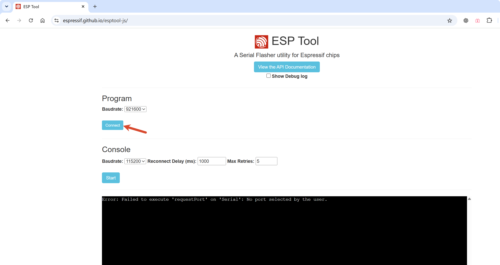

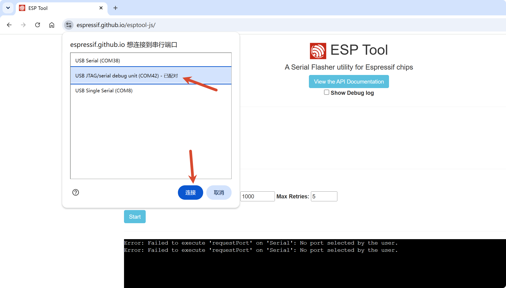

4. `Flash Address` 填写 `0x0`。
5. 选择本版本 Release 里的 `esp32s3-tirtc-at-demo-full-v0.7.0.bin`。这个文件是 4 MB 完整包。
6. 点击 `Program`，等待进度到 `100%`。

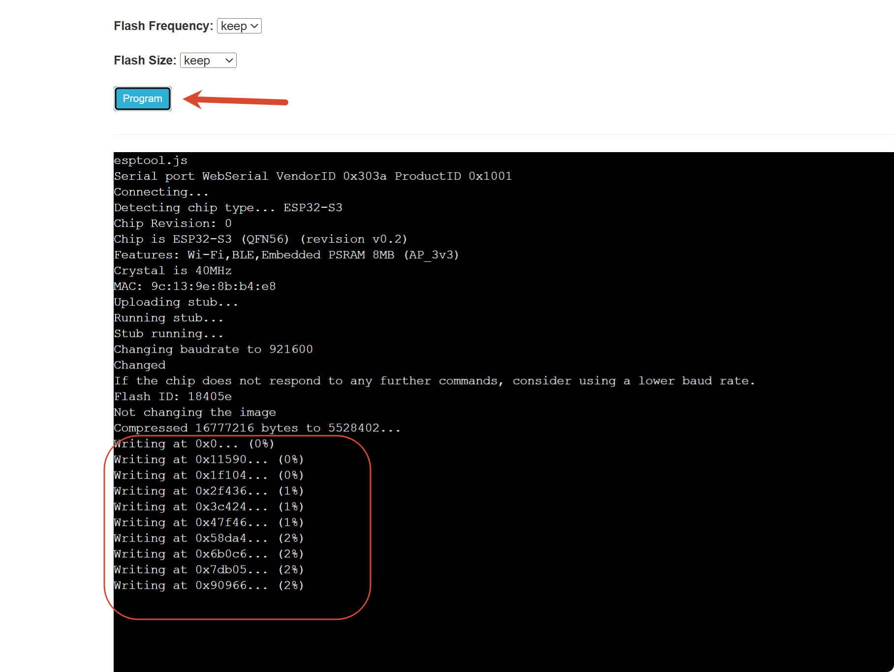

7. 看到校验成功后，按一下设备复位键。然后按照第三部分开始体验。

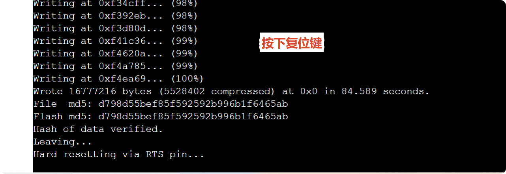


## 三、体验流程
### 1. 打开串口

打开串口助手，选择设备端口，并按下面设置：

- 速度：`115200`
- 文字：`UTF-8`
- 发送结尾：`CRLF`，也就是 `\r\n`


### 2. 连接 Wi-Fi

把下面的名称和密码换成自己的 Wi-Fi：

```text
AT+配网="Wi-Fi名称","Wi-Fi密码"
```
看到 `OK` 后等待设备重启，再重新连接串口。发送：

```text
AT+状态
```

看到 `已就绪` 和 `空闲`，说明设备已经联网。

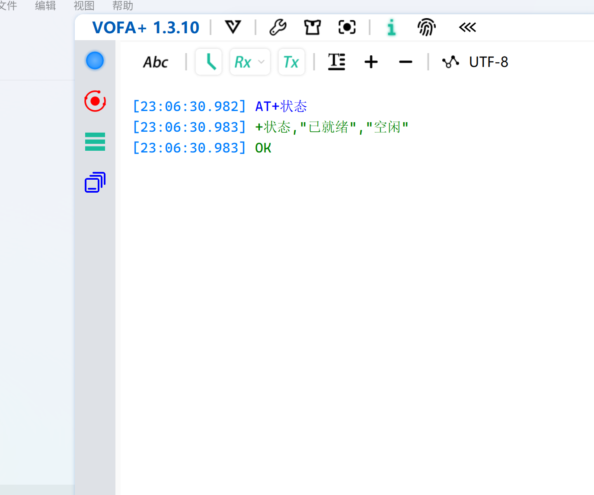

### 3. 绑定设备

发送：

```text
AT+绑定
```

串口会显示一个六位数字。


打开[开发者平台](https://demo-open.tange-ai.com/)，点击“进入控制台”。

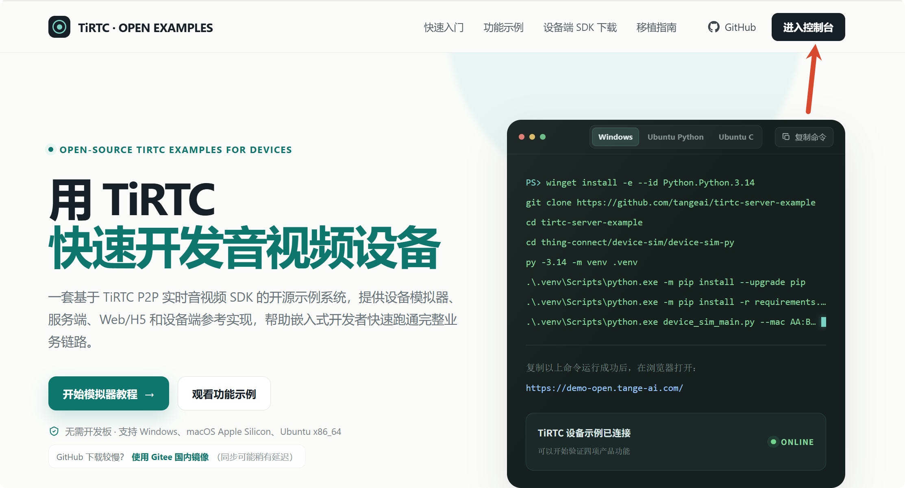

进入“我的设备”，点击“添加设备”。

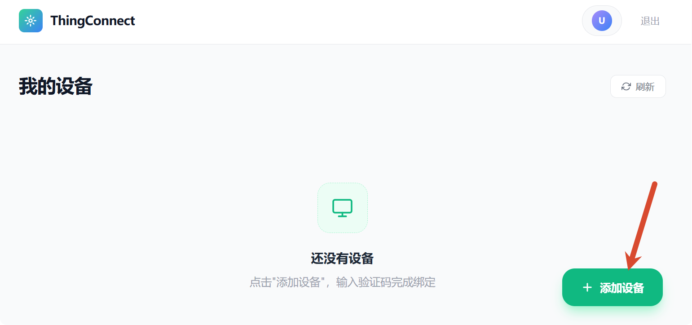

输入串口显示的六位数字，再点击“确认绑定”。

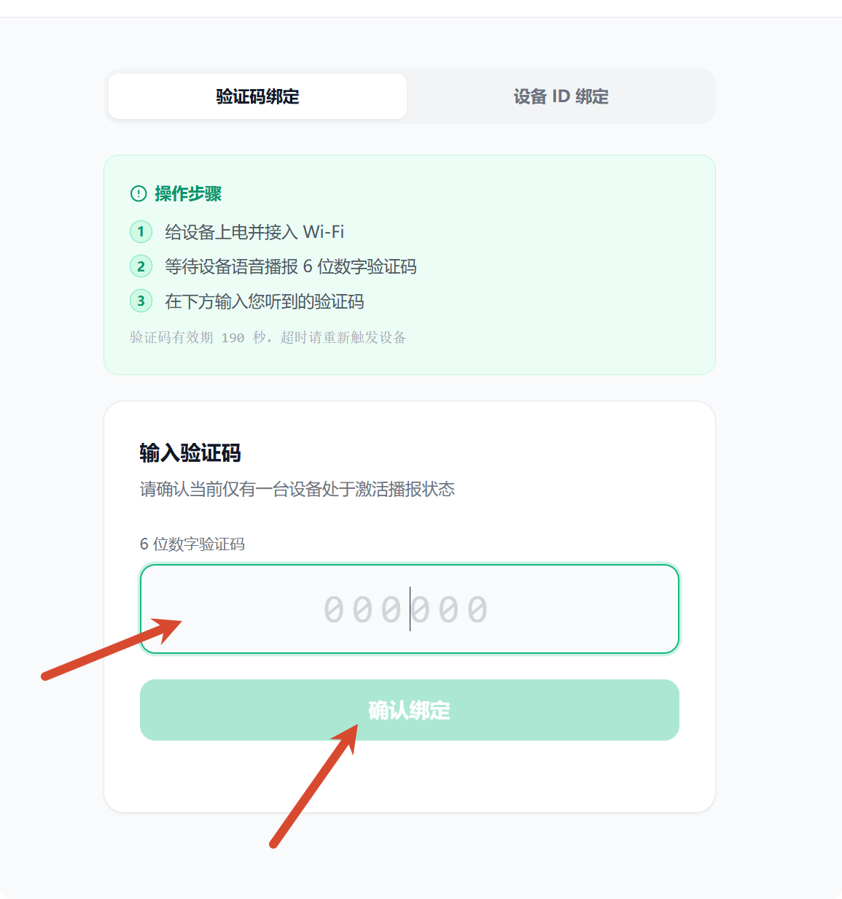

看到“绑定成功”后返回设备列表，等待设备自动重启并重新显示 `已就绪`。


### 4. 在网页上远程查看

打开开发者平台的设备列表，找到设备，点击“实时”。网页显示“已连接”后，会自动循环播放画面和声音，同时显示设备日志。

串口同时会显示“已连接”和“音视频已开始循环播放”。


### 5. 呼叫另一台设备

准备两台已经完成联网和绑定的设备，下面把呼叫方叫作 A，被叫方叫作 B。

先在 B 上查询设备 ID：

```text
AT+设备ID
```

记下 B 返回的设备 ID，然后在 A 上发起呼叫，在 B 上接听：

```text
A：AT+呼叫="B的设备ID"
B：AT+接听
```

把命令里的 `B的设备ID` 换成 B 实际显示的设备 ID。

看到两边都显示“通话接通”，说明呼叫成功。

通话中发送文字：

```text
AT+发消息="你好，小李"
```

发送方会显示“已发送”，另一台设备会显示收到的文字。


结束通话：

```text
AT+挂断
```

不想接听时发送 `AT+拒接`。还没接通时，呼叫方可以发送 `AT+取消呼叫`。


### 6. 准备小张和小李


```text
AT+设备ID
```

记下两台设备显示的设备 ID。下面把第一台叫 A，第二台叫 B。

在 A 上发送：

```text
AT+加好友="B的设备ID"
```

两台设备绑定在同一个平台账号下时，会直接提示“已自动成为联系人”，不需要在 B 上同意。

两台设备不在同一个平台账号下时，再在 B 上发送：

```text
AT+好友申请
AT+同意好友="A的设备ID"
```

再设置备注：

```text
A：AT+备注="B的设备ID","小李"
B：AT+备注="A的设备ID","小张"
```

看到“联系人备注已更新”，说明设置成功。

发送 `AT+联系人`，确认 A 能看到“小李”，B 能看到“小张”。

### 7. 让 AI 可以呼叫设备

在开发者平台的设备列表中找到设备，点击“智能体”。进入设备使用的 AI 角色后，在“设备端插件”里点击添加。

按下面填写：

```text
插件名称：呼叫设备
功能标识：call_device

输入参数
参数名：target
类型：string
必填：是
说明：联系人名称、备注、设备名称或设备 ID

返回参数 1
参数名：ok
类型：boolean

返回参数 2
参数名：message
类型：string
```

插件描述填写：

```text
用户要呼叫联系人时使用。目标可以是联系人备注、设备名称或设备 ID。
目标不清楚时请让用户重新说明，不要编造设备 ID。
```

保存插件后，点击“绑定到此设备”。如果 A 和 B 都需要通过 AI 发起呼叫，两台设备都要绑定这个 AI 角色。

### 8. 让 AI 呼叫小李

先确认下面三件事都已经完成：

1. A 的联系人中，B 的备注是“小李”。
2. A 已经绑定第 7 章配置好的 AI 角色。
3. B 处于在线、空闲状态。

在 AI 对话中说“呼叫小李”。AI 会调用 `call_device` 插件，设备会按照联系人备注找到小李，结束当前 AI 对话，然后向 B 发起呼叫。

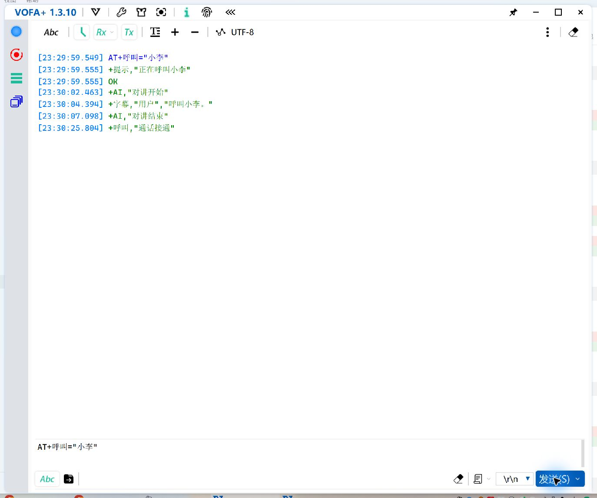

B 收到来电后发送：

```text
AT+接听
```

两台设备都显示“通话接通”，说明 AI 呼叫成功。结束通话时发送：

```text
AT+挂断
```

AI 呼叫和第 5 章的直接呼叫是两种操作。`AT+呼叫="小李"` 会直接呼叫联系人，不会启动 AI。

这个最小系统使用内置测试语音验证 AI 呼叫流程，内部测试命令不对外公开。开发者把自己的语音输入接入 AI 对话后，直接说“呼叫小李”即可。

### 9. 体验 AI 对讲

一次发送一条，看到本轮完成后再发下一条：

```text
AT+讲故事
AT+讲笑话
AT+查天气
```

串口会显示设备提交给 AI 的问题和 AI 的回答。这个例子通过串口命令体验 AI，不需要麦克风。

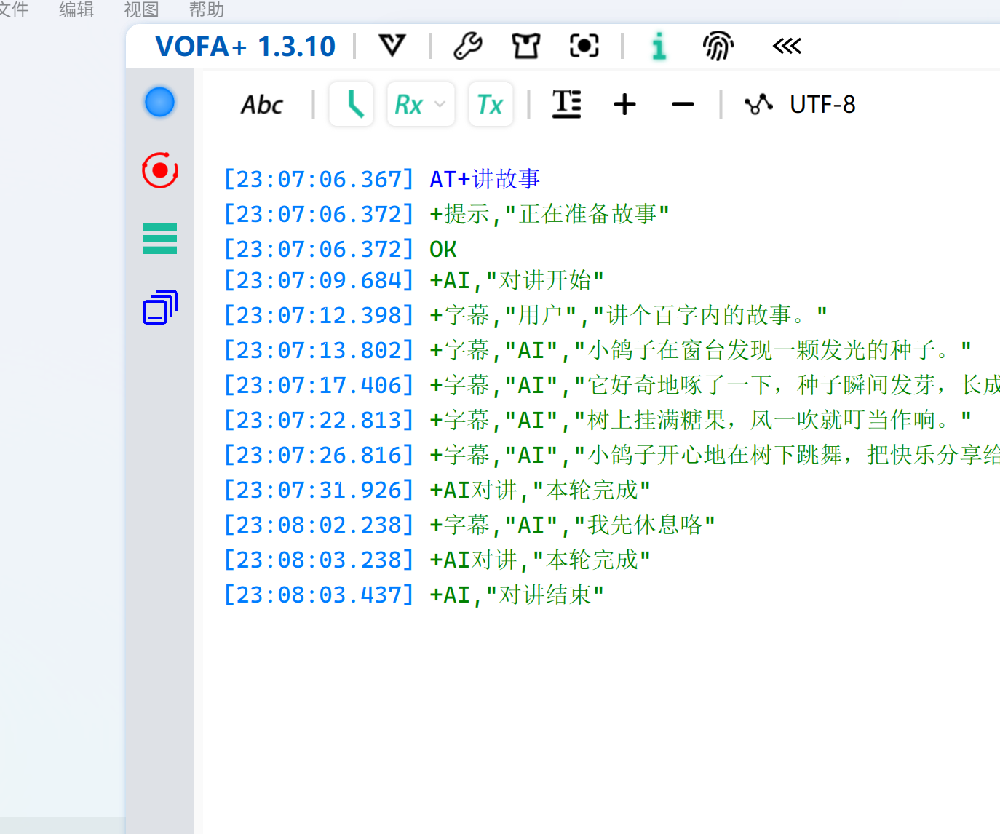

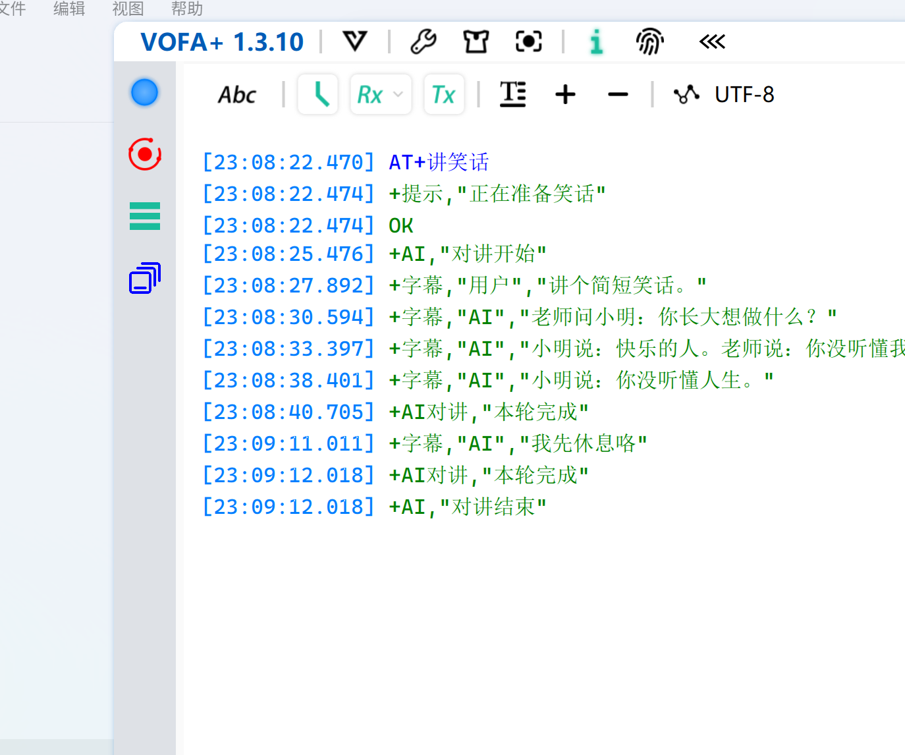

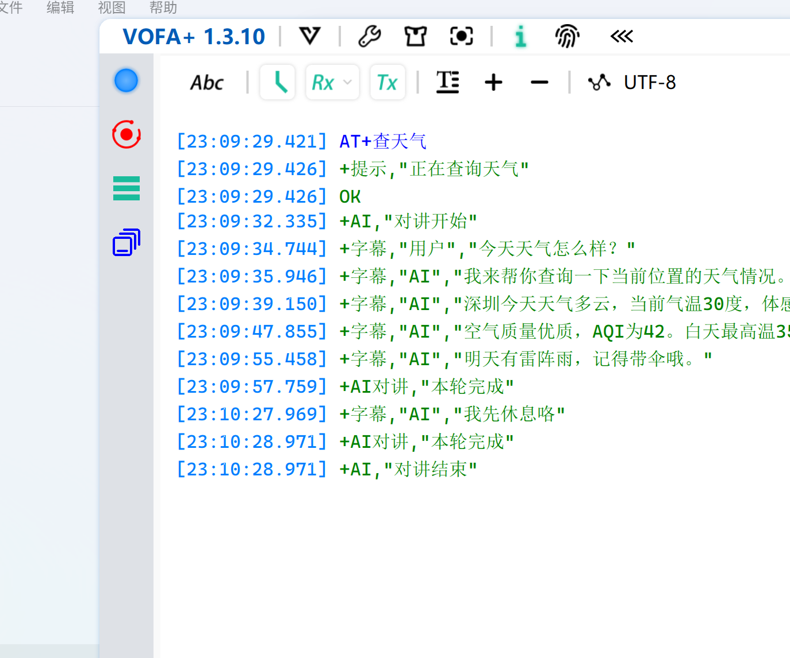

结束 AI 对讲时发送：

```text
AT+结束对讲
```

忘记指令时发送：

```text
AT+帮助
```
