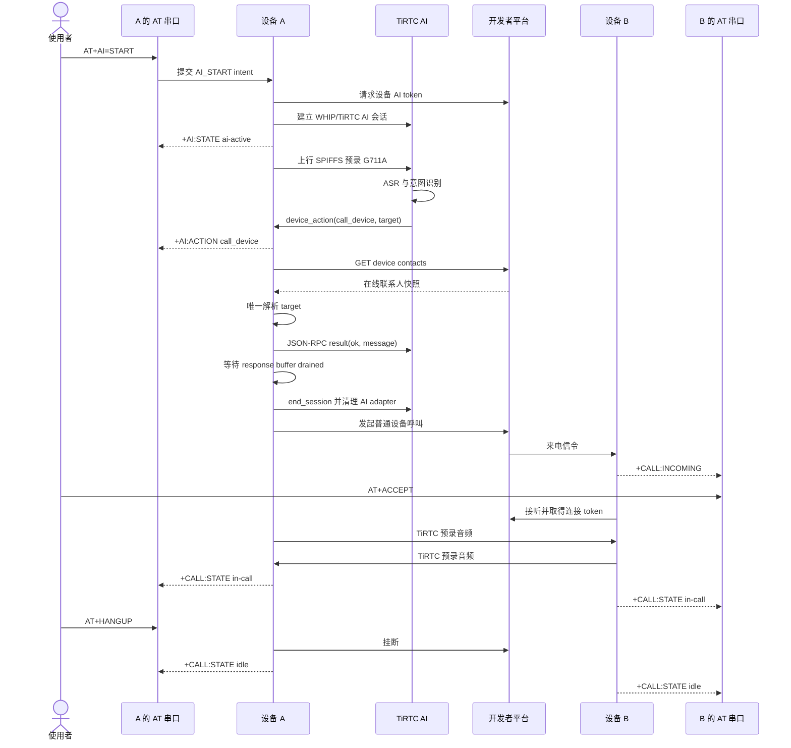

# ESP32-S3 AT ThingConnect 日志示例：AI 呼叫设备流程

本文描述使用者从串口启动 AI，到 AI 自动呼叫另一台设备，再由串口接听和
挂断的完整体验。为了展示完整 generation、request ID 和媒体证据，本文
使用结构化调试模式；开始前在 A、B 两端发送 `AT+PROTO=RAW`。日常体验
可直接使用 README 中的 `AT+TIRTC` 精简中文指令。

## 1. 参与方

| 参与方 | 职责 |
| --- | --- |
| 使用者 | 通过 A、B 两个 AT 串口发送命令 |
| 设备 A | 启动 AI、上行预录语音、处理 `call_device`、发起普通呼叫 |
| 开发者平台 | 管理设备身份、联系人、AI 角色和插件 |
| AI 服务 | ASR、对话理解和 `call_device` 插件决策 |
| 设备 B | 接收来电并通过 AT 接听、拒绝或挂断 |

本例没有麦克风和扬声器。体验中的“用户说话”由设备 A 的 SPIFFS 预录
G711A 文件代替，“通话媒体正常”由两端收发计数增长证明。

## 2. 总体时序



## 3. 体验前检查

### 3.1 平台

- A、B 都已绑定并在线。
- A、B 已建立普通设备联系人关系。
- A 的联系人列表中，B 有唯一且适合语音识别的备注。
- A 当前 AI 角色已经启用 `call_device` 插件。
- 插件输入为必填 `target:string`。
- 插件返回为 `ok:boolean` 和 `message:string`。

### 3.2 预录语音

- A 当前 SPIFFS 音频包含“呼叫 + B 的联系人备注”。
- 文件为 8 kHz、单声道、G711A、10 秒、80000 字节。
- B 可以使用普通预录音频，不需要包含 AI 指令。

### 3.3 两端状态

A、B 都执行：

```text
AT
AT+BUILD?
AT+STATUS?
AT+SESSION?
AT+MEDIA?
```

开始条件：

```text
STATUS = READY
SESSION owner = none
SESSION state = idle
MEDIA adapter_state = running
MEDIA connected = 0
MEDIA 异步 pending 计数 = 0
```

## 4. 阶段一：启动 AI

在 A：

```text
AT+AI=START
```

使用者首先看到同步受理：

```text
+REQUEST,<generation>,<request_id>,0,"AI_START","",""
OK
```

随后是异步状态：

```text
+AI:STATE,...,"ai-connecting",...
+AI:STATE,...,"ai-starting",...
+AI:STATE,...,"ai-active",...
```

体验含义：

- `ai-connecting`：正在申请平台 token 和建立媒体连接。
- `ai-starting`：连接已建立，正在完成 AI `start_session`。
- `ai-active`：AI 已进入可收发音频和协议消息的状态。

只有看到 `ai-active` 才表示 AI 会话真正可用。

## 5. 阶段二：AI 听到呼叫请求

进入 `ai-active` 后，设备自动读取预录 G711A 并上行。使用者不需要再发送
“目标文字”或 `AT+AIACTION`。

可用以下命令确认音频正在发送：

```text
AT+MEDIA?
```

AI 阶段应看到 `active_profile=ai`，并且 `tx_audio_frames` 增长。平台完成
ASR 和意图判断后，A 输出：

```text
+AI:ACTION,...,"<json_rpc_id>","call_device",
  "{\"action\":\"call_device\",\"data\":{\"target\":\"测试设备\"}}"
```

这条 URC 是云端真实下发 action 的证据。测试脚本不应直接构造这条消息。

## 6. 阶段三：解析目标并交接会话

A 内部按以下优先级解析 `target`：

1. 设备 ID 精确匹配。
2. 联系人备注精确匹配。
3. 唯一备注子串匹配。

只接受唯一在线普通设备联系人。解析成功后，使用者应观察到固定顺序：

```text
+AI:OP,...,"ai-call-device","contacts-refresh-submitted",""
+AI:OP,...,"ai-call-device","response-submitted",""
+AI:OP,...,"ai-call-device","response-drained",
  "{\"send_buffer_bytes\":0}"
+AI:STATE,...,"ending","","ai-call-device-transfer"
+AI:STATE,...,"idle","","ai-call-device-transfer"
+AI:OP,...,"ai-call-device","adapter-drained",""
+CALL:OP,...,"call-start","accepted",...
```

各阶段含义：

| 阶段 | 含义 |
| --- | --- |
| `contacts-refresh-submitted` | 正在读取实时联系人快照 |
| `response-submitted` | SDK 已接受 JSON-RPC 成功回包 |
| `response-drained` | 同代发送缓冲区已经归零 |
| `ending/idle` | AI 会话进入统一清理并释放 owner |
| `adapter-drained` | 连接、回调、断开和 handle 使用全部收口 |
| `call-start accepted` | 普通 CALL 已取得新 generation |

只有完整经过 `response-drained` 和 `adapter-drained` 才算可靠交接。
此处的 AI 成功回包只表示设备接受切换请求；普通呼叫是否接通仍由下一阶段
的来电、接听和两端 `in-call` 状态证明。

## 7. 阶段四：B 收到并接听

B 输出：

```text
+CALL:INCOMING,<generation>,0,"<DEVICE_ID_A>","<room_id>","audio"
```

在 B：

```text
AT+ACCEPT
```

预期：

```text
+REQUEST,...,"CALL_ACCEPT",...
+CALL:OP,...,"call-accept","accepted",...
+CALL:STATE,...,"call-connecting",...
+CALL:STATE,...,"in-call",...
```

A 也应进入：

```text
+CALL:STATE,...,"in-call",...
```

如果希望体验拒绝流程，将 `AT+ACCEPT` 换为：

```text
AT+REJECT
```

A 应收到远端拒绝并回到 idle。

## 8. 阶段五：观察双向媒体

A、B 间隔数秒各执行两次：

```text
AT+MEDIA?
```

成功体验至少满足：

| 指标 | A | B |
| --- | --- | --- |
| `active_profile` | `call` | `call` |
| `connected` | `1` | `1` |
| `tx_audio_frames` | 相对基线增长 | 相对基线增长 |
| `rx_audio_frames` | 相对基线增长 | 相对基线增长 |
| `send_errors` | `0` | `0` |

本例没有扬声器 sink，收到的音频帧会计数并记录后丢弃。因此体验重点是
连接状态、代际一致性和媒体计数，不是实际听感。

## 9. 阶段六：结束并恢复

在 A 或 B：

```text
AT+HANGUP
```

两端应先进入 `ending`，再进入 `idle`：

```text
+CALL:STATE,...,"ending",...
+CALL:STATE,...,"idle",...
```

最后两端执行：

```text
AT+STATUS?
AT+SESSION?
AT+MEDIA?
```

结束条件：

- 系统仍为 `READY`
- `owner=none`
- `state=idle`
- `connected=0`
- `connect_request_pending=0`
- `connect_callback_pending=0`
- `accept_callbacks_pending=0`
- `disconnects_pending=0`
- `connection_users=0`
- `incoming_armed=0`

## 10. 失败分支的体验

### 10.1 目标不存在

现象：

```text
+AI:OP,...,"ai-call-device",<error>,"target-not-found",...
```

结果：AI 保持 active，不进入 CALL。刷新联系人并修正备注或语音目标。

### 10.2 目标歧义

多个联系人都匹配同一子串时，固件拒绝猜测。给联系人设置唯一备注后重试。

### 10.3 目标离线

目标存在但 `online=0` 时不会呼叫。等待 B 重新上线并用
`AT+CONTACTS?` 确认。

### 10.4 AI 回包未排空

现象：

```text
+AI:OP,...,"ai-call-device",<error>,
  "response-drain-terminal-failed",...
```

结果：结束 AI，但不发起 CALL。该行为用于避免平台未可靠收到结果时设备
已经切换会话。

### 10.5 交接期间再次操作

- 新的 `AI=START` 或普通 `CALL` 会被拒绝。
- 来电会按 busy 处理。
- 重复的同一 JSON-RPC ID 不会生成矛盾回包。
- 超出串行处理能力的第三个不同请求会明确结束交接，不会静默丢失。

### 10.6 SDK 请求受控重启

若出现：

```text
+SYSTEM:RESTARTING,...,"tirtc_failed_connect_transport"
```

等待设备重新 READY。恢复后重新执行 BUILD、STATUS、SESSION、MEDIA 和
联系人查询，不能沿用重启前的会话状态。

## 11. 体验完成判据

一次完整 AI 呼叫设备体验应同时具备：

1. 两端运行同一预期 ELF 和 TiRTC SDK。
2. A、B 均为 READY，B 是 A 的唯一在线普通设备联系人。
3. A 由 `AT+AI=START` 进入 `ai-active`。
4. AI 音频上行计数增长。
5. A 收到真实 `call_device` action，目标与语音备注一致。
6. action response 按原 JSON-RPC ID 提交并排空。
7. AI adapter 完全清理后才出现 CALL accepted。
8. B 收到来电并通过 `AT+ACCEPT` 接听。
9. 两端进入 `in-call`，双向音频计数增长且发送错误为 0。
10. 挂断后两端回到 READY、none/idle，所有异步计数归零。

满足这些条件可以证明 AT 控制、云端 AI、插件、联系人解析、AI 到 CALL
交接和预录媒体链路已经闭环。它仍不等同于带真实麦克风、扬声器或显示设备
的产品级用户体验。
