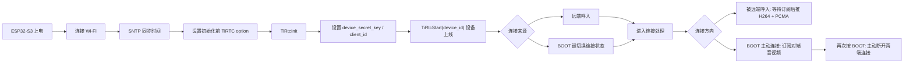
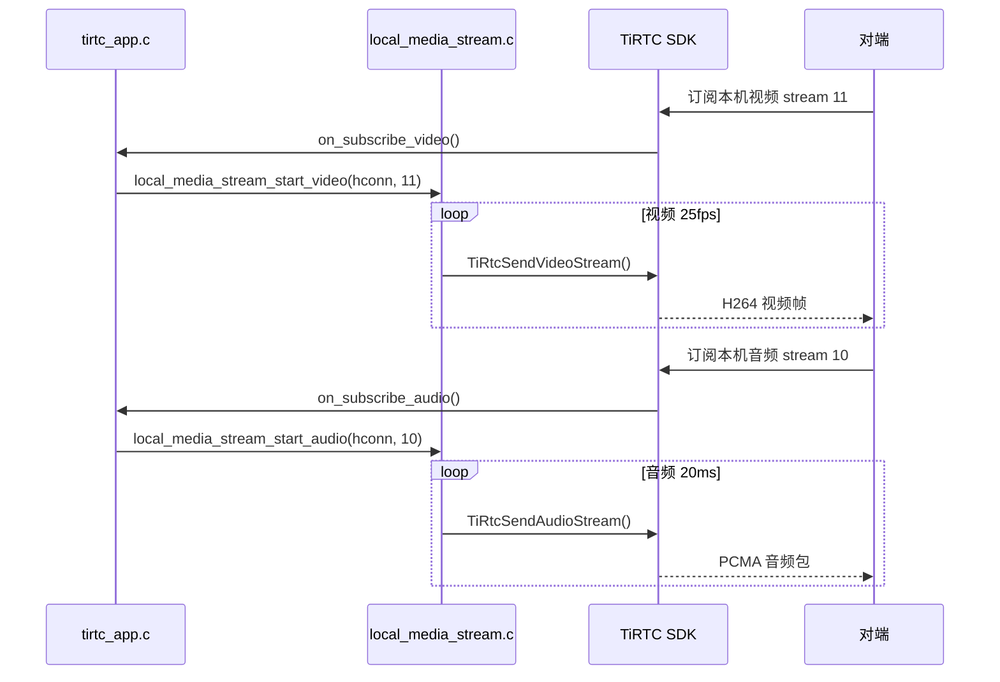
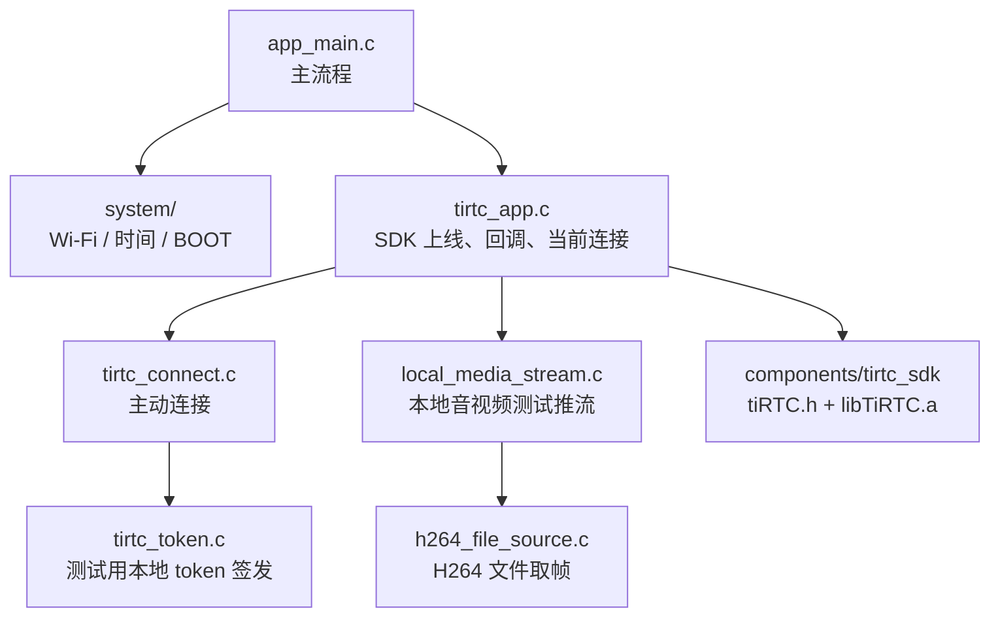

# ESP32-S3 最小 TiRTC 集成示例

TiRTC 产品能力可以参考官网文档：[TiRTC 产品介绍](https://docs.tange.ai/products/tirtc/overview/what-is-tirtc.html)。

## 工程能力

- 设备启动后自动连接 Wi-Fi。
- 联网后通过 SNTP 同步系统时间。
- 初始化后通过 `TIRTC_OPT_DEVICE_SECRET_KEY` 设置设备密钥，再以设备 ID 调用 `TiRtcStart()` 上线。
- 支持远端呼入连接，也支持按 BOOT 键切换连接状态：未连接时主动连接目标设备，已连接时主动断开。
- 远端呼入后等待对端订阅；收到订阅后发送本地 H264 视频和 PCMA 音频。BOOT 主动连接时作为观看端订阅对端音视频。
- 示例代码保留常用控制接口：断开连接、订阅/取消订阅音视频、请求关键帧。

## 整体流程



## 目录说明

```text
tirtc_esp32s3_wifi_link_demo
├─ components/tirtc_sdk/        TiRTC SDK 头文件和静态库
├─ firmware/                    编译生成的烧录文件和 flash 参数
├─ main/app_main.c              示例主流程
├─ main/app_config.h            Wi-Fi 和 BOOT 键配置
├─ main/system/                 Wi-Fi、时间同步、BOOT 键
├─ main/tirtc/tirtc_config.h    TiRTC 业务参数
├─ main/tirtc/tirtc_app.c       TiRTC 上线、回调、连接和控制接口
├─ main/tirtc/tirtc_connect.c   主动连接和本地 token 签发入口
├─ main/tirtc/tirtc_token.c     测试用本地 token 签发
├─ main/tirtc/local_media_stream.c  本地 H264/PCMA 测试推流
├─ main/tirtc/h264_file_source.c    H264 文件逐帧读取
└─ main/tirtc/test_assets/          打包到 SPIFFS 的测试媒体文件
```

完整交付内容请看 [PACKAGE_CONTENTS.md](PACKAGE_CONTENTS.md)。

## SDK 包说明

本示例使用 ESP32-S3 KCP single static library：`components/tirtc_sdk/lib/libTiRTC.a`。`libwebrtc_nosctp.a` 已合入这一个静态库，应用工程不需要再额外链接第二个 WebRTC 库。

SDK 内部已包含平台初始化入口 `SA_platInit()`。TiRTC 2.2.x 的设备启动顺序为：`TiRtcInit()`、设置 `TIRTC_OPT_DEVICE_SECRET_KEY`、设置 `TIRTC_OPT_CLIENT_ID`、最后调用 `TiRtcStart(device_id, callbacks)`。设备密钥不再与设备 ID 拼接后传给 `TiRtcStart()`。

## 需要先改的配置

系统配置在 `main/app_config.h`：

```c
#define APP_WIFI_SSID "your_wifi_ssid"
#define APP_WIFI_PASSWORD "your_wifi_password"
```

TiRTC 业务配置在 `main/tirtc/tirtc_config.h`：

```c
#define TIRTC_DEVICE_ID "your_device_id"
#define TIRTC_DEVICE_SECRET_KEY "your_device_secret"
#define TIRTC_CLIENT_ID TIRTC_DEVICE_ID
#define TIRTC_REMOTE_DEVICE_ID "peer_device_id"
#define TIRTC_REMOTE_DEVICE_SECRET_KEY "peer_device_secret_key"
#define TIRTC_TOKEN_ACCESS_ID "your_token_access_id"
#define TIRTC_TOKEN_SECRET_KEY "your_token_secret_key"
```

当前设备入网策略要求 `client_id` 非空。已绑定设备应使用云端下发的 `device_id` 作为 `client_id`，不要自行改成 MAC 等其他值，否则可能触发设备身份冲突。`TIRTC_REMOTE_DEVICE_SECRET_KEY`、`TIRTC_TOKEN_ACCESS_ID` 和 `TIRTC_TOKEN_SECRET_KEY` 只用于示例工程本地签发测试 token，方便快速联调。正式产品不建议把这类密钥写进固件，建议由自己的业务服务端签发 token，再下发给设备使用。

## 编译环境

我们当前验证环境：

- 芯片：ESP32-S3
- ESP-IDF：5.5.4
- 工具链：Windows 下 ESP-IDF PowerShell 环境
- Flash：16 MB
- PSRAM：8 MB，已在 `sdkconfig.defaults` 中启用

编译命令：

```powershell
. "$env:IDF_PATH\export.ps1"
idf.py build
```

烧录命令示例：

```powershell
idf.py -p COMx flash monitor
```

把 `COMx` 换成实际串口号。

更完整的客户测试流程、前置条件、操作步骤和预期日志请参考 [TEST_GUIDE.md](TEST_GUIDE.md)。

## 运行现象

设备正常启动后，串口里能看到类似日志：

```text
Wi-Fi 已连接
系统时间同步完成
TiRTC 版本: 2.2.1
TiRTC 启动配置: device_id=... client_id=... secret_len=32
TiRTC 启动选项已设置: device_secret_key length=...
TiRTC 启动选项已设置: client_id length=...
TiRTC 启动请求已提交
TiRTC 已上线，可接收入站连接，也可主动连接远端设备
```

未连接时按下 BOOT 键，设备会本地生成测试 token 并连接 `TIRTC_REMOTE_DEVICE_ID`：

```text
BOOT 键已按下，准备切换 TiRTC 连接状态
准备创建主动连接任务 remote_id=xxx
主动连接任务已创建
开始本地生成本次主动连接 token
主动连接开始 remote_id=xxx token=local
TiRTC 状态：已上线=1，连接=主动连接中
主动连接成功 hconn=...
当前连接已建立
本地测试媒体已就绪: H264=298486 bytes PCMA=213846 bytes
[CTRL][TX] 订阅对端视频 stream=11 ret=0 OK
[CTRL][TX] 订阅对端音频 stream=10 ret=0 OK
[CTRL][RX] 对端订阅本机视频 stream=11
[TX][video] 视频发送准备完成：格式=H264，流ID=11
[TX][video] 发流开始：视频=H264，目标帧率=25 fps，流ID=11
[CTRL][RX] 对端订阅本机音频 stream=10
[TX][audio] 音频发送准备完成：格式=PCMA，流ID=10
[TX][audio] 发流开始：音频=PCMA，采样=8k A-law，流ID=10
[TX][video] 发送统计：视频帧=25，流ID=11，发送缓冲=...
[TX][audio] 发送统计：音频包=50，流ID=10，发送缓冲=...
[RX][video] 接收统计：视频帧=25，流ID=11，长度=...字节，时间戳=...，关键帧=...
[RX][audio] 接收统计：音频包=50，流ID=10，长度=...字节，时间戳=...
```

连接状态下再次按 BOOT，本机会主动断开当前连接，对端也会收到断开事件并停止本地测试媒体发送：

```text
收到 BOOT 键触发，切换 TiRTC 连接状态
BOOT 按键触发：当前已有连接，主动断开两端连接
主动断开当前连接 ret=0 OK
```

## 音视频链路说明

本工程把 `send_video.h264` 和 `send_audio.pcma` 打包到 SPIFFS。设备被远端呼入并收到对端订阅后，视频按 25fps 发送 H264 帧，音频按 8k A-law 每包约 20ms 发送。BOOT 主动连接时，本机作为观看端，只订阅对端 stream `11` 视频和 stream `10` 音频。



接真实摄像头或麦克风时，主要替换 `main/tirtc/local_media_stream.c` 中读取本地文件的位置，保留 `TIRTCFRAMEINFO` 和发送 API 的写法即可：

```c
int ret = TiRtcSendVideoStream(conn, &frame, (void *)data);
int ret = TiRtcSendAudioStream(conn, &frame, packet);
```

本地测试视频使用 stream `11`，本地测试音频使用 stream `10`。这两个 ID 和测试媒体格式保持在代码里，方便客户直接看到发送参数。

## 代码分层



我们刻意让 `tirtc_app.c` 直接展示 SDK 的常用调用，不再做过多包装。看示例时，可以直接看到每个动作对应哪个 TiRTC API。

## 常用接口位置

- 设备上线：`tirtc_start()`
- 释放资源：`tirtc_deinit()`
- 主动连接：`tirtc_connect_configured()`
- 主动断开：`tirtc_disconnect_current()`
- BOOT 连接状态切换：`tirtc_toggle_connection()`
- 订阅对端视频：`tirtc_subscribe_remote_video()`
- 订阅对端音频：`tirtc_subscribe_remote_audio()`
- 请求关键帧：`tirtc_request_remote_key_frame()`

## 注意事项

- 本示例默认关闭 Wi-Fi 省电，优先保证音视频链路稳定性。
- 本示例没有启用 Wi-Fi NVS 校准数据保存，配置见 `sdkconfig.defaults`。
- 本地签发 token 只用于联调。正式产品请改成服务端签发 token。
- `libTiRTC.a` 已放在 `components/tirtc_sdk/lib/`，不需要额外手动链接。
- 测试媒体文件会通过 SPIFFS 随工程一起烧录，分区名为 `storage`。

## 候选来源

本目录来自一个含未提交 SDK 升级与配置改动的源工作树，公开副本已将测试凭据替换为占位符。
复制范围和未验证边界见 [来源与验证边界](SOURCE_PROVENANCE.md)。

## 验收建议

建议按下面顺序验证：

1. 先确认 Wi-Fi 能拿到 IP。
2. 确认系统时间同步成功。
3. 确认 TiRTC 上线成功。
4. 用远端客户端呼入设备，确认连接建立。
5. 按 BOOT 键主动连接目标设备，确认主动连接成功。
6. 观察 H264/PCMA 推流日志，确认音视频帧持续发送。
7. 连接状态下再次按 BOOT，确认本机主动断开，对端收到断开事件。

如果某一步失败，请保留完整串口日志，重点包含 Wi-Fi、SNTP、TiRTC 启动、连接回调和 H264/PCMA 推流日志。
